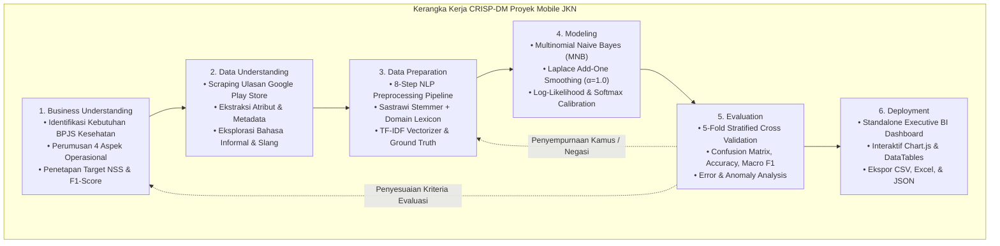
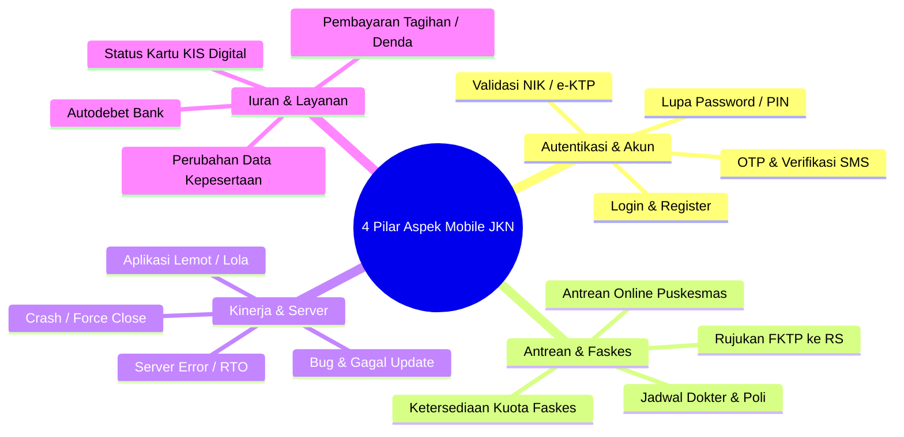
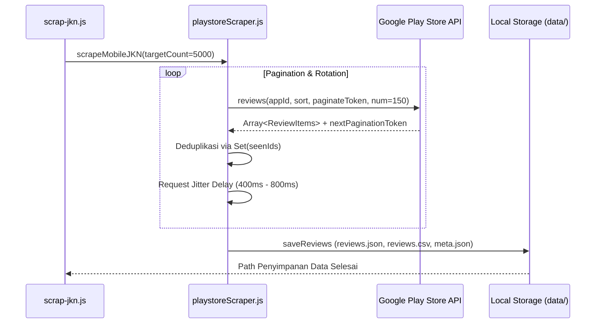
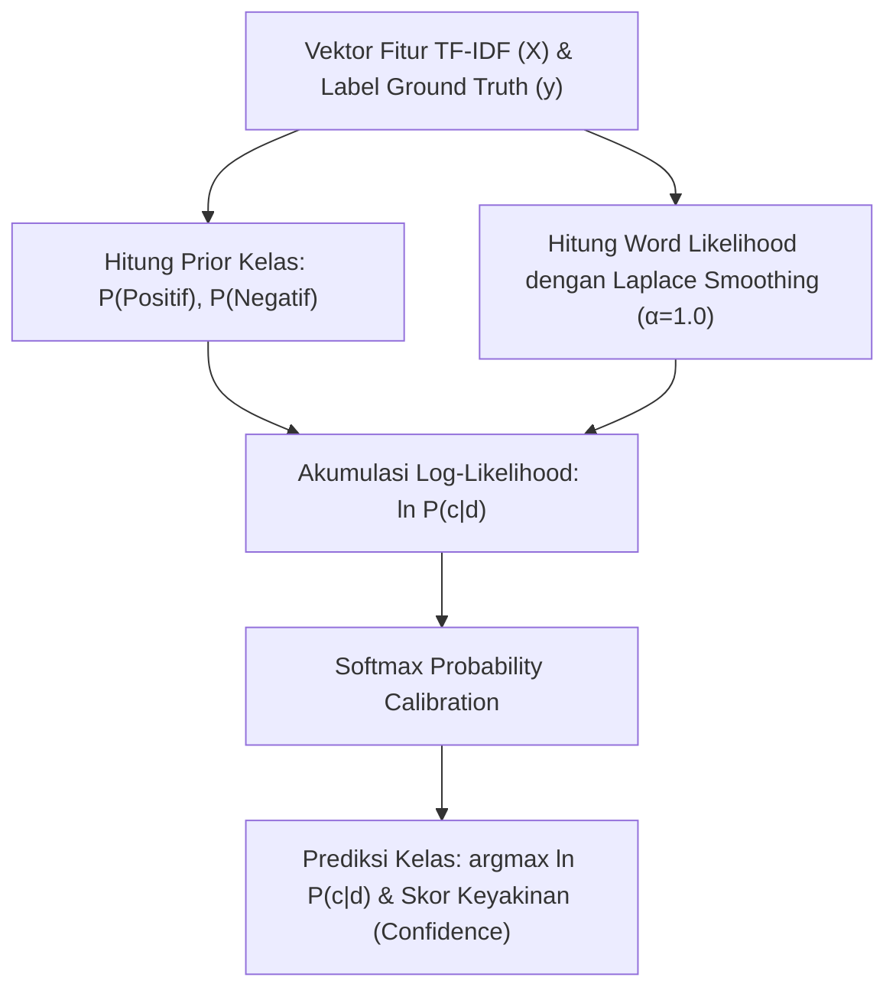
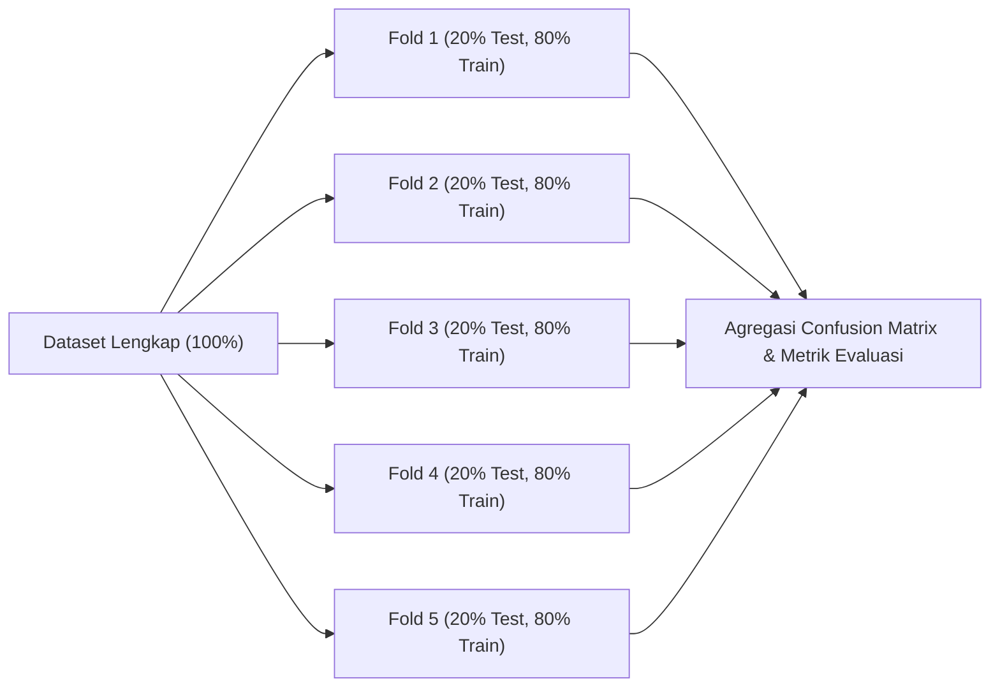
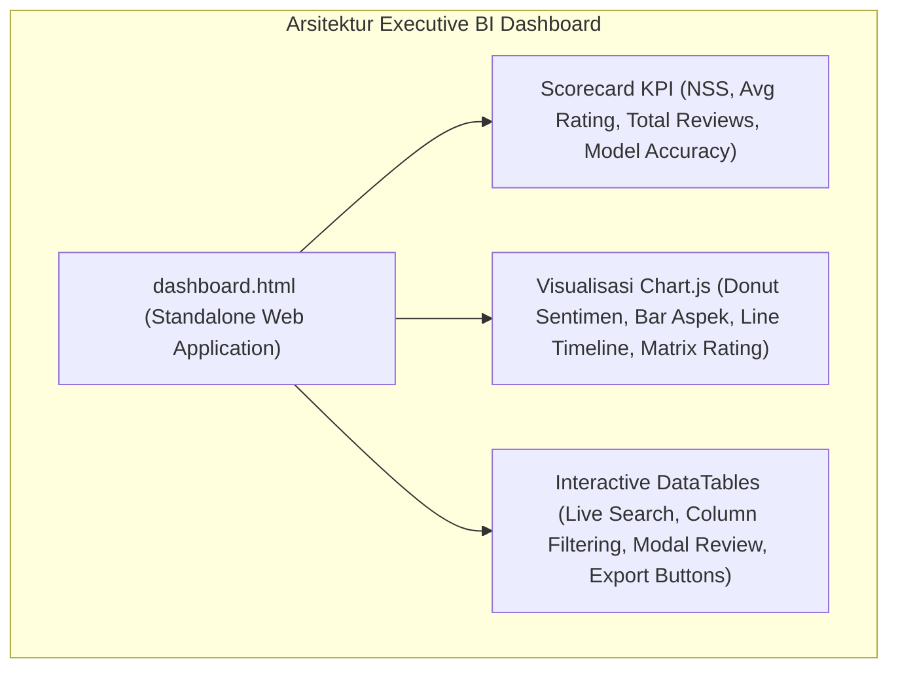

# 📖 FASE 1: METODOLOGI PENELITIAN CRISP-DM
## Analisis Sentimen & Data Mining Ulasan Mobile JKN (BPJS Kesehatan)

---

## 📌 Daftar Isi
1. [Pengantar & Justifikasi Metodologi](#1-pengantar--justifikasi-metodologi)
2. [Kerangka Kerja CRISP-DM](#2-kerangka-kerja-crisp-dm)
3. [Fase 1: Business Understanding (Pemahaman Bisnis)](#3-fase-1-business-understanding)
4. [Fase 2: Data Understanding (Pemahaman Data)](#4-fase-2-data-understanding)
5. [Fase 3: Data Preparation (Persiapan & Preprocessing Data)](#5-fase-3-data-preparation)
6. [Fase 4: Modeling (Pemodelan Machine Learning)](#6-fase-4-modeling)
7. [Fase 5: Evaluation (Evaluasi Model & Validasi)](#7-fase-5-evaluation)
8. [Fase 6: Deployment (Implementasi & Visualisasi BI)](#8-fase-6-deployment)
9. [Tabel Matriks Pemetaan Kode Program](#9-tabel-matriks-pemetaan-kode-program)

---

## 1. Pengantar & Justifikasi Metodologi

Dalam penelitian analitik data dan *data mining*, pemilihan kerangka kerja metodologis yang terstruktur sangat penting untuk memastikan keterulangan (*reproducibility*), keandalan hasil, dan relevansi temuan terhadap kebutuhan praktis. 

Penelitian ini mengadopsi standar internasional **CRISP-DM (*Cross-Industry Standard Process for Data Mining*)**. CRISP-DM dipilih karena memiliki keunggulan:
- **Pendekatan Berorientasi Masalah Bisnis**: Menghubungkan metrik teknis *Machine Learning* langsung dengan tujuan manajerial BPJS Kesehatan.
- **Sifat Siklus Iteratif (*Cyclical & Iterative*)**: Memungkinkan penyempurnaan leksikon kamus (*slang*, *emoji*, *negation*) dan fitur ekstraksi TF-IDF berdasarkan hasil evaluasi model secara berkesinambungan.
- **Standar Baku Industri & Akademisi**: Diakui secara luas dalam penulisan tesis, skripsi, dan publikasi ilmiah internasional pada bidang *Business Intelligence and Analytics*.

---

## 2. Kerangka Kerja CRISP-DM

---

## 3. Fase 1: Business Understanding

### 3.1. Latar Belakang & Urgensi Masalah
Aplikasi **Mobile JKN** yang dikelola oleh BPJS Kesehatan merupakan platform transformasi layanan kesehatan digital terbesar di Indonesia dengan puluhan juta pengguna terdaftar. Melalui aplikasi ini, peserta dapat mengakses antrean online fasilitas kesehatan tingkat pertama (FKTP), mengecek status kepesertaan KIS/BPJS, memilih jadwal dokter rumah sakit, hingga melakukan pembayaran iuran.

Namun, tingginya volume pengguna menghadirkan tantangan operasional:
1. **Volume Ulasan Sangat Masif**: Google Play Store menerima ribuan ulasan per minggu yang mustahil dipilah dan dianalisis secara manual oleh tim *Customer Care* maupun manajemen.
2. **Bias Rating Bintang**: Banyak pengguna memberikan **bintang 5 disertai keluhan keras** dengan tujuan agar ulasan mereka diprioritaskan oleh sistem (*"bintang 5 biar dibaca developer, aplikasi crash terus"*). Sebaliknya, sebagian pengguna keliru memberi **bintang 1 untuk ulasan yang sangat puas**.
3. **Ketiadaan Pemetaan Isu Operasional**: Rating bintang rata-rata tidak memberikan informasi spesifik mengenai unit kerja mana yang mengalami kendala (apakah server IT, faskes/puskesmas, atau sistem pembayaran perbankan).

### 3.2. Perumusan 4 Aspek Operasional Mobile JKN
Sistem dirancang untuk mengelompokkan setiap ulasan secara otomatis ke dalam **4 Pilar Aspek Operasional**:

### 3.3. Metrik Kepuasan Manajerial: Net Sentiment Score (NSS)
Untuk memberikan gambaran eksekutif mengenai tren kepuasan publik secara agregat, didefinisikan indeks **Net Sentiment Score (NSS)**:

$$\text{NSS} = \left( \frac{N_{\text{Positif}} - N_{\text{Negatif}}}{N_{\text{Total}}} \right) \times 100\%$$

- **Interpretasi**:
  - $\text{NSS} > +20\%$: Persepsi publik sangat sehat dan puas.
  - $0\% \le \text{NSS} \le +20\%$: Persepsi publik netral cenderung positif.
  - $\text{NSS} < 0\%$: Persepsi publik kritis; membutuhkan intervensi operasional segera.

### 3.4. Kriteria Keberhasilan (Success Criteria)
1. **Kriteria Teknis (Machine Learning)**:
   - Akurasi Klasifikasi $\ge 85.0\%$.
   - Macro F1-Score $\ge 80.0\%$ pada pengujian *5-Fold Cross Validation*.
2. **Kriteria Bisnis (Business Intelligence)**:
   - Menghasilkan laporan dashboard interaktif mandiri (*zero-dependency standalone HTML*) dengan waktu respon filter data $< 100\text{ ms}$.

---

## 4. Fase 2: Data Understanding

### 4.1. Ekstraksi Data (Data Acquisition)
Pengambilan data ulasan dilakukan secara terprogram menggunakan pustaka `google-play-scraper` pada aplikasi `app.bpjs.mobile` dengan parameter lokalisasi bahasa Indonesia (`lang=id`, `country=id`).

- **Modul Scraper**: [`src/scraper/playstoreScraper.js`](file:///x:/laragon/kuliah/playstore-mining/src/scraper/playstoreScraper.js)
- **Skrip CLI**: [`scrap-jkn.js`](file:///x:/laragon/kuliah/playstore-mining/scrap-jkn.js)

### 4.2. Spesifikasi Atribut Data Mentah
Data ulasan mentah disimpan dalam folder `data/<timestamp>/reviews.json` dengan struktur skema:

| Nama Atribut | Tipe Data | Deskripsi | Contoh Nilai |
| :--- | :---: | :--- | :--- |
| `id` | *String* | Pengenal unik ulasan dari Google Play Store | `"gp:AOqpTOE_..."` |
| `userName` | *String* | Nama profil pengguna (disamarkan) | `"Ahmad Fauzi"` |
| `score` | *Integer* | Skor rating bintang (1 hingga 5) | `1` |
| `date` | *ISO String* | Waktu ulasan dipublikasikan | `"2026-08-25T10:15:30.000Z"` |
| `text` | *String* | Konten ulasan teks asli pengguna | `"Aplikasi bagus tapi antrean faskes sering error!"` |
| `thumbsUp` | *Integer* | Jumlah *helpful votes* dari pengguna lain | `42` |
| `version` | *String* | Versi rilis aplikasi saat ulasan dibuat | `"v4.18.0"` |

### 4.3. Karakteristik & Tantangan Kebahasaan Teks Ulasan
1. **Penggunaan Slang & Singkatan Non-Baku**: *"bgt"*, *"ga bsa"*, *"lola"*, *"apdet"*, *"bkin pusing"*.
2. **Penggunaan Emotikon Intensif**: Simbol ekspresi sentimen seperti 👍, ❤️, 😡, 🤮, 🙏.
3. **Klausa Bertingkat (*Adversative / Concessive*)**: Kalimat majemuk yang memuat pujian semu sebelum keluhan inti (*"awalnya bagus TAPI sekarang login aja gabisa"*).
4. **Negasi Tersembunyi**: Frasa negasi yang sering terpecah saat tokenisasi (*"tidak bisa"*, *"belum masuk"*, *"kurang responsif"*).

---

## 5. Fase 3: Data Preparation

Data preparation merupakan fase paling krusial untuk mentransformasikan teks informal menjadi vektor numerik berbobot.

```mermaid
flowchart LR
    A["Raw Review Text"] --> B["1. Emoji Translation<br>(emojis.csv)"]
    B --> C["2. Case Folding &<br>Regex Cleansing"]
    C --> D["3. Idiom Normalization<br>(Frasa Retoris)"]
    D --> E["4. Slang Expansion<br>(slang.csv - 860+ kata)"]
    E --> F["5. Clause Splitting<br>(tapi / padahal weighting)"]
    F --> G["6. Multi-step Negation<br>(tidak_bisa, tidak_bantu)"]
    G --> H["7. Nazief-Adriani Stemming<br>(ts-sastrawi + BPJS Dict)"]
    H --> I["8. Stopwords Removal<br>(stopwords.csv)"]
    I --> J["TF-IDF Vectorizer<br>(Sublinear TF + L2-Norm)"]
```

### 5.1. Rincian 8 Tahapan NLP Preprocessing ([`src/nlp/preprocessor.js`](file:///x:/laragon/kuliah/playstore-mining/src/nlp/preprocessor.js))

1. **Emoji Translation**:
   Mengonversi simbol emoji menjadi token teks semantik bahasa Indonesia menggunakan kamus [`master_data/emojis.csv`](file:///x:/laragon/kuliah/playstore-mining/master_data/emojis.csv).
   - `👍` $\rightarrow$ `emoji_jempol_bagus`
   - `😡` $\rightarrow$ `emoji_marah_kesal`
   - `🙏` $\rightarrow$ `emoji_terima_kasih`

2. **Case Folding & Cleansing**:
   - Mengubah seluruh huruf menjadi huruf kecil (*lowercase*).
   - Menghapus URL (`https?://...`), mention (`@user`), dan tagar (`#hashtag`).
   - Menghapus karakter non-alfanumerik dan tanda baca.
   - Reduksi karakter berulang (*elongated characters*, misal: `"baguuus"` $\rightarrow$ `"bagus"`).

3. **Normalisasi Frasa Idiom Retoris**:
   - Frasa *"apa gunanya"*, *"buat apa"*, *"gak guna"* $\rightarrow$ `tidak berguna`
   - Frasa *"ujung ujungnya ke kantor"* $\rightarrow$ `kecewa`
   - Frasa *"tidak memberikan solusi"* $\rightarrow$ `kecewa tidak solusi`

4. **Ekspansi Slang & Singkatan Informal**:
   Mencocokkan kata dengan kamus [`master_data/slang.csv`](file:///x:/laragon/kuliah/playstore-mining/master_data/slang.csv) yang berisi 860+ pemetaan kata gaul ke kata baku (*"bgt"* $\rightarrow$ *"sangat"*, *"lemot"* $\rightarrow$ *"lambat"*, *"gabisa"* $\rightarrow$ *"tidak bisa"*).

5. **Pembobotan Klausa Konjungsi (*Clause Splitting*)**:
   - **Konjungsi Adversatif (*tapi, tetapi, namun, sayang*)**: Klausa setelah konjungsi diberi bobot $2\times$ karena memuat inti keluhan sesungguhnya.
   - **Konjungsi Konsesif (*padahal, walaupun, meskipun*)**: Klausa sebelum konjungsi diberi bobot $2\times$.

6. **Multi-Step Negation Binding**:
   Mengikat partikel negasi (*tidak, bukan, belum, kurang, jangan*) dengan kata inti target yang telah distem:
   - *"tidak bisa login"* $\rightarrow$ token: `tidak_bisa`, `masuk`
   - *"belum membantu"* $\rightarrow$ token: `tidak_bantu`
   - *Proteksi Pronoun*: Negasi tidak digabungkan pada kata ganti (*"tidak saya"*, *"bukan kak"*).

7. **Stemming Morfologis Nazief-Adriani ([`src/nlp/stemmer.js`](file:///x:/laragon/kuliah/playstore-mining/src/nlp/stemmer.js))**:
   Menggunakan algoritma Nazief-Adriani berbasis kamus dasar 29.932 entri, diperkaya dengan istilah domain kesehatan dan BPJS (*faskes, antrean, rujukan, iuran, autodebet, skrining, puskesmas*), serta dilengkapi *memoization cache* untuk efisiensi komputasi.

8. **Pembersihan Stopwords (Stopwords Removal)**:
   Menghapus kata tugas non-sentimen menggunakan [`master_data/stopwords.csv`](file:///x:/laragon/kuliah/playstore-mining/master_data/stopwords.csv) dengan pengecualian ketat terhadap seluruh token negasi dan kata sentimen inti.

### 5.2. Ekstraksi Fitur TF-IDF ([`src/ml/vectorizer.js`](file:///x:/laragon/kuliah/playstore-mining/src/ml/vectorizer.js))
Setiap ulasan ditransformasikan menjadi vektor berbobot menggunakan:
- **Sublinear Term Frequency**: $\text{TF}(t, d) = 1 + \ln(f_{t, d})$ untuk $f_{t, d} > 0$.
- **Smooth Inverse Document Frequency**: $\text{IDF}(t) = \ln\left(\frac{1 + N}{1 + \text{DF}(t)}\right) + 1$.
- **Normalisasi Euclidean ($L_2$-Norm)**: $\vec{v}_{\text{norm}} = \frac{\vec{v}}{\|\vec{v}\|_2}$.

### 5.3. Ground Truth Labeling & Koreksi Anomali ([`src/ml/groundTruth.js`](file:///x:/laragon/kuliah/playstore-mining/src/ml/groundTruth.js))
Menetapkan label acuan *supervised learning* yang telah dibersihkan dari bias ulasan:
- **Rating $\ge 4$**: Diberi label `Positif`, kecuali terdeteksi pola komplain kuat (*"kecewa parah"*, *"aplikasi sampah"*, *"tidak berguna"*) $\rightarrow$ dikoreksi menjadi `Negatif` (Sarkasme Rating 5).
- **Rating $\le 2$**: Diberi label `Negatif`, kecuali terdeteksi pola pujian mutlak tanpa negasi (*"sangat membantu"*, *"terbaik"*) $\rightarrow$ dikoreksi menjadi `Positif` (Pujian Rating 1 Keliru).
- **Rating 3**: Ditentukan melalui selisih frekuensi leksikon positif vs negatif.

---

## 6. Fase 4: Modeling

### 6.1. Algoritma: Multinomial Naive Bayes (MNB)
Model klasifikasi dibangun menggunakan kelas **`MultinomialNaiveBayes`** ([`src/ml/naiveBayes.js`](file:///x:/laragon/kuliah/playstore-mining/src/ml/naiveBayes.js)).

### 6.2. Parameter & Formulasi Matematika
1. **Laplace Add-One Smoothing ($\alpha = 1.0$)**:
   Mencegah *Zero-Frequency Problem* saat term baru dievaluasi pada data uji:
   $$P(w_i | c) = \frac{\sum_{d \in D_c} w_{i, d} + \alpha}{\sum_{k=1}^{|V|} \left(\sum_{d \in D_c} w_{k, d}\right) + \alpha \cdot |V|}$$

2. **Akumulasi Log-Likelihood (Anti-Underflow)**:
   Perhitungan probabilitas dilakukan dalam domain logaritma untuk menghindari *floating-point underflow*:
   $$\ln P(c | d) = \ln P(c) + \sum_{i=1}^{|d|} w_{i, d} \cdot \ln P(w_i | c)$$

3. **Kalibrasi Softmax**:
   Probabilitas posterior dinormalisasi menggunakan fungsi Softmax dengan reduksi nilai maksimum untuk menjamin kestabilan numerik:
   $$P(c | d) = \frac{\exp(\ln P(c | d) - M)}{\sum_{c' \in C} \exp(\ln P(c' | d) - M)}, \quad \text{di mana } M = \max_{c \in C}(\ln P(c | d))$$

---

## 7. Fase 5: Evaluation

### 7.1. Skema Validasi: 5-Fold Stratified Cross Validation
Untuk membuktikan ketahanan (*robustness*) model terhadap variasi ulasan, dataset dievaluasi menggunakan **5-Fold Stratified Cross Validation** ([`src/ml/evaluator.js`](file:///x:/laragon/kuliah/playstore-mining/src/ml/evaluator.js)).

### 7.2. Metrik Evaluasi & Confusion Matrix
- **Confusion Matrix**:
  - $TP$ (*True Positive*): Ulasan positif yang diprediksi positif.
  - $FP$ (*False Positive*): Ulasan negatif yang salah diprediksi positif.
  - $TN$ (*True Negative*): Ulasan negatif yang diprediksi negatif.
  - $FN$ (*False Negative*): Ulasan positif yang salah diprediksi negatif.

- **Formula Metrik**:
  $$\text{Accuracy} = \frac{TP + TN}{TP + FP + TN + FN} \times 100\%$$
  $$\text{Precision} = \frac{TP}{TP + FP}, \quad \text{Recall} = \frac{TP}{TP + FN}$$
  $$\text{Macro F1-Score} = \frac{F1_{\text{Positif}} + F1_{\text{Negatif}}}{2} \times 100\%$$

---

## 8. Fase 6: Deployment

### 8.1. Executive Business Intelligence Dashboard
Hasil analisis disajikan dalam bentuk dashboard interaktif mandiri (*Standalone HTML*) tanpa memerlukan instalasi server database atau backend eksternal ([`src/report/dashboardTemplate.js`](file:///x:/laragon/kuliah/playstore-mining/src/report/dashboardTemplate.js)).

### 8.2. Fitur Antarmuka Dashboard
1. **Scorecard KPI**: Menyajikan Net Sentiment Score (NSS), persentase sentimen, total ulasan, rata-rata rating bintang, dan akurasi model evaluasi.
2. **Visualisasi Interaktif (Chart.js)**:
   - *Donut Chart*: Proporsi perbandingan sentimen Positif vs Negatif.
   - *Bar Chart*: Distribusi komplain per Aspek Operasional Mobile JKN.
   - *Line Chart*: Tren bulanan rata-rata rating bintang dan rasio sentimen.
   - *Heatmap Matrix*: Korelasi antara rating bintang 1–5 dengan sentimen prediksi.
3. **DataTables Interaktif**:
   - Pencarian instan teks ulasan.
   - Filter dropdown per Aspek Operasional, Rating Bintang, Sentimen, dan Anomali.
   - Modal popup rincian token NLP dan skor probabilitas posterior.
   - Ekspor data instan ke format **CSV**, **Excel**, dan **Print/PDF**.

### 8.3. Artefak Output Sistem
Setiap eksekusi analisis menghasilkan berkas terstruktur pada folder `report/<timestamp>/`:
- `dashboard.html`: Halaman dashboard interaktif.
- `predictions.json`: Seluruh data ulasan dengan label prediksi, confidence, dan token NLP.
- `predictions.csv`: Format spreadsheet untuk pengolahan statistik lanjutan.
- `metrics.json`: Ringkasan metrik akurasi, presisi, recall, dan confusion matrix.

---

## 9. Tabel Matriks Pemetaan Kode Program

Tabel berikut menunjukkan keselarasan penuh antara setiap fase CRISP-DM dengan modul kode sumber dalam repositori:

| Fase CRISP-DM | Modul / Berkas Sumber | Fungsi & Kelas Utama | Output / Artefak |
| :--- | :--- | :--- | :--- |
| **1. Business Understanding** | [`run-analisa.js`](file:///x:/laragon/kuliah/playstore-mining/run-analisa.js) [`README.md`](file:///x:/laragon/kuliah/playstore-mining/README.md) | `detectAspects()` Definisi 4 Pilar Aspek & NSS | Parameter aspek bisnis & target metrik evaluasi |
| **2. Data Understanding** | [`scrap-jkn.js`](file:///x:/laragon/kuliah/playstore-mining/scrap-jkn.js) [`src/scraper/playstoreScraper.js`](file:///x:/laragon/kuliah/playstore-mining/src/scraper/playstoreScraper.js) | `scrapeMobileJKN()` `saveReviews()` | `data/<timestamp>/reviews.json` `data/<timestamp>/reviews.csv` `data/<timestamp>/meta.json` |
| **3. Data Preparation** | [`src/nlp/preprocessor.js`](file:///x:/laragon/kuliah/playstore-mining/src/nlp/preprocessor.js) [`src/nlp/stemmer.js`](file:///x:/laragon/kuliah/playstore-mining/src/nlp/stemmer.js) [`src/nlp/csvLoader.js`](file:///x:/laragon/kuliah/playstore-mining/src/nlp/csvLoader.js) [`src/ml/vectorizer.js`](file:///x:/laragon/kuliah/playstore-mining/src/ml/vectorizer.js) [`src/ml/groundTruth.js`](file:///x:/laragon/kuliah/playstore-mining/src/ml/groundTruth.js) | `TextPreprocessor.preprocess()` `stemWord()` / `stemSentence()` `TfidfVectorizer.fitTransform()` `determineGroundTruth()` | Array Token NLP Bersih Matriks Vektor TF-IDF ($X$) Label Ground Truth ($y$) |
| **4. Modeling** | [`src/ml/naiveBayes.js`](file:///x:/laragon/kuliah/playstore-mining/src/ml/naiveBayes.js) | `MultinomialNaiveBayes.train()` `MultinomialNaiveBayes.predict()` | Model MNB Terlatih Vektor Log-Likelihood Skor Confidence & Softmax |
| **5. Evaluation** | [`src/ml/evaluator.js`](file:///x:/laragon/kuliah/playstore-mining/src/ml/evaluator.js) [`test-nlp.js`](file:///x:/laragon/kuliah/playstore-mining/test-nlp.js) | `ModelEvaluator.crossValidate()` `ModelEvaluator.computeMetrics()` | `report/<timestamp>/metrics.json` Confusion Matrix ($TP, FP, TN, FN$) Akurasi & Macro F1 |
| **6. Deployment** | [`src/report/dashboardTemplate.js`](file:///x:/laragon/kuliah/playstore-mining/src/report/dashboardTemplate.js) [`open-report.js`](file:///x:/laragon/kuliah/playstore-mining/open-report.js) | `generateDashboardHtml()` `exec('start dashboard.html')` | `report/<timestamp>/dashboard.html` `report/<timestamp>/predictions.json` `report/<timestamp>/predictions.csv` |

---
*Dokumen ini merupakan standar metodologis resmi proyek Mobile JKN Data Mining & Sentiment Analytics.*
