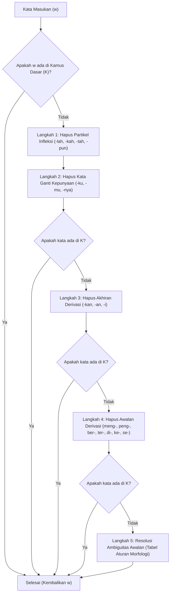

# 📐 FASE 2: ALGORITMA & FORMULASI MATEMATIKA
## Analisis Sentimen & Data Mining Ulasan Mobile JKN (BPJS Kesehatan)

---

## 📌 Daftar Isi
1. [Pengantar Landasan Matematis](#1-pengantar-landasan-matematis)
2. [Algoritma Pemrosesan Bahasa Alami (NLP Preprocessing)](#2-algoritma-pemrosesan-bahasa-alami-nlp-preprocessing)
   - [2.1. Pemetaan Semantik Emoji](#21-pemetaan-semantik-emoji)
   - [2.2. Normalisasi Frasa Idiom Retoris](#22-normalisasi-frasa-idiom-retoris)
   - [2.3. Pembobotan Klausa Konjungsi (Clause Weighting)](#23-pembobotan-klausa-konjungsi-clause-weighting)
   - [2.4. Multi-Step Negation Binding](#24-multi-step-negation-binding)
   - [2.5. Algoritma Morfologis Nazief-Adriani Sastrawi](#25-algoritma-morfologis-nazief-adriani-sastrawi)
   - [2.6. Penyaringan Stopwords Selektif](#26-penyaringan-stopwords-selektif)
3. [Ekstraksi Fitur: TF-IDF Vectorizer](#3-ekstraksi-fitur-tf-idf-vectorizer)
   - [3.1. Sublinear Term Frequency (Sublinear TF)](#31-sublinear-term-frequency-sublinear-tf)
   - [3.2. Smooth Inverse Document Frequency (Smooth IDF)](#32-smooth-inverse-document-frequency-smooth-idf)
   - [3.3. Normalisasi Vektor Euclidean (L2-Norm)](#33-normalisasi-vektor-euclidean-l2-norm)
   - [3.4. Algoritma Fit-Transform TF-IDF](#34-algoritma-fit-transform-tf-idf)
4. [Mesin Klasifikasi: Multinomial Naive Bayes (MNB)](#4-mesin-klasifikasi-multinomial-naive-bayes-mnb)
   - [4.1. Teorema Bayes & Asumsi Independensi](#41-teorema-bayes--asumsi-independensi)
   - [4.2. Probabilitas Prior Kelas P(c)](#42-probabilitas-prior-kelas-pc)
   - [4.3. Likelihood Kata Bersyarat & Laplace Smoothing (α=1.0)](#43-likelihood-kata-bersyarat--laplace-smoothing-α10)
   - [4.4. Akumulasi Log-Likelihood (Anti-Underflow)](#44-akumulasi-log-likelihood-anti-underflow)
   - [4.5. Kalibrasi Probabilitas Posterior via Softmax](#45-kalibrasi-probabilitas-posterior-via-softmax)
5. [Evaluasi Model & Validasi Statistik](#5-evaluasi-model--validasi-statistik)
   - [5.1. Skema 5-Fold Stratified Cross Validation](#51-skema-5-fold-stratified-cross-validation)
   - [5.2. Confusion Matrix & Metrik Klasifikasi](#52-confusion-matrix--metrik-klasifikasi)
   - [5.3. Justifikasi Macro F1-Score](#53-justifikasi-macro-f1-score)
6. [Metrik Bisnis: Net Sentiment Score (NSS)](#6-metrik-bisnis-net-sentiment-score-nss)

---

## 1. Pengantar Landasan Matematis

Dokumen ini menyajikan formalisasi matematis, teori probabilitas, dan rincian algoritma yang menjadi fondasi sistem data mining ulasan Mobile JKN. Formulasi ini dirancang untuk mengatasi tantangan unik pada teks ulasan bahasa Indonesia informal, seperti:
1. Ambiguitas kata negasi (*negation leakage*).
2. Pergeseran polaritas sentimen pada kalimat majemuk bertingkat.
3. *Floating-point arithmetic underflow* pada perkalian rantai probabilitas kecil.
4. *Zero-frequency problem* pada kata yang belum pernah muncul pada data latih.

---

## 2. Algoritma Pemrosesan Bahasa Alami (NLP Preprocessing)

Tahapan preprocessing mentransformasikan teks mentah $D_{\text{raw}} = \{d_1, d_2, \dots, d_N\}$ menjadi himpunan dokumen terstruktur berisi token bersih $D_{\text{clean}} = \{T_1, T_2, \dots, T_N\}$.

```mermaid
flowchart LR
    A["Teks Mentah"] --> B["Emoji Translation"]
    B --> C["Cleansing & Case Folding"]
    C --> D["Idiom Normalization"]
    D --> E["Slang Normalization"]
    E --> F["Clause Splitting"]
    F --> G["Negation Binding"]
    G --> H["Nazief-Adriani Stemmer"]
    H --> I["Stopwords Filter"]
    I --> J["Token Bersih"]
```



### 2.1. Pemetaan Semantik Emoji
Ekspresi emotikon dan emoji Unicode diterjemahkan ke dalam leksikon bahasa Indonesia menggunakan fungsi pemetaan bijektif $f_{\text{emoji}}$:

$$f_{\text{emoji}}(e) = \text{Token}_{\text{Indo}}, \quad \forall e \in \mathcal{E}$$

Di mana $\mathcal{E}$ adalah kamus emoji ([`master_data/emojis.csv`](file:///x:/laragon/kuliah/playstore-mining/master_data/emojis.csv)). Pemetaan diurutkan berdasarkan panjang karakter menurun ($\text{length}(e) \downarrow$) untuk menangani emoji gabungan (*compound emoji*).

$$\text{Contoh:} \quad \text{"Bagus banget "} \mathbf{👍}\mathbf{⭐} \xrightarrow{f_{\text{emoji}}} \text{"Bagus banget emoji\_jempol\_bagus emoji\_bintang\_puas"}$$

### 2.2. Normalisasi Frasa Idiom Retoris
Pengguna sering menggunakan frasa retoris yang secara harfiah tidak memuat kata sentimen eksplisit tetapi bermakna keluhan keras:

$$\mathcal{R}_{\text{idiom}}: \text{String} \longrightarrow \text{String}$$

$$\text{"apa gunanya"} \lor \text{"buat apa"} \lor \text{"gak guna"} \xrightarrow{\mathcal{R}} \text{"tidak berguna"}$$
$$\text{"ujung ujungnya ke kantor"} \lor \text{"sama saja bohong"} \xrightarrow{\mathcal{R}} \text{"kecewa"}$$
$$\text{"tidak memberikan solusi"} \lor \text{"gada solusi"} \xrightarrow{\mathcal{R}} \text{"kecewa tidak solusi"}$$

### 2.3. Pembobotan Klausa Konjungsi (Clause Weighting)
Untuk menangkap pergeseran polaritas pada kalimat majemuk, teks dipecah berdasarkan konjungsi:

1. **Konjungsi Adversatif ($\mathcal{C}_{\text{adv}} = \{\text{tapi, tetapi, namun, sayang, cuma, hanya}\}$)**:
   - Jika dokumen $d$ memiliki struktur $d = [K_1, c_{\text{adv}}, K_2]$, maka klausa $K_2$ (setelah konjungsi) membawa bobot inti $2\times$:
   
   $$\text{Weight}(K_1) = 1, \quad \text{Weight}(K_2) = 2$$

2. **Konjungsi Konsesif ($\mathcal{C}_{\text{conc}} = \{\text{padahal, walaupun, meskipun, kendati}\}$)**:
   - Jika dokumen $d$ memiliki struktur $d = [K_1, c_{\text{conc}}, K_2]$, maka klausa $K_1$ (sebelum konjungsi) memuat keluhan utama berbobot $2\times$:
   
   $$\text{Weight}(K_1) = 2, \quad \text{Weight}(K_2) = 1$$

$$\text{Contoh:} \quad \text{"Aplikasinya bagus } \underbrace{\text{tapi}}_{\text{adv}} \text{ } \underbrace{\text{antrean faskes sering error}}_{K_2 \text{ (Bobot } 2\times\text{)}}"$$

### 2.4. Multi-Step Negation Binding
Kelemahan model *Bag-of-Words* konvensional adalah memisahkan kata negasi dengan kata sifat setelahnya (misal: *"tidak"* dan *"bantu"* dipisah, sehingga kata *"bantu"* terhitung positif). 

Sistem menerapkan **Multi-Step Negation Binding** dengan algoritma sebagai berikut:

```
Algoritma: Multi-Step Negation Binding
Input    : Array token mentah T = [t_1, t_2, ..., t_m], Set Negasi NEG, Set Adverbia FILLER
Output   : Array token terikat T_bound

1. Inisialisasi T_bound = [], skip_indices = Set()
2. Untuk setiap indeks i dari 0 sampai m-1:
3.    Jika t_i ∈ NEG:
4.       target_idx = i + 1
5.       // Lewati adverbia pengisi (filler) maksimal 2 langkah (misal: "tidak terlalu sangat bagus")
6.       Sementara target_idx < m DAN t_{target_idx} ∈ FILLER DAN (target_idx - i <= 2):
7.          target_idx = target_idx + 1
8.       
9.       Jika target_idx < m:
10.         raw_target = t_{target_idx}
11.         // Proteksi: jangan gabung jika target adalah kata ganti (saya, aku, kak)
12.         Jika raw_target ∉ PRONOUNS dan raw_target ∉ STOPWORDS:
13.            stemmed_target = StemWord(raw_target)
14.            compound_token = "tidak_" + stemmed_target
15.            Tambahkan compound_token ke T_bound (sebanyak bobot klausa)
16.            Tambahkan target_idx ke skip_indices
17.            i = target_idx
18.            Lanjutkan ke iterasi berikutnya
19.   Jika i ∉ skip_indices DAN t_i ∉ NEG:
20.      Tambahkan StemWord(t_i) ke T_bound (sebanyak bobot klausa)
21. Return T_bound
```

$$\text{Contoh:} \quad \text{"tidak sanggup membantu"} \xrightarrow{\text{Negation Binding}} \mathbf{\text{"tidak\_bantu"}}$$

### 2.5. Algoritma Morfologis Nazief-Adriani Sastrawi
Algoritma Nazief-Adriani ([`src/nlp/stemmer.js`](file:///x:/laragon/kuliah/playstore-mining/src/nlp/stemmer.js)) mereduksi kata berimbuhan ke kata dasar dengan hierarki penghapusan afiks (*affix stripping*):

$$\text{Bentuk Kata: } [\text{Awalan 1} + [\text{Awalan 2}]] + \text{Kata Dasar} + [\text{Akhiran}] + [\text{Kepunyaan}] + [\text{Partikel}]$$



#### Aturan Disambiguasi Awalan Nazief-Adriani:
| Tipe Awalan | Pola Karakter Kata ($w$) | Transformasi Karakter Dasar | Contoh Kasus |
| :--- | :--- | :--- | :--- |
| **`meng-`** | `meng-` + $\{g, h, q, k\}$ | `meng-V` $\rightarrow$ `k-V` (luluh) atau `V` | *mengurus* $\rightarrow$ *urus*, *mengunci* $\rightarrow$ *kunci* |
| **`mem-`** | `mem-` + $\{b, f, v\}$ | `mem-b...` $\rightarrow$ `b...` | *membayar* $\rightarrow$ *bayar* |
| **`mem-`** | `mem-` + $\{p, v\}$ (luluh) | `mem-P...` $\rightarrow$ `p...` | *memotong* $\rightarrow$ *potong* |
| **`men-`** | `men-` + $\{c, d, j, z\}$ | `men-c...` $\rightarrow$ `c...` | *mendaftar* $\rightarrow$ *daftar* |
| **`meny-`** | `meny-` + Vokal | `meny-V...` $\rightarrow$ `s-V...` | *menyulitkan* $\rightarrow$ *sulit* |
| **`peng-`** | `peng-` + $\{e, g, h, q\}$ | `peng-V...` $\rightarrow$ `k-V...` atau `V...` | *pengguna* $\rightarrow$ *guna* |
| **`ber-`** | `ber-` + Vokal | `ber-V...` $\rightarrow$ `r-V...` atau `V...` | *berobat* $\rightarrow$ *obat* |

#### Optimasi Kamus Domain Khusus BPJS:
Untuk mencegah kesalahan pemotongan istilah medis/asuransi, kamus dasar diperluas dengan istilah domain:
$$\mathcal{K}_{\text{domain}} = \{\text{faskes, antrean, rujukan, autodebet, iuran, skrining, puskesmas, peserta, kepesertaan, klinik, bpjs, jkn, kis, nik, otp}\}$$

### 2.6. Penyaringan Stopwords Selektif
$$\text{Token Bersih} = \{t \in T \mid t \notin \mathcal{S}_{\text{stop}} \lor t \in \mathcal{T}_{\text{sentiment}} \lor \text{startsWith}(t, \text{"tidak\_"})\}$$

---

## 3. Ekstraksi Fitur: TF-IDF Vectorizer

Setiap dokumen ulasan $d$ direpresentasikan sebagai vektor numerik dalam ruang vektor berdimensi $|V|$, di mana $|V|$ adalah total kosakata unik yang memenuhi ambang batas frekuensi dokumen minimum ($\text{minDF} \ge 2$).

### 3.1. Sublinear Term Frequency (Sublinear TF)
Frekuensi kemunculan kata $f_{t, d}$ ditransformasikan menggunakan fungsi logaritmik sublinear untuk mencegah dominasi term berulang:

$$\text{TF}(t, d) = \begin{cases} 
1 + \ln(f_{t, d}), & \text{jika } f_{t, d} > 0 \\ 
0, & \text{jika } f_{t, d} = 0 
\end{cases}$$

### 3.2. Smooth Inverse Document Frequency (Smooth IDF)
Tingkat kekhususan term $t$ di seluruh korpus $N$ dihitung dengan formulasi *Smooth IDF*:

$$\text{IDF}(t) = \ln\left( \frac{1 + N}{1 + \text{DF}(t)} \right) + 1$$

Di mana:
- $N$ = Total jumlah ulasan dalam dataset.
- $\text{DF}(t) = |\{d \in D \mid t \in d\}|$ = Jumlah dokumen yang memuat term $t$.
- Konstanta $+1$ menjamin bahwa term yang muncul di semua dokumen ($\text{DF}(t) = N$) tetap memiliki bobot positif $\text{IDF} = 1.0$, bukan nol.

### 3.3. Normalisasi Vektor Euclidean ($L_2$-Norm)
Bobot mentah $w'_{t, d} = \text{TF}(t, d) \times \text{IDF}(t)$ dinormalisasi menggunakan norma Euclidean ($L_2$) untuk menghilangkan bias variasi panjang teks:

$$w_{t, d} = \frac{w'_{t, d}}{\|\vec{w}'_d\|_2} = \frac{w'_{t, d}}{\sqrt{\sum_{k=1}^{|V|} (w'_{k, d})^2}}$$

Setiap vektor dokumen memenuhi syarat:
$$\|\vec{w}_d\|_2 = \sqrt{\sum_{k=1}^{|V|} (w_{k, d})^2} = 1.0$$

### 3.4. Algoritma Fit-Transform TF-IDF ([`src/ml/vectorizer.js`](file:///x:/laragon/kuliah/playstore-mining/src/ml/vectorizer.js))

```
Algoritma: TF-IDF Fit-Transform
Input    : Dokumen token D = [T_1, T_2, ..., T_N], minDF, maxDFRatio
Output   : Matriks vektor berbobot X = [v_1, v_2, ..., v_N], Vocabulary Map V, IDF Array

1. Hitung DF(t) untuk setiap token unik t pada D.
2. Inisialisasi index = 0, V = Map(), IDF = []
3. maxDF = floor(N * maxDFRatio)
4. Untuk setiap (token t, count df) dalam DF:
5.    Jika df >= minDF DAN df <= maxDF:
6.       V.set(t, index)
7.       IDF[index] = ln((1 + N) / (1 + df)) + 1
8.       index = index + 1
9. 
10. Untuk setiap dokumen T_i dalam D:
11.    Inisialisasi sparse_vector v_i = {}
12.    Hitung frekuensi term f_{t, T_i} untuk setiap token t
13.    sum_sq = 0
14.    Untuk setiap t dengan index j = V.get(t):
15.       tf_val = 1 + ln(f_{t, T_i})
16.       weight = tf_val * IDF[j]
17.       v_i[j] = weight
18.       sum_sq = sum_sq + weight^2
19.    norm = sqrt(sum_sq)
20.    Jika norm > 0:
21.       Bagi setiap v_i[j] dengan norm
22.    Tambahkan v_i ke X
23. Return X, V, IDF
```

---

## 4. Mesin Klasifikasi: Multinomial Naive Bayes (MNB)

### 4.1. Teorema Bayes & Asumsi Independensi
Diberikan representasi vektor dokumen $d = (w_1, w_2, \dots, w_m)$ dan himpunan kelas sentimen $C = \{\text{Positif}, \text{Negatif}\}$, Teorema Bayes menyatakan:

$$P(c | d) = \frac{P(c) \cdot P(d | c)}{P(d)} = \frac{P(c) \cdot P(w_1, w_2, \dots, w_m | c)}{P(d)}$$

Dengan asumsi *Naive* (independensi bersyarat antar fitur), model klasifikasi didefinisikan sebagai:

$$\hat{c} = \arg\max_{c \in C} P(c) \prod_{i=1}^{m} P(w_i | c)^{w_{i, d}}$$

### 4.2. Probabilitas Prior Kelas $P(c)$
Probabilitas awal tiap kelas $c$ dihitung berdasarkan perbandingan jumlah dokumen kelas tersebut terhadap total korpus dengan *Laplace Smoothing*:

$$P(c) = \frac{N_c + 1}{N + |C|}$$

Di mana:
- $N_c$ = Jumlah dokumen latih dengan label kelas $c$.
- $N$ = Total dokumen latih.
- $|C| = 2$ (Positif dan Negatif).

### 4.3. Likelihood Kata Bersyarat & Laplace Smoothing ($\alpha=1.0$)
Probabilitas kemunculan term kata ke-$i$ pada kelas $c$ dihitung dari akumulasi bobot TF-IDF dengan **Laplace Add-One Smoothing ($\alpha = 1.0$)**:

$$P(w_i | c) = \frac{\sum_{d \in D_c} w_{i, d} + \alpha}{\sum_{k=1}^{|V|} \left(\sum_{d \in D_c} w_{k, d}\right) + \alpha \cdot |V|}$$

Di mana:
- $\sum_{d \in D_c} w_{i, d}$ = Total akumulasi bobot TF-IDF fitur kata $w_i$ pada seluruh dokumen kelas $c$.
- $|V|$ = Ukuran total kosakata unik.
- $\alpha = 1.0$ = Menjamin $P(w_i | c) > 0$, sehingga tidak ada nilai perkalian nol (*Zero-Frequency Problem*).

### 4.4. Akumulasi Log-Likelihood (Anti-Underflow)
Perkalian ratusan probabilitas kecil $\prod P(w_i|c)$ pada komputer dapat menghasilkan nilai 0 (*arithmetic underflow*). Oleh karena itu, persamaan ditransformasikan ke dalam penjumlahan logaritma natural:

$$\ln P(c | d) = \ln P(c) + \sum_{i=1}^{|d|} w_{i, d} \cdot \ln P(w_i | c)$$

Keputusan kelas ditentukan oleh nilai log-posterior tertinggi:
$$\hat{c} = \arg\max_{c \in \{\text{Positif}, \text{Negatif}\}} \ln P(c | d)$$

### 4.5. Kalibrasi Probabilitas Posterior via Softmax
Untuk mengubah nilai log-likelihood menjadi probabilitas persentase kepastian $P(c|d) \in [0.0, 1.0]$ yang stabil secara komputasi:

$$M = \max \left( \ln P(\text{Positif}|d), \ln P(\text{Negatif}|d) \right)$$

$$P(\text{Positif} | d) = \frac{\exp(\ln P(\text{Positif} | d) - M)}{\exp(\ln P(\text{Positif} | d) - M) + \exp(\ln P(\text{Negatif} | d) - M)}$$

$$P(\text{Negatif} | d) = 1.0 - P(\text{Positif} | d)$$

- **Confidence Score**:
  $$\text{Confidence}(d) = \max \left( P(\text{Positif} | d), P(\text{Negatif} | d) \right)$$

---

## 5. Evaluasi Model & Validasi Statistik

### 5.1. Skema 5-Fold Stratified Cross Validation
Seluruh dataset $D$ dibagi secara acak dan seimbang (*stratified*) menjadi 5 bagian (*folds*) $F_1, F_2, \dots, F_5$. Pengujian dilakukan sebanyak 5 iterasi ($k=5$):

$$\forall k \in \{1, \dots, 5\}: \quad D_{\text{test}}^{(k)} = F_k, \quad D_{\text{train}}^{(k)} = \bigcup_{j \neq k} F_j$$

Pada setiap iterasi, TF-IDF Vectorizer dan MNB dilatih secara terisolasi hanya pada $D_{\text{train}}^{(k)}$ untuk mencegah kebocoran data (*data leakage*).

### 5.2. Confusion Matrix & Metrik Klasifikasi

Matriks kontingensi $2 \times 2$ mengelompokkan hasil uji:

| Nilai Aktual \ Prediksi | Diprediksi Positif | Diprediksi Negatif | Total Aktual |
| :--- | :---: | :---: | :---: |
| **Aktual Positif** | True Positive ($TP$) | False Negative ($FN$) | $Actual_{\text{pos}} = TP + FN$ |
| **Aktual Negatif** | False Positive ($FP$) | True Negative ($TN$) | $Actual_{\text{neg}} = TN + FP$ |
| **Total Prediksi** | $Pred_{\text{pos}} = TP + FP$ | $Pred_{\text{neg}} = TN + FN$ | Total Dokumen ($N$) |

#### Formulasi Metrik:
1. **Akurasi (Accuracy)**:
   $$\text{Accuracy} = \frac{TP + TN}{TP + FP + TN + FN} \times 100\%$$

2. **Presisi Kelas Positif & Negatif**:
   $$\text{Precision}_{\text{Pos}} = \frac{TP}{TP + FP}, \quad \text{Precision}_{\text{Neg}} = \frac{TN}{TN + FN}$$

3. **Recall (Sensitivitas) Kelas Positif & Negatif**:
   $$\text{Recall}_{\text{Pos}} = \frac{TP}{TP + FN}, \quad \text{Recall}_{\text{Neg}} = \frac{TN}{TN + FP}$$

4. **F1-Score per Kelas (Harmonic Mean)**:
   $$F1_{\text{Pos}} = 2 \times \frac{\text{Precision}_{\text{Pos}} \times \text{Recall}_{\text{Pos}}}{\text{Precision}_{\text{Pos}} + \text{Recall}_{\text{Pos}}}$$
   $$F1_{\text{Neg}} = 2 \times \frac{\text{Precision}_{\text{Neg}} \times \text{Recall}_{\text{Neg}}}{\text{Precision}_{\text{Neg}} + \text{Recall}_{\text{Neg}}}$$

5. **Macro-Averaged F1-Score**:
   $$\text{Macro F1} = \frac{F1_{\text{Pos}} + F1_{\text{Neg}}}{2} \times 100\%$$

### 5.3. Justifikasi Macro F1-Score
Pada dataset ulasan aplikasi publik, distribusi sentimen sering kali tidak seimbang (*imbalanced dataset*), misalnya 75% negatif dan 25% positif.
- **Akurasi Bias**: Jika model memprediksi seluruh data sebagai Negatif, akurasi tetap tinggi ($75\%$), namun model gagal mengenali ulasan Positif ($Recall_{\text{Pos}} = 0\%$).
- **Macro F1-Score Objektif**: Memberikan bobot evaluasi yang setara pada kedua kelas tanpa memandang jumlah sampel, sehingga merefleksikan performa model yang sebenarnya.

---

## 6. Metrik Bisnis: Net Sentiment Score (NSS)

Untuk keperluan pelaporan eksekutif pada level manajemen BPJS Kesehatan, dihitung indeks **Net Sentiment Score (NSS)**:

$$\text{NSS} = \left( \frac{N_{\text{Positif}} - N_{\text{Negatif}}}{N_{\text{Total}}} \right) \times 100\%$$

Di mana:
- $N_{\text{Positif}}$ = Total ulasan yang terklasifikasi sebagai sentimen Positif.
- $N_{\text{Negatif}}$ = Total ulasan yang terklasifikasi sebagai sentimen Negatif.
- $N_{\text{Total}} = N_{\text{Positif}} + N_{\text{Negatif}}$.

### Matriks Interpretasi NSS:
| Rentang Skor NSS | Kategori Persepsi Publik | Tindakan Manajerial yang Disarankan |
| :---: | :---: | :--- |
| **$+50\% \le \text{NSS} \le +100\%$** | *Sangat Positif / Loyal* | Pertahankan fitur unggulan & program kepuasan pengguna. |
| **$+10\% \le \text{NSS} < +50\%$** | *Positif Moderat* | Tingkatkan stabilitas performa pada versi rilis berikutnya. |
| **$-10\% \le \text{NSS} < +10\%$** | *Netral / Kritis* | Investigasi kendala utama pada aspek Autentikasi dan Server. |
| **$-100\% \le \text{NSS} < -10\%$** | *Sangat Negatif / Darurat* | Perbaikan darurat (*hotfix*) terhadap sistem antrean dan login. |

---
*Dokumen ini merupakan referensi matematis dan algoritmis formal untuk proyek Mobile JKN Sentiment Analytics.*
