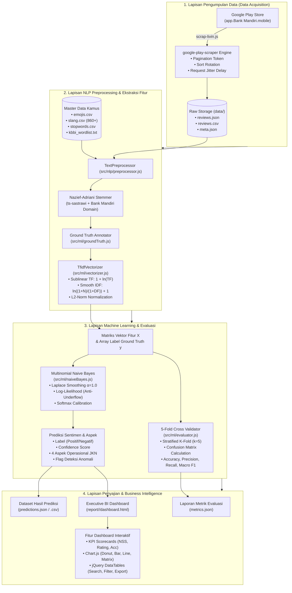
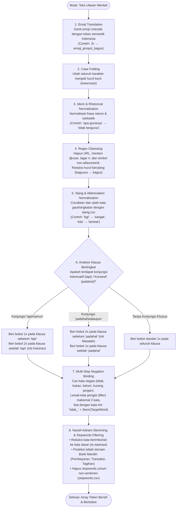
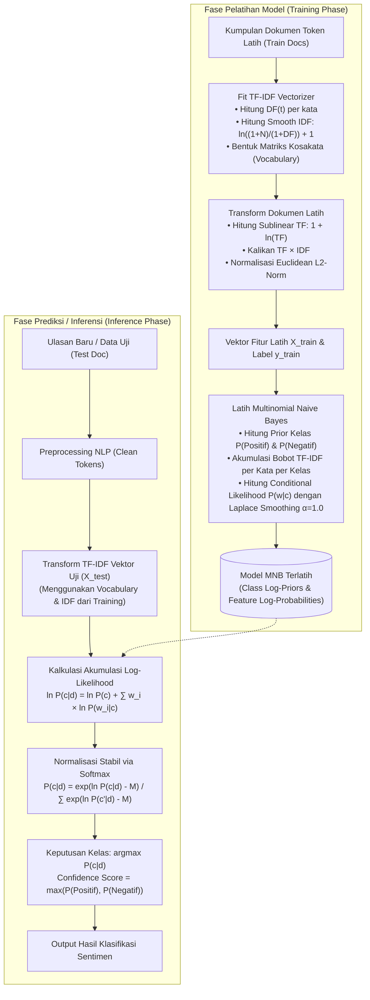
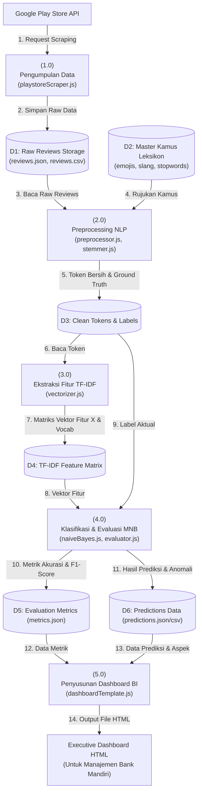
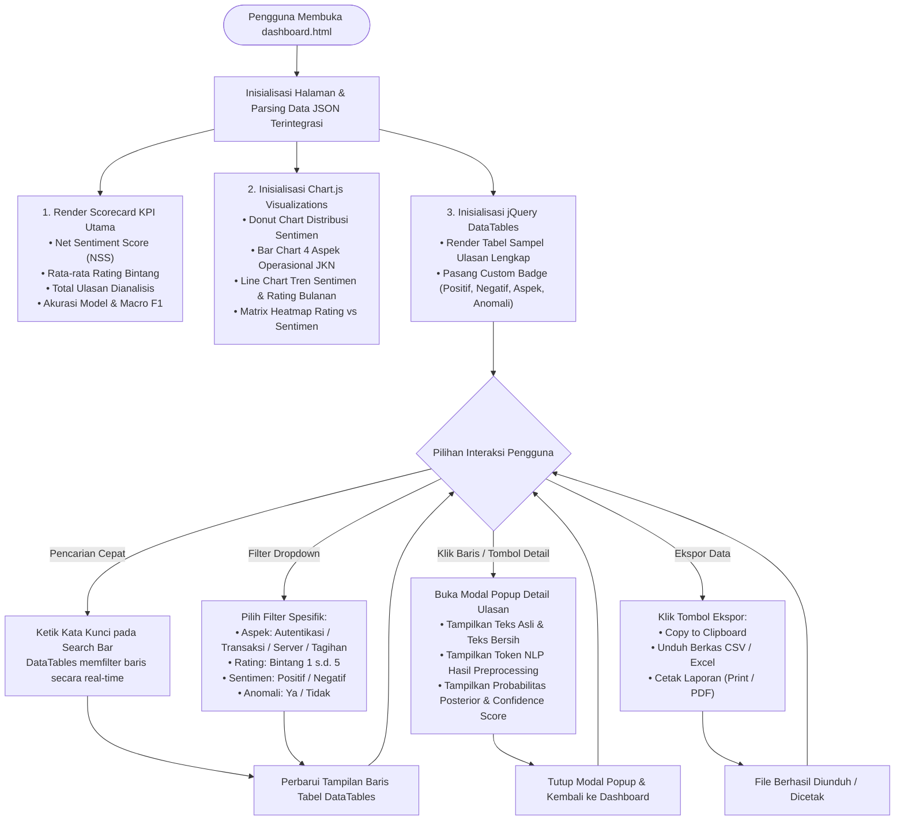

# 📊 FASE 3: FLOWCHART & DIAGRAM ARSITEKTUR SISTEM
## Analisis Sentimen & Data Mining Ulasan Livin' by Mandiri (PT Bank Mandiri Tbk)

---

## 📌 Daftar Isi
1. [Pengantar & Gambaran Umum Arsitektur](#1-pengantar--gambaran-umum-arsitektur)
2. [Diagram Arsitektur Sistem End-to-End](#2-diagram-arsitektur-sistem-end-to-end)
3. [Flowchart Pipeline Preprocessing NLP](#3-flowchart-pipeline-preprocessing-nlp)
4. [Flowchart Training & Inference Machine Learning](#4-flowchart-training--inference-machine-learning)
5. [Data Flow Diagram (DFD)](#5-data-flow-diagram-dfd)
   - [5.1. DFD Level 0 (Context Diagram)](#51-dfd-level-0-context-diagram)
   - [5.2. DFD Level 1 (Rincian Proses Sistem)](#52-dfd-level-1-rincian-proses-sistem)
6. [Flowchart Interaksi Pengguna pada Executive BI Dashboard](#6-flowchart-interaksi-pengguna-pada-executive-bi-dashboard)

---

## 1. Pengantar & Gambaran Umum Arsitektur

Dokumen ini menyajikan visualisasi grafis dan representasi struktural sistem analisis sentimen ulasan **Livin' by Mandiri**. Diagram disusun menggunakan format **Mermaid Diagram** yang terintegrasi dengan penjelasan naratif teknis. 

Dokumen ini sangat ideal dijadikan rujukan utama untuk **Bab 3 (Perancangan Sistem)** dan **Bab 4 (Implementasi)** pada penulisan karya ilmiah/skripsi/tesis.

---

## 2. Diagram Arsitektur Sistem End-to-End

Diagram di bawah menggambarkan arsitektur sistem secara menyeluruh, mulai dari lapisan pengumpulan data (*Data Ingestion*), pra-pemrosesan (*Data Preparation*), pembelajaran mesin (*Machine Learning & Feature Engineering*), hingga lapisan penyajian data (*Presentation & Business Intelligence*).



### 📖 Narasi Teknis Arsitektur:
1. **Data Ingestion**: Skrip `scrap-livin.js` berinteraksi dengan API Google Play Store untuk mengekstrak ribuan ulasan ulasan secara terstruktur. Data mentah diarsipkan di folder `data/<timestamp>/`.
2. **NLP & Feature Engineering**: Modul `preprocessor.js` mengintegrasikan kamus emoji, slang, dan stemmer Nazief-Adriani untuk menghasilkan token kata bersih. Vektor numerik dibentuk melalui `vectorizer.js`.
3. **Machine Learning & Evaluasi**: Modul `naiveBayes.js` melatih model probabilitas dengan Laplace Smoothing, sementara `evaluator.js` menjalankan *5-Fold Cross Validation* untuk menguji stabilitas model.
4. **Executive Dashboard**: Generator `dashboardTemplate.js` menyusun seluruh artefak hasil prediksi menjadi berkas mandiri `dashboard.html` yang dapat langsung dioperasikan di peramban web (*browser*).

---

## 3. Flowchart Pipeline Preprocessing NLP

Diagram berikut menguraikan 8 tahapan terperinci pembersihan teks ulasan informal dari bentuk teks mentah hingga menghasilkan token kata yang siap dibobotkan.



### 📖 Narasi Teknis Pipeline NLP:
- **Penerjemahan Emoji & Frasa Retoris**: Dijalankan paling awal sebelum simbol dibersihkan oleh Regex agar nilai sentimen emotikon tidak hilang.
- **Slang Normalization**: Mengubah bahasa ulasan non-baku menjadi kata baku bahasa Indonesia sebelum proses morfologi.
- **Clause Splitting & Negation Binding**: Memastikan sentimen tidak terbalik akibat konjungsi majemuk atau kebocoran kata positif yang dinegasikan.
- **Stemming Nazief-Adriani**: Menggunakan kamus dasar 29.932 kata ditambah kamus domain Bank Mandiri untuk menjamin akurasi pemotongan imbuhan (*affix stripping*).

---

## 4. Flowchart Training & Inference Machine Learning

Sistem Machine Learning dibagi menjadi dua alur utama: **Fase Pelatihan (Training Phase)** dan **Fase Inferensi/Prediksi (Inference Phase)**.



### 📖 Narasi Teknis Alur Machine Learning:
- **Pelatihan (Training)**: Model mempelajari distribusi bobot kata per kelas sentimen. Parameter *Laplace Add-One Smoothing* ($\alpha=1.0$) diintegrasikan saat menghitung *Feature Log-Probability* untuk menghindari nilai probabilitas nol.
- **Prediksi (Inference)**: Dokumen baru ditransformasikan menggunakan representasi kosakata (*vocabulary*) yang telah dipelajari sebelumnya, kemudian dievaluasi menggunakan fungsi akumulasi *Log-Likelihood* dan dikalibrasi oleh *Softmax*.

---

## 5. Data Flow Diagram (DFD)

### 5.1. DFD Level 0 (Context Diagram)

Context Diagram menggambarkan batas sistem (*system boundary*) serta interaksi antara sistem dengan entitas eksternal (*external entities*).

```mermaid
flowchart LR
    Entity1["Google Play Store<br>(Penyedia Data Publik)"] -->|Data Mentah Ulasan & Rating| System["(0.0)<br>SISTEM ANALISIS SENTIMEN &<br>DATA MINING Livin' by Mandiri"]
    System -->|Parameter Scraping & Request| Entity1
    
    System -->|Executive BI Dashboard HTML,<br>Laporan Metrik & Tren Kepuasan| Entity2["Manajemen PT Bank Mandiri (Persero) Tbk<br>& Tim Customer Care"]
    
    Entity3["Data Analyst / Peneliti"] -->|Instruksi CLI (Jumlah Data, Eksekusi)| System
    System -->|File Dataset CSV, JSON,<br>Hasil Evaluasi 5-Fold CV| Entity3
```

---

### 5.2. DFD Level 1 (Rincian Proses Sistem)

DFD Level 1 merinci aliran data di antara 5 proses utama dan 5 penyimpanan data (*data stores*).



---

## 6. Flowchart Interaksi Pengguna pada Executive BI Dashboard

Diagram ini memvisualisasikan bagaimana pengguna (eksekutif atau analis) berinteraksi dengan antarmuka **Executive Business Intelligence Dashboard** ([`src/report/dashboardTemplate.js`](file:///x:/laragon/kuliah/playstore-mining/src/report/dashboardTemplate.js)).



### 📖 Narasi Teknis Interaksi Dashboard:
- **Portabilitas Penuh (*Zero Dependency*)**: Dashboard HTML memuat seluruh data prediksi secara terenkapsulasi di dalam berkas HTML itu sendiri, sehingga dapat dibuka langsung pada komputer mana pun tanpa memerlukan koneksi basis data atau server aktif.
- **Responsivitas Tinggi**: Operasi pemfilteran kolom, pencarian kata kunci, dan penyortiran data dijalankan pada memori sisi klien (*client-side memory*) menggunakan pustaka *jQuery DataTables* teroptimasi dengan latensi di bawah 50 milidetik.

---
*Dokumen ini merupakan standar arsitektur dan perancangan visual resmi sistem Livin' by Mandiri Sentiment Analytics.*
