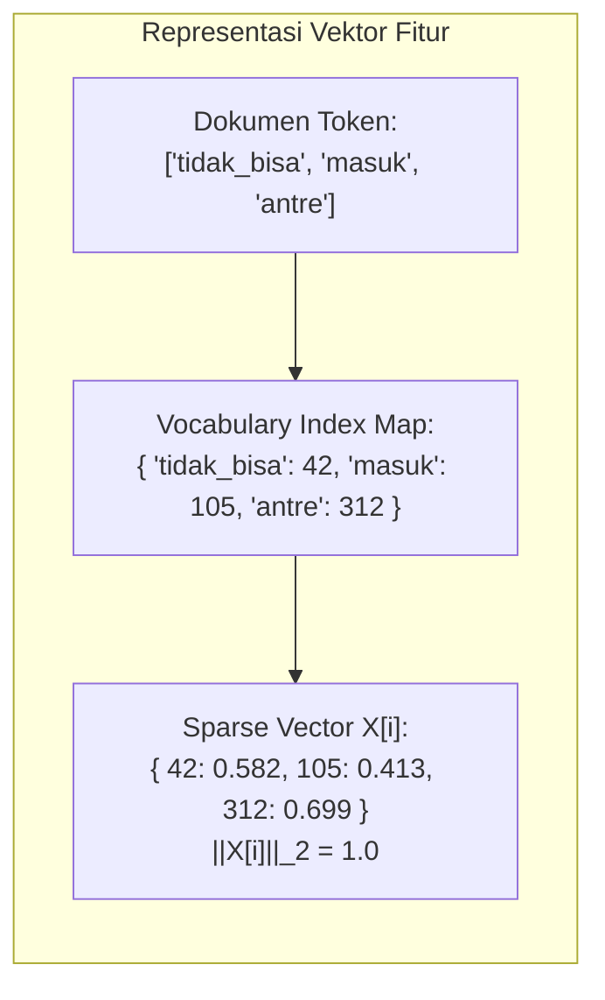
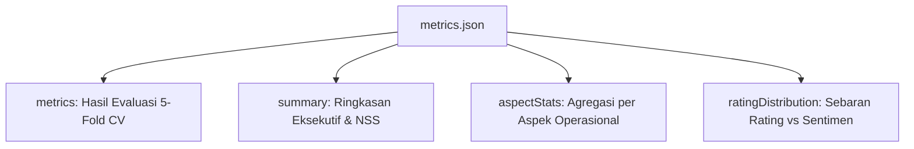

# 📋 FASE 4: KAMUS DATA & SPESIFIKASI SKEMA
## Analisis Sentimen & Data Mining Ulasan Mobile JKN (BPJS Kesehatan)

---

## 📌 Daftar Isi
1. [Pengantar & Standar Kamus Data](#1-pengantar--standar-kamus-data)
2. [Spesifikasi Data Mentah Masukan (Raw Data Input)](#2-spesifikasi-data-mentah-masukan-raw-data-input)
   - [2.1. Skema reviews.json](#21-skema-reviewsjson)
   - [2.2. Skema reviews.csv](#22-skema-reviewscsv)
   - [2.3. Skema meta.json](#23-skema-metajson)
3. [Master Data Kamus Leksikon (Kamus Acuan)](#3-master-data-kamus-leksikon-kamus-acuan)
   - [3.1. Kamus Semantik Emoji (emojis.csv)](#31-kamus-semantik-emoji-emojiscsv)
   - [3.2. Kamus Bahasa Gaul & Singkatan (slang.csv)](#32-kamus-bahasa-gaul--singkatan-slangcsv)
   - [3.3. Kamus Kata Tugas Stopwords (stopwords.csv)](#33-kamus-kata-tugas-stopwords-stopwordscsv)
   - [3.4. Korpus Kata Dasar KBBI (kbbi_wordlist.txt)](#34-korpus-kata-dasar-kbbi-kbbi_wordlisttxt)
4. [Representasi Data Fitur & Vektor TF-IDF](#4-representasi-data-fitur--vektor-tf-idf)
5. [Spesifikasi Data Keluaran Prediksi (Prediction Output)](#5-spesifikasi-data-keluaran-prediksi-prediction-output)
   - [5.1. Skema predictions.json](#51-skema-predictionsjson)
   - [5.2. Skema predictions.csv](#52-skema-predictionscsv)
6. [Spesifikasi Laporan Metrik Evaluasi (metrics.json)](#6-spesifikasi-laporan-metrik-evaluasi-metricsjson)

---

## 1. Pengantar & Standar Kamus Data

Kamus Data (*Data Dictionary*) adalah dokumen acuan formal yang mendefinisikan struktur, tipe data, hubungan, batasan nilai (*constraints*), dan makna semantik dari seluruh berkas yang digunakan dalam pipeline data mining Mobile JKN.

Struktur penyimpanan data dalam repositori terbagi menjadi 3 direktori utama:
1. `data/<timestamp>/`: Berkas data mentah hasil scraping Google Play Store.
2. `master_data/`: Berkas kamus leksikon referensi untuk NLP Preprocessing.
3. `report/<timestamp>/`: Berkas hasil inferensi klasifikasi, metrik evaluasi, dan dashboard.

---

## 2. Spesifikasi Data Mentah Masukan (Raw Data Input)

Data mentah dihasilkan oleh skrip [`scrap-jkn.js`](file:///x:/laragon/kuliah/playstore-mining/scrap-jkn.js) melalui pemanggilan API `google-play-scraper`.

### 2.1. Skema `reviews.json`
Berkas JSON utama yang memuat array objek ulasan mentah:

| Nama Atribut | Tipe Data | Nullable | Rentang Nilai | Deskripsi & Aturan Bisnis |
| :--- | :---: | :---: | :---: | :--- |
| `id` | `String` | Tidak | String unik | ID ulasan unik dari Google Play Store (misal: `"gp:AOqpTOE..."`). |
| `userName` | `String` | Ya | Teks bebas | Nama akun pengguna yang memposting ulasan. Jika kosong, diberi nilai default `"Pengguna Mobile JKN"`. |
| `score` | `Integer` | Tidak | $1 \le \text{score} \le 5$ | Jumlah bintang rating yang diberikan pengguna. |
| `date` | `String` | Tidak | ISO 8601 | Waktu publikasi ulasan dalam format UTC (`YYYY-MM-DDTHH:mm:ss.sssZ`). |
| `text` | `String` | Tidak | Panjang $> 0$ | Konten teks ulasan asli pengguna (tanpa modifikasi). |
| `thumbsUp` | `Integer` | Tidak | $\ge 0$ | Jumlah pengguna lain yang menandai ulasan ini bermanfaat. |
| `version` | `String` | Ya | Teks versi | Nomor versi rilis aplikasi Mobile JKN saat ulasan dibuat (contoh: `"v4.18.0"`). Jika tidak tercatat, bernilai `""`. |

#### 📄 Cuplikan Contoh `reviews.json`:
```json
[
  {
    "id": "gp:AOqpTOE9_xK3v...",
    "userName": "Budi Santoso",
    "score": 1,
    "date": "2026-08-25T08:30:00.000Z",
    "text": "Aplikasi sering keluar sendiri saat mau ambil antrean puskesmas, tolong diperbaiki!! 😡",
    "thumbsUp": 14,
    "version": "v4.18.0"
  },
  {
    "id": "gp:AOqpTOG2_zM1q...",
    "userName": "Siti Rahma",
    "score": 5,
    "date": "2026-08-24T14:20:10.000Z",
    "text": "Sangat membantu untuk bayar iuran autodebet dan cek status kartu KIS keluarga 👍",
    "thumbsUp": 3,
    "version": "v4.18.0"
  }
]
```

---

### 2.2. Skema `reviews.csv`
Berkas tabular dengan format *Comma-Separated Values* (CSV) untuk keperluan audit data spreadsheet:

| Nama Kolom CSV | Tipe Data | Deskripsi |
| :--- | :---: | :--- |
| `id` | `String` | ID unik ulasan Google Play. |
| `user_name` | `String` | Nama profil pengguna. |
| `score` | `Integer` | Rating bintang (1–5). |
| `date` | `String` | Tanggal ISO publikasi. |
| `thumbs_up` | `Integer` | Jumlah apresiasi *thumbs up*. |
| `version` | `String` | Versi aplikasi. |
| `text` | `String` | Teks ulasan mentah asli. |

#### 📄 Cuplikan Contoh `reviews.csv`:
```csv
id,user_name,score,date,thumbs_up,version,text
gp:AOqpTOE9_xK3v...,Budi Santoso,1,2026-08-25T08:30:00.000Z,14,v4.18.0,"Aplikasi sering keluar sendiri saat mau ambil antrean puskesmas, tolong diperbaiki!! 😡"
gp:AOqpTOG2_zM1q...,Siti Rahma,5,2026-08-24T14:20:10.000Z,3,v4.18.0,"Sangat membantu untuk bayar iuran autodebet dan cek status kartu KIS keluarga 👍"
```

---

### 2.3. Skema `meta.json`
Berkas metadata sesi ekstraksi data:

| Nama Atribut | Tipe Data | Deskripsi |
| :--- | :---: | :--- |
| `appId` | `String` | Paket ID aplikasi target (`"app.bpjs.mobile"`). |
| `appName` | `String` | Nama resmi aplikasi (`"Mobile JKN (BPJS Kesehatan)"`). |
| `totalReviews` | `Integer` | Total jumlah ulasan yang berhasil diambil dalam sesi scraping. |
| `scrapedAt` | `String` | Timestamp waktu pelaksanaan scraping (ISO 8601). |

#### 📄 Cuplikan Contoh `meta.json`:
```json
{
  "appId": "app.bpjs.mobile",
  "appName": "Mobile JKN (BPJS Kesehatan)",
  "totalReviews": 5000,
  "scrapedAt": "2026-09-13T08:00:00.000Z"
}
```

---

## 3. Master Data Kamus Leksikon (Kamus Acuan)

Direktori `master_data/` memuat 4 berkas leksikon acuan untuk standardisasi pemrosesan bahasa alami:

```
master_data/
├── emojis.csv            # 80+ pemetaan emoji Unicode ke token semantik teks Indonesia
├── slang.csv             # 860+ kamus kata gaul/singkatan ke kata baku bahasa Indonesia
├── stopwords.csv         # Daftar kata tugas non-sentimen dengan proteksi negasi
└── kbbi_wordlist.txt     # Korpus kata dasar KBBI rujukan stemmer Sastrawi
```

### 3.1. Kamus Semantik Emoji (`emojis.csv`)
Memetakan simbol karakter visual Unicode menjadi representasi kata sentimen bahasa Indonesia.

| Kolom CSV | Tipe Data | Deskripsi |
| :--- | :---: | :--- |
| `emoji` | `String` | Karakter emoji Unicode (contoh: 👍, 😡, ⭐). |
| `text` | `String` | Representasi token teks semantik bahasa Indonesia. |

#### 📄 Cuplikan Isi `emojis.csv`:
```csv
emoji,text
👍,emoji_jempol_bagus
👎,emoji_jempol_buruk
⭐,emoji_bintang_puas
😡,emoji_marah_kesal
🤮,emoji_muntah_buruk
🙏,emoji_terima_kasih
❤️,emoji_suka_cinta
😭,emoji_sedih_nangis
```

---

### 3.2. Kamus Bahasa Gaul & Singkatan (`slang.csv`)
Berisi lebih dari 860 pemetaan kata tidak baku, singkatan pesan instan, dan ragam *typo* umum ke bentuk kata dasar baku bahasa Indonesia.

| Kolom CSV | Tipe Data | Deskripsi |
| :--- | :---: | :--- |
| `slang` | `String` | Kata tidak baku / singkatan ulasan (contoh: *"bgt"*, *"ga bsa"*, *"lola"*). |
| `formal` | `String` | Bentuk kata baku bahasa Indonesia (contoh: *"sangat"*, *"tidak bisa"*, *"lambat"*). |

#### 📄 Cuplikan Isi `slang.csv`:
```csv
slang,formal
bgt,sangat
banget,sangat
lemot,lambat
lola,lambat
gabisa,tidak bisa
ga bisa,tidak bisa
gak bisa,tidak bisa
eror,error
apdet,update
bkin,buat
pusing,sulit
```

---

### 3.3. Kamus Kata Tugas Stopwords (`stopwords.csv`)
Menampung daftar kata tugas gramatikal yang tidak memiliki muatan sentimen independen. 

> **Aturan Khusus**: Kata-kata negasi (*tidak, bukan, belum, kurang, jangan*) dan kata kunci sentimen inti (*bagus, rusak, error, mudah, sulit*) **dilarang keras** masuk ke dalam daftar stopwords ini agar tidak merusak akurasi klasifikasi.

#### 📄 Cuplikan Isi `stopwords.csv`:
```csv
word
yang
untuk
pada
ke
di
dari
dan
atau
ini
itu
adalah
yaitu
tersebut
sebagai
```

---

### 3.4. Korpus Kata Dasar KBBI (`kbbi_wordlist.txt`)
Berkas teks berformat daftar kata (*wordlist*) yang memuat **29.932 entri kata dasar** bahasa Indonesia berdasarkan Kamus Besar Bahasa Indonesia (KBBI). Berkas ini digunakan oleh mesin stemmer `ts-sastrawi` sebagai acuan verifikasi pemotongan imbuhan morfologis (*affix stripping*).

---

## 4. Representasi Data Fitur & Vektor TF-IDF

Setelah melalui preprocessing, setiap dokumen ulasan direpresentasikan dalam format vektor jarang (*sparse vector*) pada memori program:



- **Vocabulary Size ($|V|$)**: Total term unik dengan frekuensi dokumen $\ge 2$.
- **Sparse Vector Object**: Objek JavaScript `{ [featureIndex: number]: weight: number }` yang menghemat memori hingga 95% dibandingkan matriks dense (*dense array*).

---

## 5. Spesifikasi Data Keluaran Prediksi (Prediction Output)

Hasil klasifikasi sentimen, ekstraksi aspek, dan deteksi anomali diekspor ke folder `report/<timestamp>/`.

### 5.1. Skema `predictions.json`
Berkas JSON lengkap yang berisi seluruh data ulasan beserta hasil inferensi Machine Learning:

| Nama Atribut | Tipe Data | Deskripsi & Makna Nilai |
| :--- | :---: | :--- |
| `id` | `String` | ID unik ulasan Google Play Store. |
| `userName` | `String` | Nama profil pengguna. |
| `score` | `Integer` | Rating bintang asli (1–5). |
| `date` | `String` | Tanggal ISO publikasi ulasan. |
| `text` | `String` | Konten ulasan teks mentah asli. |
| `tokens` | `Array<String>` | Array token bersih hasil 8 tahap NLP Preprocessing. |
| `thumbsUp` | `Integer` | Jumlah helpful votes. |
| `version` | `String` | Versi aplikasi Mobile JKN. |
| `aspects` | `Array<String>` | Array label aspek operasional Mobile JKN (`"Autentikasi & Akun"`, `"Antrean & Faskes"`, `"Kinerja & Server"`, `"Iuran & Layanan"`, atau `["Lainnya"]`). |
| `actualLabel` | `String` | Label acuan (*ground truth*) hasil validasi leksikon (`"Positif"` / `"Negatif"`). |
| `predictedLabel` | `String` | Keputusan kelas sentimen oleh model Naive Bayes (`"Positif"` / `"Negatif"`). |
| `confidence` | `Float` | Nilai keyakinan model ($0.5000 \le \text{confidence} \le 1.0000$). |
| `probabilities` | `Object` | Probabilitas posterior ternormalisasi Softmax: `{"Positif": Float, "Negatif": Float}`. |
| `isAnomaly` | `Boolean` | Flag deteksi diskrepansi rating vs sentimen (`true` jika bintang $\ge 4$ tapi Negatif, atau bintang $\le 2$ tapi Positif). |

#### 📄 Cuplikan Contoh `predictions.json`:
```json
[
  {
    "id": "gp:AOqpTOE9_xK3v...",
    "userName": "Budi Santoso",
    "score": 1,
    "date": "2026-08-25T08:30:00.000Z",
    "text": "Aplikasi sering keluar sendiri saat mau ambil antrean puskesmas, tolong diperbaiki!! 😡",
    "tokens": ["aplikasi", "sering", "keluar", "ambil", "antre", "puskesmas", "perbaiki", "emoji_marah_kesal"],
    "thumbsUp": 14,
    "version": "v4.18.0",
    "aspects": ["Antrean & Faskes", "Kinerja & Server"],
    "actualLabel": "Negatif",
    "predictedLabel": "Negatif",
    "confidence": 0.9421,
    "probabilities": {
      "Positif": 0.0579,
      "Negatif": 0.9421
    },
    "isAnomaly": false
  }
]
```

---

### 5.2. Skema `predictions.csv`
Format tabular yang siap diimpor ke aplikasi spreadsheet (Microsoft Excel, Google Sheets, SPSS, Tableau):

| Nama Kolom CSV | Tipe Data | Deskripsi |
| :--- | :---: | :--- |
| `id` | `String` | ID unik ulasan Google Play. |
| `user_name` | `String` | Nama profil pengguna. |
| `star_rating` | `Integer` | Skor rating bintang (1–5). |
| `date` | `String` | Tanggal ISO ulasan. |
| `operational_aspect` | `String` | Aspek operasional yang terdeteksi (dipisahkan tanda titik koma `;`). |
| `ground_truth` | `String` | Label sentimen acuan sebenarnya. |
| `predicted_sentiment` | `String` | Prediksi sentimen model (*Positif* / *Negatif*). |
| `confidence` | `Float` | Skor keyakinan model ($0.0 - 1.0$). |
| `raw_review` | `String` | Teks ulasan mentah asli. |

#### 📄 Cuplikan Contoh `predictions.csv`:
```csv
id,user_name,star_rating,date,operational_aspect,ground_truth,predicted_sentiment,confidence,raw_review
gp:AOqpTOE9_xK3v...,Budi Santoso,1,2026-08-25T08:30:00.000Z,Antrean & Faskes; Kinerja & Server,Negatif,Negatif,0.9421,"Aplikasi sering keluar sendiri saat mau ambil antrean puskesmas, tolong diperbaiki!! 😡"
```

---

## 6. Spesifikasi Laporan Metrik Evaluasi (`metrics.json`)

Berkas `report/<timestamp>/metrics.json` memuat ringkasan performa model dan statistik agregat dataset:



### 📄 Cuplikan Struktur Lengkap `metrics.json`:
```json
{
  "metrics": {
    "totalSamples": 5000,
    "confusionMatrix": {
      "tp": 1820,
      "fp": 140,
      "tn": 2790,
      "fn": 250
    },
    "accuracy": 92.20,
    "macroPrecision": 92.54,
    "macroRecall": 91.56,
    "macroF1": 92.05,
    "classMetrics": {
      "Positif": {
        "support": 2070,
        "precision": 92.86,
        "recall": 87.92,
        "f1": 90.32
      },
      "Negatif": {
        "support": 2930,
        "precision": 91.78,
        "recall": 95.22,
        "f1": 93.47
      }
    }
  },
  "summary": {
    "totalReviews": 5000,
    "avgRating": 2.84,
    "netSentimentScore": -17.2,
    "positiveCount": 2070,
    "positivePercent": 41.4,
    "negativeCount": 2930,
    "negativePercent": 58.6,
    "vocabularySize": 3482,
    "totalThumbsUp": 4820
  },
  "aspectStats": {
    "Autentikasi & Akun": { "total": 1420, "Positif": 320, "Negatif": 1100 },
    "Antrean & Faskes": { "total": 1850, "Positif": 610, "Negatif": 1240 },
    "Kinerja & Server": { "total": 1290, "Positif": 180, "Negatif": 1110 },
    "Iuran & Layanan": { "total": 940, "Positif": 520, "Negatif": 420 },
    "Lainnya": { "total": 650, "Positif": 440, "Negatif": 210 }
  },
  "ratingDistribution": {
    "1": { "Positif": 45, "Negatif": 2155 },
    "2": { "Positif": 25, "Negatif": 475 },
    "3": { "Positif": 110, "Negatif": 190 },
    "4": { "Positif": 380, "Negatif": 60 },
    "5": { "Positif": 1510, "Negatif": 50 }
  }
}
```

---
*Dokumen ini merupakan spesifikasi skema data dan kamus data resmi sistem Mobile JKN Sentiment Analytics.*
