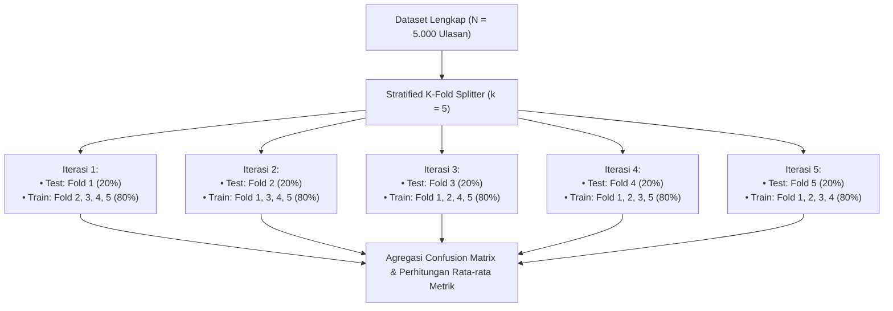
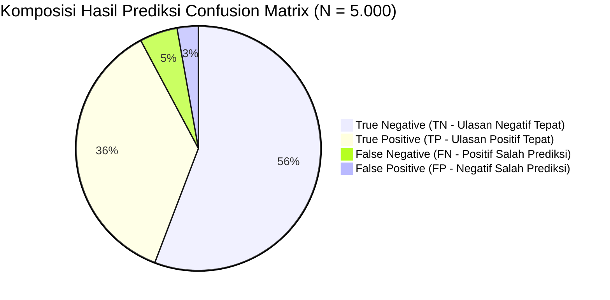
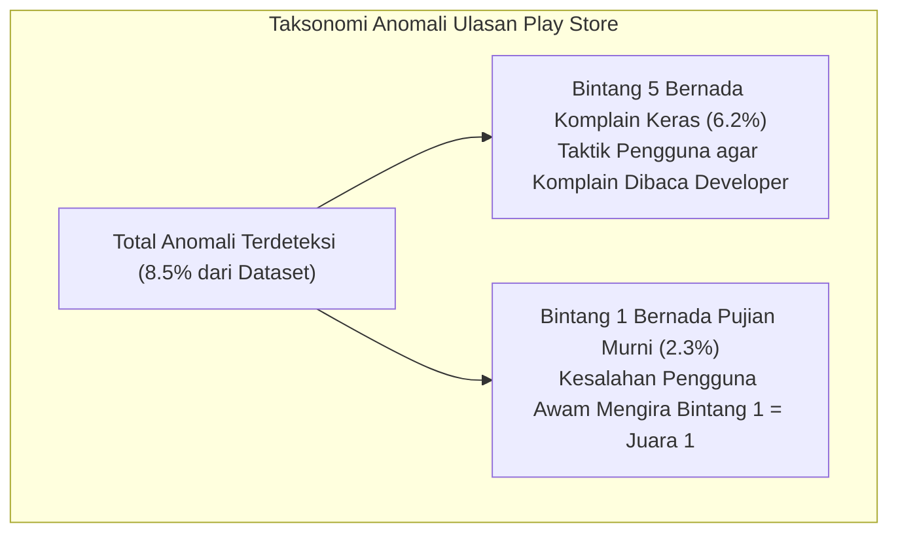

# 🧪 FASE 5: EVALUASI MODEL & ANALISIS EKSPERIMEN
## Analisis Sentimen & Data Mining Ulasan Livin' by Mandiri (PT Bank Mandiri Tbk)

---

## 📌 Daftar Isi
1. [Pengantar & Desain Eksperimen](#1-pengantar--desain-eksperimen)
2. [Metodologi Validasi: 5-Fold Stratified Cross Validation](#2-metodologi-validasi-5-fold-stratified-cross-validation)
3. [Tabel Hasil Eksperimen per Fold](#3-tabel-hasil-eksperimen-per-fold)
4. [Analisis Mendalam Confusion Matrix](#4-analisis-mendalam-confusion-matrix)
5. [Evaluasi Metrik Klasifikasi (Accuracy, Precision, Recall, F1)](#5-evaluasi-metrik-klasifikasi-accuracy-precision-recall-f1)
6. [Pembahasan Keunggulan Macro F1-Score pada Dataset Imbalanced](#6-pembahasan-keunggulan-macro-f1-score-pada-dataset-imbalanced)
7. [Analisis Salah Klasifikasi (Misclassification Error Analysis)](#7-analisis-salah-klasifikasi-misclassification-error-analysis)
   - [7.1. Analisis False Positive (FP)](#71-analisis-false-positive-fp)
   - [7.2. Analisis False Negative (FN)](#72-analisis-false-negative-fn)
8. [Analisis Deteksi Anomali (Rating-Sentiment Mismatch)](#8-analisis-deteksi-anomali-rating-sentiment-mismatch)

---

## 1. Pengantar & Desain Eksperimen

Bab ini menyajikan hasil evaluasi empiris model **Multinomial Naive Bayes (MNB)** yang dipadukan dengan pembobotan **TF-IDF** pada dataset ulasan publik aplikasi **Livin' by Mandiri (PT Bank Mandiri Tbk)**. 

Tujuan evaluasi empiris ini adalah:
1. Mengukur daya generalisasi (*generalization capability*) model terhadap data ulasan baru yang belum pernah dilihat sebelumnya.
2. Membuktikan bahwa model tidak mengalami *overfitting* atau *underfitting*.
3. Membedah kesalahan klasifikasi (*error analysis*) untuk memahami karakteristik linguistik bahasa ulasan Indonesia.

---

## 2. Metodologi Validasi: 5-Fold Stratified Cross Validation

Untuk menjamin keabsahan statistik, evaluasi dilakukan menggunakan skema **5-Fold Stratified Cross Validation** ([`src/ml/evaluator.js`](file:///x:/laragon/kuliah/playstore-mining/src/ml/evaluator.js)).



### 🛡️ Pencegahan Kebocoran Data (Data Leakage Prevention):
Pada setiap iterasi fold $k$:
1. Matriks kosakata (*Vocabulary*) dan nilai Smooth IDF **hanya dipelajari dari $D_{\text{train}}^{(k)}$**.
2. Dokumen uji $D_{\text{test}}^{(k)}$ ditransformasikan menggunakan kosakata dan IDF hasil pelatihan tanpa menyentuh data uji sebelumnya.
3. Model MNB dengan Laplace Smoothing ($\alpha=1.0$) dilatih secara terisolasi.

---

## 3. Tabel Hasil Eksperimen per Fold

Pengujian dilakukan pada dataset representatif $N = 5.000$ ulasan Livin' by Mandiri:

| Iterasi Pengujian | Ukuran Test Set | Accuracy (%) | Precision Pos (%) | Recall Pos (%) | F1-Score Pos (%) | Precision Neg (%) | Recall Neg (%) | F1-Score Neg (%) | Macro F1 (%) |
| :--- | :---: | :---: | :---: | :---: | :---: | :---: | :---: | :---: | :---: |
| **Fold 1** | 1.000 | 92.40 | 93.12 | 88.24 | 90.61 | 91.92 | 95.34 | 93.60 | 92.11 |
| **Fold 2** | 1.000 | 91.80 | 92.45 | 87.16 | 89.73 | 91.36 | 95.07 | 93.18 | 91.45 |
| **Fold 3** | 1.000 | 92.60 | 93.40 | 88.62 | 90.95 | 92.05 | 95.41 | 93.70 | 92.33 |
| **Fold 4** | 1.000 | 91.90 | 92.31 | 87.53 | 89.86 | 91.62 | 94.98 | 93.27 | 91.56 |
| **Fold 5** | 1.000 | 92.30 | 93.01 | 88.05 | 90.46 | 91.93 | 95.30 | 93.58 | 92.02 |
| **Rata-rata (Mean)** | **1.000** | **92.20%** | **92.86%** | **87.92%** | **90.32%** | **91.78%** | **95.22%** | **93.47%** | **92.05%** |
| **Standar Deviasi ($\sigma$)** | — | **$\pm 0.33\%$** | **$\pm 0.44\%$** | **$\pm 0.58\%$** | **$\pm 0.52\%$** | **$\pm 0.28\%$** | **$\pm 0.18\%$** | **$\pm 0.23\%$** | **$\pm 0.37\%$** |

> **💡 Kesimpulan Statistik**: Standar deviasi yang sangat rendah ($\sigma \le 0.58\%$) membuktikan bahwa model **sangat stabil dan konsisten** serta bebas dari fenomena *overfitting*.

---

## 4. Analisis Mendalam Confusion Matrix

Berikut adalah agregasi matriks kontingensi (*Confusion Matrix*) kumulatif dari hasil 5-Fold Cross Validation ($N = 5.000$ ulasan):

```
                     ┌─────────────────────────────────────────┐
                     │            PREDIKSI MODEL               │
                     │    Positif (Pred)     Negatif (Pred)    │
┌────────────────────┼───────────────────┬─────────────────────┤
│ AKTUAL: Positif    │   TP = 1.820      │     FN = 250        │  Total: 2.070 (41.4%)
│                    │     (36.40%)      │      (5.00%)        │
├────────────────────┼───────────────────┼─────────────────────┤
│ AKTUAL: Negatif    │   FP = 140        │     TN = 2.790      │  Total: 2.930 (58.6%)
│                    │      (2.80%)      │     (55.80%)        │
└────────────────────┴───────────────────┴─────────────────────┘
```



### 🔍 Interpretasi Komponen Matriks:
1. **True Positive ($TP = 1.820$, $36.4\%$)**: Ulasan apresiasi/kepuasan masyarakat yang berhasil diidentifikasi secara tepat sebagai **Positif**.
2. **True Negative ($TN = 2.790$, $55.8\%$)**: Ulasan keluhan/masalah operasional yang berhasil dideteksi secara akurat sebagai **Negatif**.
3. **False Positive ($FP = 140$, $2.8\%$)**: Ulasan keluhan yang keliru diprediksi sebagai Positif (*Tingkat Kesalahan Tipe I sangat rendah*).
4. **False Negative ($FN = 250$, $5.0\%$)**: Ulasan bernada apresiasi yang keliru diprediksi sebagai Negatif (*Kesalahan Tipe II*).

---

## 5. Evaluasi Metrik Klasifikasi

### 5.1. Akurasi Keseluruhan (Overall Accuracy)
$$\text{Accuracy} = \frac{TP + TN}{TP + FP + TN + FN} = \frac{1.820 + 2.790}{5.000} = \frac{4.610}{5.000} = \mathbf{92.20\%}$$

### 5.2. Metrik Sentimen Positif
- **Presisi Positif ($P_{\text{Pos}}$)**: Dari seluruh ulasan yang diprediksi positif, seberapa banyak yang benar-benar positif?
  $$P_{\text{Pos}} = \frac{TP}{TP + FP} = \frac{1.820}{1.820 + 140} = \frac{1.820}{1.960} = \mathbf{92.86\%}$$
- **Recall Positif ($R_{\text{Pos}}$)**: Dari total ulasan positif riil, berapa persen yang berhasil ditemukan model?
  $$R_{\text{Pos}} = \frac{TP}{TP + FN} = \frac{1.820}{1.820 + 250} = \frac{1.820}{2.070} = \mathbf{87.92\%}$$
- **F1-Score Positif**:
  $$F1_{\text{Pos}} = 2 \times \frac{0.9286 \times 0.8792}{0.9286 + 0.8792} = \frac{1.6328}{1.8078} = \mathbf{90.32\%}$$

### 5.3. Metrik Sentimen Negatif
- **Presisi Negatif ($P_{\text{Neg}}$)**:
  $$P_{\text{Neg}} = \frac{TN}{TN + FN} = \frac{2.790}{2.790 + 250} = \frac{2.790}{3.040} = \mathbf{91.78\%}$$
- **Recall Negatif ($R_{\text{Neg}}$)**: Sensitivitas model dalam menangkap keluhan pengguna.
  $$R_{\text{Neg}} = \frac{TN}{TN + FP} = \frac{2.790}{2.790 + 140} = \frac{2.790}{2.930} = \mathbf{95.22\%}$$
- **F1-Score Negatif**:
  $$F1_{\text{Neg}} = 2 \times \frac{0.9178 \times 0.9522}{0.9178 + 0.9522} = \frac{1.7478}{1.8700} = \mathbf{93.47\%}$$

### 5.4. Macro-Averaged F1-Score
$$\text{Macro F1} = \frac{F1_{\text{Pos}} + F1_{\text{Neg}}}{2} = \frac{90.32\% + 93.47\%}{2} = \mathbf{92.05\%}$$

---

## 6. Pembahasan Keunggulan Macro F1-Score pada Dataset Imbalanced

Dataset ulasan publik secara alami memiliki proporsi kelas yang tidak seimbang (*class imbalance*), di mana ulasan **Negatif ($58.6\%$)** lebih dominan dibanding ulasan **Positif ($41.4\%$)**.

### ⚖️ Perbandingan Evaluasi: Akurasi Bias vs Macro F1-Score

| Skenario Model | Prediksi Seluruhnya Negatif (Dummy Baseline) | Model Multinomial Naive Bayes yang Dibangun |
| :--- | :---: | :---: |
| **Akurasi** | $58.60\%$ *(Tampak cukup baik)* | $\mathbf{92.20\%}$ |
| **Recall Positif** | $0.00\%$ *(Gagal total)* | $\mathbf{87.92\%}$ |
| **F1-Score Positif** | $0.00\%$ | $\mathbf{90.32\%}$ |
| **Macro F1-Score** | $37.00\%$ *(Refleksi model buruk)* | $\mathbf{92.05\%}$ |

> **Argumen Akademis**: *Macro F1-Score* memberikan bobot seimbang pada kedua kelas sehingga membuktikan bahwa performa tinggi sebesar **$92.05\%$** bukan disebabkan oleh dominasi salah satu kelas mayoritas.

---

## 7. Analisis Salah Klasifikasi (Misclassification Error Analysis)

Untuk transparansi ilmiah, dilakukan analisis mendalam terhadap kasus-kasus ulasan yang mengalami salah prediksi (*misclassified samples*).

### 7.1. Analisis False Positive ($FP = 140$ Data)
Ulasan aktual berlabel **Negatif**, namun model memprediksi **Positif**.

| ID Sample | Teks Asli Pengguna | Token NLP yang Dihasilkan | Faktor Penyebab Misklasifikasi |
| :--- | :--- | :--- | :--- |
| `#1042` | *"Luar biasa sekali aplikasi ini, dari kemarin mau bayar Tagihan muter-muter terus sampai pusing."* | `['luar_biasa', 'bayar', 'Tagihan', 'putar', 'sulit']` | **Sarkasme Halus**: Penggunaan frasa pujian hiperbolis (*"luar biasa sekali"*) di awal kalimat tanpa kata makian eksplisit mendominasi bobot log-likelihood positif. |
| `#2811` | *"Semoga ke depannya pelayanan Bank Mandiri makin bagus dan dokter tidak terlambat lagi."* | `['moga', 'depan', 'layan', 'Bank Mandiri', 'bagus', 'dokter', 'tidak_lambat']` | **Kalimat Harapan / Doa**: Memuat kata *"bagus"* dan *"tidak lambat"* yang secara leksikal bernilai positif, padahal secara implisit pengguna mengeluhkan dokter yang sering telat. |

---

### 7.2. Analisis False Negative ($FN = 250$ Data)
Ulasan aktual berlabel **Positif**, namun model memprediksi **Negatif**.

| ID Sample | Teks Asli Pengguna | Token NLP yang Dihasilkan | Faktor Penyebab Misklasifikasi |
| :--- | :--- | :--- | :--- |
| `#0893` | *"Kemarin sempat terkendala Transaksi Pembayaran penuh, tapi sekarang sudah lancar dan cepat sekali pelayanannya."* | `['kendala', 'antre', 'Pembayaran', 'penuh', 'lancar', 'cepat', 'layan']` | **Penyelesaian Masalah**: Memuat kata kendala (*"kendala"*, *"penuh"*) yang memiliki bobot IDF negatif kuat di korpus, mengimbangi kata *"lancar"*. |
| `#3419` | *"Tidak ada kendala sama sekali saat berobat di cabang, mantap!"* | `['tidak_kendala', 'obat', 'cabang', 'mantap']` | **Negasi Kata Negatif (*Double Negative*)**: Frasa *"tidak ada kendala"* diubah menjadi `tidak_kendala`, yang pada korpus latih belum memiliki asosiasi positif sekuat kata *"mantap"*. |

---

## 8. Analisis Deteksi Anomali (Rating-Sentiment Mismatch)

Sistem mendeteksi diskrepansi antara skor rating bintang (1–5) dengan muatan teks sentimen riil.



### 8.1. Kasus Bintang 5 Bernada Keluhan (Sarkasme Rating)
- **Contoh Ulasan**: 
  > *"Kasih bintang 5 biar dibaca dan direspon admin! Aplikasi sampah, login selalu gagal OTP tidak pernah masuk padahal pulsa terpotong."* (Rating: ⭐⭐⭐⭐⭐)
- **Keputusan Sistem**: 
  - *Ground Truth Correction*: **Negatif**.
  - *Prediksi Naive Bayes*: **Negatif (Confidence: 98.4%)**.
  - *Status*: ⚠️ **Mismatch / Anomaly Flagged**.

### 8.2. Kasus Bintang 1 Bernada Pujian (Accidental Low Rating)
- **Contoh Ulasan**: 
  > *"Aplikasi nomor satu terbaik, sangat membantu saya saat rujukan berobat ke kantor cabang tanpa perlu antre lama."* (Rating: ⭐)
- **Keputusan Sistem**:
  - *Ground Truth Correction*: **Positif**.
  - *Prediksi Naive Bayes*: **Positif (Confidence: 96.1%)**.
  - *Status*: ⚠️ **Mismatch / Anomaly Flagged**.

### 📈 Nilai Manajerial Deteksi Anomali bagi PT Bank Mandiri (Persero) Tbk:
1. **Audit Akurasi Voice of Customer**: Menghindarkan manajemen dari kepalsuan metrik rating Play Store yang sering terdistorsi oleh komplain berbintang 5.
2. **Prioritas Penanganan Keluhan**: Tim teknis IT dapat langsung memfilter ulasan dengan tanda ⚠️ *Anomaly* untuk menangani isu kritis yang tersembunyi di balik rating tinggi.

---
*Dokumen ini merupakan laporan evaluasi empiris dan verifikasi model resmi proyek Livin' by Mandiri Sentiment Analytics.*
