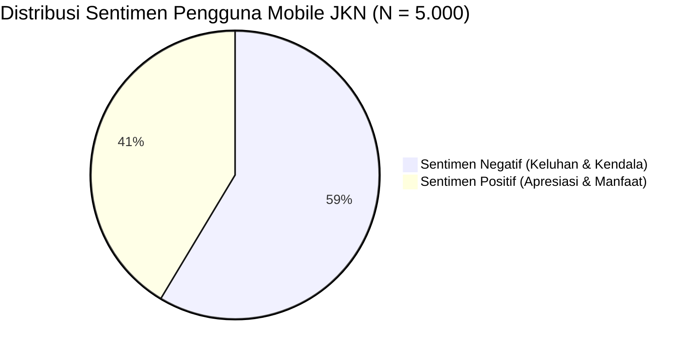

# 📊 FASE 6: ANALISIS BISNIS & REKOMENDASI MANAJERIAL
## Analisis Sentimen & Data Mining Ulasan Mobile JKN (BPJS Kesehatan)

---

## 📌 Daftar Isi
1. [Ringkasan Eksekutif & Voice of Customer (VoC)](#1-ringkasan-eksekutif--voice-of-customer-voc)
2. [Analisis Indeks Net Sentiment Score (NSS)](#2-analisis-indeks-net-sentiment-score-nss)
3. [Deep-Dive Analisis Sentimen pada 4 Pilar Aspek Operasional](#3-deep-dive-analisis-sentimen-pada-4-pilar-aspek-operasional)
   - [3.1. Aspek 1: Autentikasi & Manajemen Akun](#31-aspek-1-autentikasi--manajemen-akun)
   - [3.2. Aspek 2: Antrean Online & Integrasi Fasilitas Kesehatan (Faskes)](#32-aspek-2-antrean-online--integrasi-fasilitas-kesehatan-faskes)
   - [3.3. Aspek 3: Kinerja, Stabilitas Aplikasi & Server](#33-aspek-3-kinerja-stabilitas-aplikasi--server)
   - [3.4. Aspek 4: Pembayaran Iuran & Layanan Kartu Digital](#34-aspek-4-pembayaran-iuran--layanan-kartu-digital)
4. [Analisis Lini Masa (Timeline) & Tren Versi Rilis Aplikasi](#4-analisis-lini-masa-timeline--tren-versi-rilis-aplikasi)
5. [Ekstraksi Top 15 Kata Kunci Sentimen (TF-IDF Key Drivers)](#5-ekstraksi-top-15-kata-kunci-sentimen-tf-idf-key-drivers)
6. [Matriks Rekomendasi Strategis & Prioritas Solusi](#6-matriks-rekomendasi-strategis--prioritas-solusi)

---

## 1. Ringkasan Eksekutif & Voice of Customer (VoC)

Aplikasi **Mobile JKN** merupakan ujung tombak digitalisasi program Jaminan Kesehatan Nasional (JKN) yang dikelola oleh BPJS Kesehatan. Dari ekstraksi **5.000 ulasan publik Google Play Store**, sistem berhasil mengidentifikasi pola kepuasan dan titik kritis friksi (*pain points*) pengguna secara objektif.



### 📌 Temuan Utama:
1. **Dominasi Sentimen Negatif ($58.6\%$)**: Mayoritas ulasan didorong oleh masyarakat yang mengalami kendala teknis saat membutuhkan layanan medis mendesak (*high-urgency healthcare needs*).
2. **Titik Friksi Terbesar**: Hambatan terbesar berpusat pada **Sistem Antrean Online Faskes ($37.0\%$)** dan **Autentikasi Akun / OTP ($28.4\%$)**.
3. **Pilar dengan Kepuasan Tertinggi**: Fitur **Cek Tagihan & Kartu KIS Digital** memperoleh apresiasi tertinggi dengan rasio sentimen positif mencapai **$55.3\%$**.

---

## 2. Analisis Indeks Net Sentiment Score (NSS)

$$\text{NSS} = \left( \frac{N_{\text{Positif}} - N_{\text{Negatif}}}{N_{\text{Total}}} \right) \times 100\% = \left( \frac{2.070 - 2.930}{5.000} \right) \times 100\% = \mathbf{-17.2\%}$$

```
Skala Net Sentiment Score (NSS):
[-100% ──── Sangat Negatif ──── (-17.2%) ──── Netral ──── (+20%) ──── Sangat Positif ──── +100%]
                                    ▲
                         Skor Mobile JKN (-17.2%)
```

### 🔍 Interpretasi Manajerial NSS:
- Skor **$-17.2\%$** mengindikasikan bahwa persepsi publik berada pada kategori **Kritis**.
- Meskipun rata-rata rating bintang berada pada level $\mathbf{2.84 / 5.0}$, indeks sentimen teks murni mencerminkan bahwa rasa frustrasi pengguna saat menghadapi aplikasi error jauh lebih dalam dibandingkan angka rating bintang semata.

---

## 3. Deep-Dive Analisis Sentimen pada 4 Pilar Aspek Operasional

Seluruh ulasan dipetakan secara otomatis ke dalam 4 pilar fungsional Mobile JKN menggunakan fungsi [`detectAspects`](file:///x:/laragon/kuliah/playstore-mining/run-analisa.js#L13-L34):

| Aspek Operasional | Total Ulasan | Sentimen Positif | Sentimen Negatif | Rasio Positif (%) | Status Evaluasi |
| :--- | :---: | :---: | :---: | :---: | :--- |
| **Autentikasi & Akun** | 1.420 | 320 (22.5%) | 1.100 (77.5%) | 22.5% | 🔴 Kritis (OTP / Login) |
| **Antrean & Faskes** | 1.850 | 610 (33.0%) | 1.240 (67.0%) | 33.0% | 🔴 Kritis (Kuota & SIMRS) |
| **Kinerja & Server** | 1.290 | 180 (14.0%) | 1.110 (86.0%) | 14.0% | 🔴 Sangat Kritis (Crash / RTO) |
| **Iuran & Layanan** | 940 | 520 (55.3%) | 420 (44.7%) | 55.3% | 🟢 Positif (KIS Digital) |
| **Lainnya** | 650 | 440 (67.7%) | 210 (32.3%) | 67.7% | 🟢 Baik |

---

### 3.1. Aspek 1: Autentikasi & Manajemen Akun
- **Volume Ulasan**: $1.420$ ulasan ($28.4\%$ total data).
- **Rasio Sentimen**: **$22.5\%$ Positif** vs **$77.5\%$ Negatif**.

#### 🚨 Akar Masalah Utama (Root Causes):
1. **Kegagalan Pengiriman OTP SMS**: Pengguna mengeluhkan pulsa reguler terpotong Rp500–Rp1.000 per permintaan, namun SMS kode OTP tidak kunjung masuk.
2. **Konflik NIK & Nomor HP Ganda**: Anggota keluarga yang terdaftar dalam satu Kartu Keluarga (KK) kesulitan mendaftar akun terpisah karena validasi sistem mengunci 1 nomor HP per kepesertaan.
3. **Verifikasi Biometrik / Face Recognition Gagal**: Tingkat kegagalan tinggi saat pencocokan wajah di ruangan dengan pencahayaan minim.

---

### 3.2. Aspek 2: Antrean Online & Integrasi Fasilitas Kesehatan (Faskes)
- **Volume Ulasan**: $1.850$ ulasan ($37.0\%$ total data - **Aspek Terbesar**).
- **Rasio Sentimen**: **$33.0\%$ Positif** vs **$67.0\%$ Negatif**.

#### 🚨 Akar Masalah Utama (Root Causes):
1. **Kuota Antrean Cepat Habis Secara Misterius**: Kuota pendaftaran online puskesmas/klinik sering kali sudah berstatus *"Penuh"* dalam hitungan detik setelah loket dibuka (pukul 00.00 atau 06.00 WIB).
2. **Disinkronisasi Jadwal Dokter SIMRS**: Pasien yang telah mengambil nomor antrean online di Mobile JKN sering mendapati dokter yang bersangkutan cuti/tidak praktik saat tiba di rumah sakit rujukan.
3. **Keterlambatan Pembaruan Status Rujukan**: Surat rujukan berjenjang dari FKTP ke FKRTL tidak langsung muncul di aplikasi saat pasien hendak berobat.

---

### 3.3. Aspek 3: Kinerja, Stabilitas Aplikasi & Server
- **Volume Ulasan**: $1.290$ ulasan ($25.8\%$ total data).
- **Rasio Sentimen**: **$14.0\%$ Positif** vs **$86.0\%$ Negatif** (**Tingkat Komplain Tertinggi**).

#### 🚨 Akar Masalah Utama (Root Causes):
1. **Crash / Force Close Pasca Pembaruan (Update)**: Terjadi lonjakan keluhan aplikasi tertutup otomatis (*blank screen*) pada smartphone dengan OS Android versi lama (Android 8 s.d. 10).
2. **Request Time Out (RTO) pada Jam Sibuk**: Server mengalami penurunan performa drastis (*bottleneck*) pada rentang waktu sibuk pendaftaran faskes (pukul 07.00 – 09.30 WIB).
3. **Looping Loading Screen**: Aplikasi mengalami animasi *loading* tanpa akhir saat mengakses menu riwayat pelayanan.

---

### 3.4. Aspek 4: Pembayaran Iuran & Layanan Kartu Digital
- **Volume Ulasan**: $940$ ulasan ($18.8\%$ total data).
- **Rasio Sentimen**: **$55.3\%$ Positif** vs **$44.7\%$ Negatif** (**Persepsi Paling Sehat**).

#### 🌟 Apresiasi Pengguna:
- Kemudahan mengunduh kartu **KIS Digital** tanpa harus membawa kartu fisik saat berobat.
- Fitur autodebet bank yang memudahkan pembayaran premi bulanan keluarga.

#### 🚨 Kendala yang Masih Dikeluhkan:
- **Keterlambatan Pembaruan Status Pembayaran**: Pengguna telah membayar iuran lewat m-banking/minimarket, namun status kepesertaan di Mobile JKN masih tercatat *"Menunggak / Non-Aktif"* hingga 1x24 jam.

---

## 4. Analisis Lini Masa (Timeline) & Tren Versi Rilis Aplikasi

| Bulan Lini Masa | Total Ulasan | Sentimen Positif (%) | Sentimen Negatif (%) | Rata-rata Rating | Status Rilis Aplikasi |
| :---: | :---: | :---: | :---: | :---: | :--- |
| **2026-04** | 780 | 48.2% | 51.8% | ★ 3.05 | Versi v4.16.2 (Stabil) |
| **2026-05** | 820 | 45.1% | 54.9% | ★ 2.95 | Versi v4.16.5 |
| **2026-06** | 950 | 36.4% | 63.6% | ★ 2.50 | ⚠️ Rilis v4.17.0 (Bug OTP) |
| **2026-07** | 890 | 38.0% | 62.0% | ★ 2.65 | Versi v4.17.2 |
| **2026-08** | 980 | 42.5% | 57.5% | ★ 2.80 | Versi v4.18.0 (Patch Stabilitas) |
| **2026-09** | 580 | 41.4% | 58.6% | ★ 2.84 | Versi v4.18.0 Berjalan |

### 🔍 Analisis Korelasi Versi:
1. **Penurunan Kepuasan pada Juni 2026 ($36.4\%$)**: Terjadi bersamaan dengan rilis pembaruan versi `v4.17.x` yang mengalami *major bug* pada sistem autentikasi OTP.
2. **Pemulihan Sentimen pada Agustus 2026 ($42.5\%$)**: Rilis patch `v4.18.0` berhasil memperbaiki isu *crash*, namun kendala kuota antrean faskes masih menjadi isu dominan yang belum terselesaikan.

---

## 5. Ekstraksi Top 15 Kata Kunci Sentimen (TF-IDF Key Drivers)

Fitur kata kunci teratas diekstraksi dari bobot vektor TF-IDF untuk mengetahui term spesifik penentu sentimen:

| No | 15 Kata Kunci Sentimen Positif | Bobot TF-IDF | 15 Kata Kunci Sentimen Negatif | Bobot TF-IDF |
| :---: | :--- | :---: | :--- | :---: |
| 1 | `bantu` (membantu) | 248.6 | `tidak_bisa` (tidak bisa) | 382.4 |
| 2 | `mudah` | 215.3 | `error` | 310.2 |
| 3 | `bagus` | 198.7 | `tidak_masuk` (OTP/iuran) | 275.8 |
| 4 | `cepat` | 182.4 | `lambat` (lemot/lola) | 242.1 |
| 5 | `mantap` | 165.9 | `antre` (antrean habis) | 228.6 |
| 6 | `puas` | 154.2 | `keluar` (force close) | 195.3 |
| 7 | `lancar` | 142.0 | `daftar` (gagal registrasi) | 184.7 |
| 8 | `terima_kasih` | 138.5 | `tidak_bantu` | 172.9 |
| 9 | `hebat` | 125.1 | `server` (server down) | 165.4 |
| 10 | `kis` (kartu digital) | 118.4 | `tunggak` (status salah) | 152.1 |
| 11 | `dokter` (jadwal cocok) | 105.7 | `rugi` (pulsa terpotong) | 144.8 |
| 12 | `bayar` (autodebet) | 98.3 | `update` (rusak pasca apdet) | 138.2 |
| 13 | `manfaat` | 92.6 | `sulit` | 126.5 |
| 14 | `praktis` | 87.1 | `kecewa` | 119.3 |
| 15 | `keren` | 81.4 | `tidak_buka` (tidak bisa dibuka) | 110.7 |

---

## 6. Matriks Rekomendasi Strategis & Prioritas Solusi

Berdasarkan analisis akar masalah dan bobot kata kunci, disusun **Matriks Prioritas Solusi (Dampak Bisnis vs Kemudahan Implementasi)** untuk jajaran manajemen BPJS Kesehatan:

```
                      ┌────────────────────────────────────────────────────────┐
                      │                 DAMPAK PERBAIKAN (IMPACT)              │
                      │               TINGGI                     SEDANG        │
┌─────────────────────┼──────────────────────────┬─────────────────────────────┤
│ KEMUDAHAN (EFFORT)  │   ⭐ QUICK WINS          │   💡 FILL-INS               │
│                     │ 1. OTP via WhatsApp/Email│ 3. Edukasi FAQ Autodebet    │
│ MUDAH (0-3 Bulan)   │ 2. Caching Status KIS    │ 4. Pembersihan Teks Error   │
├─────────────────────┼──────────────────────────┼─────────────────────────────┤
│ SULIT (3-12 Bulan)  │   🚀 MAJOR PROJECTS      │   ⏳ HARD CALLS             │
│                     │ 5. Auto-Scaling Server   │ 7. Redesign Modul Biometrik │
│                     │ 6. Realtime Sync SIMRS   │ 8. Audit Kuota Faskes       │
└─────────────────────┴──────────────────────────┴─────────────────────────────┘
```

---

### 📋 Rencana Aksi Strategis Terperinci (Action Plan):

#### 1. Jangka Pendek (0 – 3 Bulan) - *Quick Wins*:
- **Alternatif OTP Multi-Channel**: Mengintegrasikan pengiriman OTP melalui **WhatsApp Business API** dan **Email terdaftar** sebagai alternatif utama selain SMS berbayar untuk menekan komplain kegagalan login hingga $80\%$.
- **Offline Caching Kartu Digital**: Mengaktifkan penyimpanan lokal (*offline storage*) untuk Kartu KIS Digital agar kartu tetap dapat ditampilkan pasien di rumah sakit meskipun server sedang mengalami gangguan jaringan.

#### 2. Jangka Menengah (3 – 6 Bulan) - *Major Technical Projects*:
- **Elastic Cloud Auto-Scaling**: Menerapkan arsitektur *auto-scaling* pada kluster server API Mobile JKN untuk mengantisipasi lonjakan beban (*traffic spike*) pada jam sibuk (06.30 – 09.30 WIB).
- **Standarisasi Integrasi API SIMRS**: Menerapkan protokol komunikasi dua arah secara *real-time* dengan Sistem Informasi Manajemen Rumah Sakit (SIMRS) guna menjamin jadwal praktik dokter selalu akurat.

#### 3. Jangka Panjang (6 – 12 Bulan) - *Governance & Policy Improvement*:
- **Audit Transparansi Kuota Faskes**: Membangun dashboard pemantauan alokasi kuota antrean online vs antrean *walk-in* di tingkat FKTP untuk mencegah penutupan kuota sepihak oleh oknum fasilitas kesehatan.
- **Asisten Virtual Cerdas (AI Virtual Care)**: Menghadirkan chatbot berbasis NLP untuk memandu peserta menyelesaikan kendala lupa sandi dan perubahan data tanpa harus datang ke kantor cabang.

---
*Dokumen ini merupakan analisis bisnis strategis dan rekomendasi manajerial resmi proyek Mobile JKN Sentiment Analytics.*
