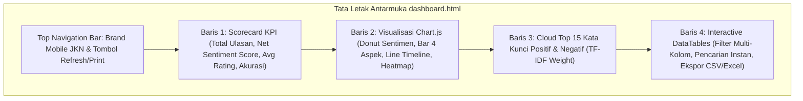

# 📖 FASE 8: PANDUAN PENGGUNAAN CLI & USER MANUAL
## Analisis Sentimen & Data Mining Ulasan Mobile JKN (BPJS Kesehatan)

---

## 📌 Daftar Isi
1. [Prasyarat Sistem (System Requirements)](#1-prasyarat-sistem-system-requirements)
2. [Instalasi Proyek & Persiapan Dependensi](#2-instalasi-proyek--persiapan-dependensi)
3. [Panduan Eksekusi Perintah CLI (Command Line Interface)](#3-panduan-eksekusi-perintah-cli-command-line-interface)
   - [3.1. Pengambilan Data Ulasan (Scraping)](#31-pengambilan-data-ulasan-scraping)
   - [3.2. Eksekusi Analisis Sentimen & Machine Learning](#32-eksekusi-analisis-sentimen--machine-learning)
   - [3.3. Membuka Executive BI Dashboard](#33-membuka-executive-bi-dashboard)
   - [3.4. Menjalankan Unit Testing NLP](#34-menjalankan-unit-testing-nlp)
4. [Struktur Folder & Penjelasan Berkas Output](#4-struktur-folder--penjelasan-berkas-output)
5. [Panduan Interaksi Antarmuka Executive BI Dashboard](#5-panduan-interaksi-antarmuka-executive-bi-dashboard)
6. [Panduan Troubleshooting & Penyelesaian Masalah Umum](#6-panduan-troubleshooting--penyelesaian-masalah-umum)

---

## 1. Prasyarat Sistem (System Requirements)

Sebelum menjalankan sistem, pastikan perangkat komputer Anda memenuhi spesifikasi berikut:

| Komponen | Spesifikasi Minimum | Spesifikasi yang Disarankan |
| :--- | :--- | :--- |
| **Node.js Environment** | Node.js v18.0.0 LTS | Node.js v20.x atau v22.x LTS |
| **Package Manager** | NPM v9.0.0+ | NPM v10.x+ |
| **Sistem Operasi** | Windows 10 / 11, Linux (Ubuntu/Debian), macOS | Windows 11 / Linux Ubuntu 22.04 |
| **Memori RAM** | 2 GB RAM | 4 GB RAM atau lebih |
| **Penyimpanan Disk** | 150 MB ruang kosong | 500 MB (untuk arsip ribuan dataset) |
| **Koneksi Internet** | Dibutuhkan hanya saat scraping data | Offline (analisis & dashboard 100% offline) |

---

## 2. Instalasi Proyek & Persiapan Dependensi

Ikuti langkah-langkah berikut untuk menyiapkan sistem pertama kali:

```bash
# 1. Buka Terminal / PowerShell / Command Prompt
# 2. Masuk ke direktori root proyek
cd X:\laragon\kuliah\playstore-mining

# 3. Pasang seluruh dependensi pustaka NPM yang diperlukan
npm install
```

### 📦 Daftar Dependensi Utama ([`package.json`](file:///x:/laragon/kuliah/playstore-mining/package.json)):
- `ts-sastrawi` (`^1.0.1`): Mesin stemming morfologi bahasa Indonesia berbasis algoritma Nazief-Adriani.
- `google-play-scraper` (`^10.1.3`): Mesin ekstraksi ulasan publik Google Play Store dengan token pagination.
- `csv-writer` (`^1.6.0`): Generator ekspor berkas tabular CSV terstruktur.
- `natural` (`^8.1.1`): Utilitas pendukung komputasi pemrosesan bahasa alami.

---

## 3. Panduan Eksekusi Perintah CLI (Command Line Interface)

Sistem menyediakan 4 perintah npm terpadu:

```
┌───────────────────┬────────────────────────────────────────────────────────┐
│ Perintah NPM      │ Fungsi Utama                                           │
├───────────────────┼────────────────────────────────────────────────────────┤
│ npm run scrape    │ Mengambil ulasan publik terbaru dari Google Play Store │
│ npm run analyze   │ Menjalankan NLP, TF-IDF, Naive Bayes, & Evaluasi Model │
│ npm run report    │ Membuka Executive BI Dashboard terbaru di Browser      │
│ npm test          │ Menjalankan Unit Testing untuk memverifikasi NLP & ML  │
└───────────────────┴────────────────────────────────────────────────────────┘
```

---

### 3.1. Pengambilan Data Ulasan (Scraping)
Skrip ini mengambil ulasan publik dari aplikasi `app.bpjs.mobile` (Mobile JKN).

#### A. Mengambil Jumlah Data Default (1.000 Ulasan):
```bash
npm run scrape
# atau
node scrap-jkn.js
```

#### B. Menentukan Jumlah Target Ulasan Kustom:
Anda dapat menentukan jumlah data (misal: 5.000 ulasan) menggunakan salah satu variasi perintah berikut:
```bash
# Menggunakan parameter data
node scrap-jkn.js data=5000

# Menggunakan parameter limit
node scrap-jkn.js limit=5000

# Menggunakan argumen posisi langsung
node scrap-jkn.js 5000
```

#### 🖥️ Contoh Tampilan Log Terminal Scraping:
```
================================================================
       SCRAPER ULASAN GOOGLE PLAY STORE - MOBILE JKN            
================================================================
[*] Target Data     : 5.000 ulasan
[*] Target App ID   : app.bpjs.mobile (Mobile JKN)
[*] Output Direktori: data/2026-09-13_15-30/
----------------------------------------------------------------
[SCRAPER] Terkumpul: 5.000/5.000 ulasan...
[SCRAPER] Selesai! Total 5.000 ulasan berhasil diambil.
----------------------------------------------------------------
[✓] Berhasil menyimpan 5.000 ulasan dalam 18.4 detik!
    - JSON : X:\laragon\kuliah\playstore-mining\data\2026-09-13_15-30\reviews.json
    - CSV  : X:\laragon\kuliah\playstore-mining\data\2026-09-13_15-30\reviews.csv
    - Meta : X:\laragon\kuliah\playstore-mining\data\2026-09-13_15-30\meta.json
================================================================
```

---

### 3.2. Eksekusi Analisis Sentimen & Machine Learning
Skrip [`run-analisa.js`](file:///x:/laragon/kuliah/playstore-mining/run-analisa.js) menjalankan seluruh pipeline: NLP Preprocessing $\rightarrow$ TF-IDF $\rightarrow$ Multinomial Naive Bayes $\rightarrow$ 5-Fold Cross Validation $\rightarrow$ Pembuatan Dashboard.

#### A. Menganalisis Folder Data Terbaru (Otomatis):
```bash
npm run analyze
# atau
node run-analisa.js
```

#### B. Menargetkan Folder Data Tertentu:
```bash
node run-analisa.js folder=data/2026-09-13_15-30
# atau
node run-analisa.js data/2026-09-13_15-30
```

#### 🖥️ Alur Tahapan Eksekusi di Terminal:
```
================================================================
   PIPELINE ANALISIS SENTIMEN & EXECUTIVE BUSINESS INTELLIGENCE 
                 DATA MINING ULASAN MOBILE JKN                  
================================================================
[*] Membaca data dari: data\2026-09-13_15-30
[*] Total ulasan dimuat: 5.000 ulasan
----------------------------------------------------------------
[1/5] Memulai NLP Preprocessing (Slang, Emoji, Negasi, Stopwords, Sastrawi Stemmer)...
      [✓] NLP Selesai (3.8s) — 5.000 ulasan valid.
[2/5] Ekstraksi Fitur Bobot Kata dengan TF-IDF Vectorizer...
      [✓] Ukuran Kosakata Fitur (|V|): 3.482 kata unik.
[3/5] Melatih Model Multinomial Naive Bayes (Laplace Smoothing α=1.0)...
[4/5] Mengklasifikasi Sentimen, Aspek Operasional, & Tren Waktu...
[5/5] Melakukan Evaluasi Model (Confusion Matrix, Accuracy, Precision, Recall, F1)...
================================================================
                     HASIL ANALISIS SENTIMEN                    
================================================================
• Total Ulasan Dianalisis : 5.000
• Rata-rata Rating        : ★ 2.84 / 5.0
• Sentimen Positif        : 2.070 (41.4%)
• Sentimen Negatif        : 2.930 (58.6%)
• Net Sentiment Score     : -17.2%
----------------------------------------------------------------
• Akurasi Model (Cross-Val): 92.20%
• Macro F1-Score           : 92.05%
• Precision / Recall (Pos) : 92.86% / 87.92%
• Precision / Recall (Neg) : 91.78% / 95.22%
----------------------------------------------------------------
• Confusion Matrix         : TP=1820, FP=140, TN=2790, FN=250
================================================================
[✓] Laporan Dashboard Berhasil Dibuat!
    📁 File: report\2026-09-13_15-32\dashboard.html
```

---

### 3.3. Membuka Executive BI Dashboard
Skrip [`open-report.js`](file:///x:/laragon/kuliah/playstore-mining/open-report.js) secara otomatis mendeteksi laporan terbaru dan meluncurkannya di peramban web (*default browser*).

```bash
npm run report
# atau
node open-report.js
```

#### Membuka Folder Laporan Tertentu:
```bash
node open-report.js report/2026-09-13_15-32
```

---

### 3.4. Menjalankan Unit Testing NLP
Skrip [`test-nlp.js`](file:///x:/laragon/kuliah/playstore-mining/test-nlp.js) menguji keandalan pembersihan emoji, slang, negasi, dan prediksi Naive Bayes pada kalimat uji representatif:

```bash
npm test
# atau
node test-nlp.js
```

---

## 4. Struktur Folder & Penjelasan Berkas Output

Setelah menjalankan seluruh pipeline, struktur repositori akan terisi berkas-berkas berikut:

```
X:\laragon\kuliah\playstore-mining/
├── data/                                 # Arsip data mentah hasil scraping
│   └── 2026-09-13_15-30/                 # Folder bertanda timestamp (YYYY-MM-DD_HH-mm)
│       ├── reviews.json                  # Data ulasan mentah format JSON
│       ├── reviews.csv                   # Data ulasan mentah format CSV
│       └── meta.json                     # Metadata sesi scraping
│
└── report/                               # Arsip hasil analitik & dashboard
    └── 2026-09-13_15-32/                 # Folder hasil analisis per sesi
        ├── dashboard.html                # Executive BI Dashboard (Standalone HTML)
        ├── predictions.json              # Data ulasan lengkap dengan hasil klasifikasi & token
        ├── predictions.csv               # Dataset hasil prediksi tabular untuk Excel/SPSS
        └── metrics.json                  # Ringkasan metrik akurasi, F1, & confusion matrix
```

---

## 5. Panduan Interaksi Antarmuka Executive BI Dashboard

Dashboard dirancang dengan tema **Enterprise Metabase/PowerBI** yang intuitif dan responsif:



### 🖱️ Panduan Fitur DataTables:
1. **Pencarian Real-Time (*Search Bar*)**: Ketik kata apa pun (misal: *"otp"*, *"dokter"*, *"antre"*) pada kolom pencarian di kanan atas tabel; baris tabel akan terfilter dalam waktu $< 10\text{ ms}$.
2. **Filter Multi-Kategori (Dropdown)**:
   - **Filter Aspek**: Pilih salah satu dari *Autentikasi & Akun*, *Antrean & Faskes*, *Kinerja & Server*, *Iuran & Layanan*.
   - **Filter Rating Bintang**: Pilih ulasan bintang 1, 2, 3, 4, atau 5.
   - **Filter Sentimen**: Tampilkan hanya ulasan *Positif* atau *Negatif*.
   - **Filter Anomali**: Tampilkan ulasan dengan status ⚠️ *Mismatch* (bintang 5 komplain atau bintang 1 pujian).
3. **Melihat Token NLP & Skor Probabilitas**:
   - Klik pada salah satu baris ulasan atau tombol **Detail**.
   - Modal popup akan muncul menampilkan: teks asli, teks bersih, daftar token kata hasil stemming, probabilitas posterior Softmax, dan skor keyakinan (*confidence*).
4. **Ekspor Data Instan**:
   - Klik tombol **CSV** untuk mengunduh dataset prediksi dalam format `.csv`.
   - Klik tombol **Excel** untuk mengunduh berkas `.xlsx` siap olah.
   - Klik tombol **Print** untuk mencetak laporan ke printer atau menyimpannya sebagai **PDF**.

---

## 6. Panduan Troubleshooting & Penyelesaian Masalah Umum

### 🔴 Kendala 1: `Error: Cannot find module 'ts-sastrawi'`
- **Penyebab**: Dependensi pustaka belum terpasang.
- **Solusi**: Jalankan perintah instalasi di terminal:
  ```bash
  npm install
  ```

---

### 🔴 Kendala 2: `[SCRAPER] Peringatan: 429 Too Many Requests`
- **Penyebab**: Google Play Store membatasi frekuensi request jika koneksi IP mengirim permintaan terlalu cepat.
- **Solusi**: Sistem telah dilengkapi mekanisme *auto-retry* dan *request jitter delay*. Tunggu beberapa detik, scraper akan secara otomatis melanjutkan proses secara aman.

---

### 🔴 Kendala 3: `[!] Belum ada laporan di direktori report/`
- **Penyebab**: Anda menjalankan `npm run report` sebelum menjalankan analisis.
- **Solusi**: Jalankan pipeline analisis terlebih dahulu:
  ```bash
  npm run analyze
  ```

---

### 🔴 Kendala 4: Browser tidak terbuka otomatis saat menjalankan `open-report.js`
- **Penyebab**: Sistem operasi Anda memblokir perintah pembuka otomatis (*child_process exec*).
- **Solusi**: Anda dapat membuka berkas laporan secara manual dengan melakukan *double-click* langsung pada berkas:
  ```
  X:\laragon\kuliah\playstore-mining\report\<timestamp_terbaru>\dashboard.html
  ```

---
*Dokumen ini merupakan panduan operasional teknis resmi sistem Mobile JKN Sentiment Analytics.*
