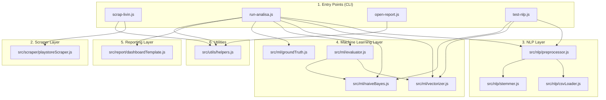

# 💻 FASE 9: DOKUMENTASI LENGKAP KODE PROGRAM & SCRIPT
## Bedah Arsitektur Modul, Fungsi, Algoritma, & API Internal

---

## 📌 Daftar Isi
1. [Pengantar & Peta Ketergantungan Modul (Dependency Graph)](#1-pengantar--peta-ketergantungan-modul-dependency-graph)
2. [Skrip Eksekusi Utama (Root Entry Points)](#2-skrip-eksekusi-utama-root-entry-points)
   - [2.1. scrap-livin.js (Data Scraper CLI)](#21-scrap-jknjs-data-scraper-cli)
   - [2.2. run-analisa.js (Pipeline Utama Analisis Sentimen)](#22-run-analisajs-pipeline-utama-analisis-sentimen)
   - [2.3. open-report.js (Launcher Dashboard Eksekutif)](#23-open-reportjs-launcher-dashboard-eksekutif)
   - [2.4. test-nlp.js (Unit Testing Verifikasi NLP & ML)](#24-test-nlpjs-unit-testing-verifikasi-nlp--ml)
3. [Modul Data Acquisition: src/scraper/](#3-modul-data-acquisition-srcscraper)
   - [3.1. playstoreScraper.js](#31-playstorescraperjs)
4. [Modul Natural Language Processing (NLP): src/nlp/](#4-modul-natural-language-processing-nlp-srcnlp)
   - [4.1. csvLoader.js](#41-csvloaderjs)
   - [4.2. stemmer.js](#42-stemmerjs)
   - [4.3. preprocessor.js](#43-preprocessorjs)
5. [Modul Machine Learning & Evaluasi: src/ml/](#5-modul-machine-learning--evaluasi-srcml)
   - [5.1. groundTruth.js](#51-groundtruthjs)
   - [5.2. vectorizer.js](#52-vectorizerjs)
   - [5.3. naiveBayes.js](#53-naivebayesjs)
   - [5.4. evaluator.js](#54-evaluatorjs)
6. [Modul Pelaporan & Dashboard BI: src/report/](#6-modul-pelaporan--dashboard-bi-srcreport)
   - [6.1. dashboardTemplate.js](#61-dashboardtemplatejs)
7. [Modul Utilitas Pendukung: src/utils/](#7-modul-utilitas-pendukung-srcutils)
   - [7.1. helpers.js](#71-helpersjs)
8. [Tabel Matriks Referensi API & Fungsi Keseluruhan](#8-tabel-matriks-referensi-api--fungsi-keseluruhan)

---

## 1. Pengantar & Peta Ketergantungan Modul (Dependency Graph)

Sistem dibangun dengan arsitektur **modular berorientasi komponen (*Component-Based Modular Architecture*)** menggunakan standar **CommonJS (Node.js)**. Setiap modul memiliki tanggung jawab tunggal (*Single Responsibility Principle*) yang terisolasi dan mudah diuji secara independen.



---

## 2. Skrip Eksekusi Utama (Root Entry Points)

---

### 2.1. `scrap-livin.js` (Data Scraper CLI)
- **Path Berkas**: [`scrap-livin.js`](file:///x:/laragon/kuliah/playstore-mining/scrap-livin.js)
- **Fungsi Utama**: Antarmuka baris perintah (CLI) untuk mengekstrak data ulasan publik dari Google Play Store.

#### ⚙️ Cara Kerja & Alur Program:
1. Membaca argumen CLI melalui fungsi `parseArgs` (misal: `node scrap-livin.js data=5000`).
2. Membuat folder target berstempel waktu di direktori `data/<YYYY-MM-DD_HH-mm>/`.
3. Memanggil fungsi `scrapeLivinMandiri` untuk mengekstrak ulasan dari paket `app.Bank Mandiri.mobile`.
4. Memanggil `saveReviews` untuk mengarsipkan data ke dalam tiga format: `reviews.json`, `reviews.csv`, dan `meta.json`.
5. Menampilkan waktu eksekusi (*execution duration*) dan petunjuk menjalankan tahap analisis selanjutnya.

#### 📥 Input Argumen & 📤 Output:
- **Input**: Parameter jumlah data (`data=N`, `limit=N`, `count=N`, atau angka langsung). Default: `1000`.
- **Output**: Direktori `data/<timestamp>/` berisi `reviews.json`, `reviews.csv`, dan `meta.json`.

---

### 2.2. `run-analisa.js` (Pipeline Utama Analisis Sentimen)
- **Path Berkas**: [`run-analisa.js`](file:///x:/laragon/kuliah/playstore-mining/run-analisa.js)
- **Fungsi Utama**: *Main Orchestrator* yang mengeksekusi 5 tahap pipeline data mining secara berurutan.

#### ⚙️ Tahapan Eksekusi Internal:
1. **Penyelesaian Folder Data**: Mendeteksi folder ulasan terbaru di `data/` secara otomatis atau membaca argumen `folder=data/...`.
2. **Pemuatan Data (`reviews.json`)**: Membaca dan memvalidasi rekaman ulasan mentah.
3. **[Tahap 1/5] NLP Preprocessing**:
   - Memproses setiap ulasan melalui `TextPreprocessor.preprocess(rev.text)`.
   - Menentukan label acuan melalui `determineGroundTruth(rev.score, rev.text)`.
4. **[Tahap 2/5] TF-IDF Feature Extraction**:
   - Mempelajari kosakata dan bobot IDF via `TfidfVectorizer.fitTransform(preprocessedDocs)`.
5. **[Tahap 3/5] Pelatihan Naive Bayes**:
   - Melatih model `MultinomialNaiveBayes` dengan parameter Laplace Smoothing $\alpha = 1.0$.
6. **[Tahap 4/5] Inferensi, Aspek, & Anomali**:
   - Memprediksi seluruh sampel ulasan.
   - Menjalankan fungsi `detectAspects(text, tokens)` untuk memetakan ulasan ke 4 Pilar Aspek Operasional Livin' by Mandiri (*Autentikasi, Transaksi, Server, Tagihan*).
   - Mengelompokkan tren bulanan (*timeline*) dan performa versi aplikasi.
   - Mengidentifikasi anomali ulasan (rating $\ge 4$ tapi Negatif atau rating $\le 2$ tapi Positif).
7. **[Tahap 5/5] Evaluasi Model 5-Fold Cross Validation**:
   - Menguji performa generalisasi model via `ModelEvaluator.crossValidate(preprocessedDocs, labels, 5)`.
8. **Penyusunan & Ekspor Laporan**:
   - Menghasilkan berkas mandiri `report/<timestamp>/dashboard.html` via `generateDashboardHtml`.
   - Menyimpan `predictions.json`, `predictions.csv`, dan `metrics.json`.

#### 🔍 Fungsi Penting: `detectAspects(text, tokens)`
```javascript
function detectAspects(text, tokens)
```
- **Fungsi**: Memindai kemunculan kata kunci operasional pada teks asli dan token hasil stemming untuk mengkategorikan ulasan.
- **Kamus Aspek**:
  - `Autentikasi & Akun`: *login, masuk, daftar, otp, sms, password, sandi, pin, nik, ktp, verifikasi*.
  - `Transaksi & Pembayaran`: *antre, Transaksi, Pembayaran, cabang, pkm, rs, klinik, kuota, dokter, poli, rujuk, obat*.
  - `Kinerja & Server`: *eror, error, lemot, lambat, lola, crash, hang, blank, server, jaringan, bug*.
  - `Layanan & Fitur Finansial`: *Tagihan, bayar, tagihan, autodebet, denda, kis, kartu, digital, mutasi, Bank Mandiri, klaim*.

---

### 2.3. `open-report.js` (Launcher Dashboard Eksekutif)
- **Path Berkas**: [`open-report.js`](file:///x:/laragon/kuliah/playstore-mining/open-report.js)
- **Fungsi Utama**: Mendeteksi folder laporan terbaru di direktori `report/` dan membukanya langsung di peramban web (*default browser*).

#### ⚙️ Cara Kerja:
- Menggunakan `getLatestFolder(baseReportDir)` untuk mencari folder laporan paling mutakhir.
- Menjalankan perintah sistem operasi `start "" "<path_to_dashboard.html>"` pada Windows (atau fallback manual jika diblokir).

---

### 2.4. `test-nlp.js` (Unit Testing Verifikasi NLP & ML)
- **Path Berkas**: [`test-nlp.js`](file:///x:/laragon/kuliah/playstore-mining/test-nlp.js)
- **Fungsi Utama**: Uji verifikasi instan untuk memastikan seluruh rantai NLP (*emoji, slang, negation, stemmer*) dan Naive Bayes berfungsi dengan benar tanpa perlu memproses ribuan data.

---

## 3. Modul Data Acquisition: `src/scraper/`

---

### 3.1. `playstoreScraper.js`
- **Path Berkas**: [`src/scraper/playstoreScraper.js`](file:///x:/laragon/kuliah/playstore-mining/src/scraper/playstoreScraper.js)
- **Tanggung Jawab**: Menangani komunikasi API dengan Google Play Store untuk pengunduhan ulasan secara andal.

#### 🔧 Fungsi Utama:

#### 1. `scrapeLivinMandiri(targetCount, onProgress)`
```javascript
async function scrapeLivinMandiri(targetCount = 1000, onProgress = null) -> Promise<Array<ReviewObject>>
```
- **Algoritma**:
  - Menggunakan *batching* maksimal 150 ulasan per *request*.
  - Menerapkan **Pagination Token** (`nextPaginationToken`) untuk melacak halaman berikutnya.
  - Menerapkan **Rotasi Kriteria Sortir** (`NEWEST` $\rightarrow$ `HELPFULNESS` $\rightarrow$ `RATING`) jika token pagination habis, sehingga data yang terkumpul bervariasi dan kaya sentimen.
  - **Deduplikasi**: Menggunakan struktur data `Set(seenIds)` untuk memastikan tidak ada ID ulasan ganda.
  - **Request Jitter Delay**: Menerapkan jeda acak $400\text{ ms} - 800\text{ ms}$ antar-permintaan untuk menghindari pemblokiran *rate-limit* (HTTP 429).
  - **Auto-Recovery**: Jika terjadi error jaringan, sistem melakukan *retry* otomatis setelah jeda 2 detik.

#### 2. `saveReviews(reviews, outputDir)`
```javascript
async function saveReviews(reviews, outputDir) -> Promise<{ jsonPath, csvPath, metaPath }>
```
- **Fungsi**: Menyimpan array ulasan mentah ke direktori target dalam bentuk `reviews.json`, `reviews.csv` (via `csv-writer`), dan `meta.json`.

---

## 4. Modul Natural Language Processing (NLP): `src/nlp/`

---

### 4.1. `csvLoader.js`
- **Path Berkas**: [`src/nlp/csvLoader.js`](file:///x:/laragon/kuliah/playstore-mining/src/nlp/csvLoader.js)
- **Tanggung Jawab**: Pembaca (*parser*) berkas CSV kamus master data dengan dukungan pemisah koma di dalam tanda kutip (*quoted strings*).

#### 🔧 Fungsi yang Disediakan:
1. `parseCSV(filePath)`: Membaca berkas CSV dan mengonversinya menjadi array of objects.
2. `loadSlangDict(masterDataDir)`: Membaca `slang.csv` dan mengembalikan objek pemetaan `{ [kata_slang: string]: kata_formal }`.
3. `loadEmojiDict(masterDataDir)`: Membaca `emojis.csv` dan mengembalikan objek `{ [emoji_unicode: string]: token_semantik }`.
4. `loadStopwords(masterDataDir)`: Membaca `stopwords.csv` dan mengembalikan struktur data `Set<string>` kata tugas non-sentimen.
5. `loadGroundTruthRules(masterDataDir)`: Membaca `ground_truth_rules.csv` dan mengembalikan objek kumpulan aturan leksikon `{ strongNegativePatterns, strongPositivePatterns, posIndicators, negIndicators }`.

---

### 4.2. `stemmer.js`
- **Path Berkas**: [`src/nlp/stemmer.js`](file:///x:/laragon/kuliah/playstore-mining/src/nlp/stemmer.js)
- **Tanggung Jawab**: Mesin reduksi morfologi kata berimbuhan ke bentuk kata dasar (*stemming*) bahasa Indonesia.

#### ⚙️ Arsitektur & Optimasi:
1. **Basis Kamus Sastrawi**: Menggunakan `ts-sastrawi` dengan kamus dasar standar 29.932 kata.
2. **Injeksi Kosakata Domain Bank Mandiri**:
   ```javascript
   const domainTerms = [
     'Pembayaran', 'Bank Mandiri', 'jkn', 'kis', 'nik', 'otp', 'pkm', 'cabang', 'fkrtl', 
     'autodebet', 'skrining', 'antre', 'Transaksi', 'rujuk', 'rujukan', 'tagihan', 
     'Tagihan', 'nasabah', 'kenasabahan', 'klinik', 'cabang', 'perbaiki', 
     'validasi', 'otentikasi', 'reaktivasi', 'unduh'
   ];
   dict.add(domainTerms);
   ```
3. **Proteksi Kata Kritis Keluhan**: Kata seperti *perbaiki*, *perbaikan*, *benahi*, *pembenahan* dikunci agar menghasilkan stem `'perbaiki'` (bukan menjadi kata positif *baik*).
4. **Memoization Cache (`stemCache = new Map()`)**: Menyimpan hasil stem kata yang sudah pernah diproses di memori RAM, meningkatkan kecepatan stemming hingga 300% pada ribuan ulasan.

#### 🔧 Fungsi:
- `stemWord(word)`: Mengembalikan kata dasar dari sebuah kata tunggal.
- `stemSentence(input)`: Melakukan tokenisasi dan stemming pada kalimat utuh.

---

### 4.3. `preprocessor.js`
- **Path Berkas**: [`src/nlp/preprocessor.js`](file:///x:/laragon/kuliah/playstore-mining/src/nlp/preprocessor.js)
- **Tanggung Jawab**: Kelas utama `TextPreprocessor` yang mengorkestrasi **8 tahap NLP Preprocessing**.

#### 🔧 Method Utama:

#### 1. `replaceEmojis(text)`
Mengganti karakter emoji Unicode dengan kata semantik bahasa Indonesia. Emoji diurutkan berdasarkan panjang karakter menurun (`b.length - a.length`) agar emoji gabungan (*compound emoji*) diproses terlebih dahulu.

#### 2. `cleanText(text)`
- Mengubah ke huruf kecil (*lowercase*).
- Menormalkan idiom retoris: `"apa gunanya"` $\rightarrow$ `"tidak berguna"`, `"ujung ujungnya ke kantor"` $\rightarrow$ `"kecewa"`.
- Menghapus URL, mention (`@user`), tagar (`#tagar`), tanda baca, dan karakter non-alfanumerik.
- Mereduksi karakter berulang (*elongated letters*, contoh: `"baguuus"` $\rightarrow$ `"bagus"`).

#### 3. `preprocess(text)`
Menjalankan seluruh alur pipeline teks:
1. Menjalankan `cleanText`.
2. Normalisasi kata slang via `slangDict`.
3. **Pemisahan Klausa (*Clause Splitting*)**:
   - Jika memuat konjungsi adversatif (*tapi, namun*), klausa setelah konjungsi diberi pengulangan bobot $2\times$.
   - Jika memuat konjungsi konsesif (*padahal, walaupun*), klausa sebelum konjungsi diberi bobot $2\times$.
4. **Multi-Step Negation Binding**:
   - Mencari kata negasi (*tidak, bukan, belum, kurang, jangan*).
   - Melewati kata pengisi (*sangat, terlalu, cukup*) maksimal 2 kata.
   - Mengikat negasi dengan kata inti: `tidak_` + `stemWord(target)`.
   - Mengabaikan kata ganti (*pronouns*: *saya, aku, kak*).
5. **Stemming & Stopwords Filtering**:
   - Men-stem unigram kata.
   - Membuang kata yang terdaftar di `stopwords` kecuali token sentimen inti atau token negasi.
- **Output Return**: `{ raw, cleaned, tokens, processedText }`.

---

## 5. Modul Machine Learning & Evaluasi: `src/ml/`

---

### 5.1. `groundTruth.js`
- **Path Berkas**: [`src/ml/groundTruth.js`](file:///x:/laragon/kuliah/playstore-mining/src/ml/groundTruth.js)
- **Tanggung Jawab**: Menetapkan label acuan *supervised learning* (*Ground Truth*) secara objektif berbasis nilai rating bintang Play Store (3-Kelas: Positif, Netral, Negatif).

#### ⚙️ Logika Algoritma `determineGroundTruth(score, text)`:
1. **Skor $\ge 4$ (Bintang 4 & 5)**: Ditetapkan sebagai **`Positif`**.
2. **Skor $= 3$ (Bintang 3)**: Ditetapkan sebagai **`Netral`**.
3. **Skor $\le 2$ (Bintang 1 & 2)**: Ditetapkan sebagai **`Negatif`**.
4. Mengembalikan string label: `'Positif' | 'Netral' | 'Negatif'`.

---

### 5.2. `vectorizer.js`
- **Path Berkas**: [`src/ml/vectorizer.js`](file:///x:/laragon/kuliah/playstore-mining/src/ml/vectorizer.js)
- **Tanggung Jawab**: Kelas `TfidfVectorizer` untuk mentransformasikan array token dokumen menjadi matriks bobot numerik TF-IDF.

#### 🔧 Method & Rumus:
1. `fit(tokenizedDocs)`:
   - Menghitung Document Frequency $\text{DF}(t)$ untuk setiap term unik.
   - Memfilter kosakata berdasarkan $\text{minDF} \ge 2$ dan $\text{maxDFRatio} \le 0.95$.
   - Menghitung **Smooth IDF**: $\text{IDF}(t) = \ln\left(\frac{1 + N}{1 + \text{DF}(t)}\right) + 1$.
2. `transformDoc(tokens)`:
   - Menghitung **Sublinear TF**: $\text{TF}(t, d) = 1 + \ln(\text{count}(t, d))$.
   - Menghitung bobot mentah: $w'_{t, d} = \text{TF} \times \text{IDF}$.
   - Melakukan **Normalisasi Euclidean ($L_2$-Norm)**: $w_{t, d} = \frac{w'_{t, d}}{\sqrt{\sum (w'_{k, d})^2}}$.
   - Mengembalikan vektor jarang (*sparse vector*): `{ [featureIndex: number]: weight: number }`.
3. `fitTransform(tokenizedDocs)`: Menjalankan `fit` dilanjutkan `transform`.
4. `getTopFeatures(vectors, topN)`: Mengakumulasi bobot TF-IDF pada seluruh vektor untuk mengekstrak $N$ kata kunci teratas per kelas.

---

### 5.3. `naiveBayes.js`
- **Path Berkas**: [`src/ml/naiveBayes.js`](file:///x:/laragon/kuliah/playstore-mining/src/ml/naiveBayes.js)
- **Tanggung Jawab**: Kelas `MultinomialNaiveBayes` sebagai mesin klasifikasi sentimen berbasis Teorema Bayes.

#### 🔧 Method Utama:

#### 1. `train(X, y, vocabSize)`
- Menghitung probabilitas prior kelas dengan Laplace Prior Smoothing:
  $$P(c) = \frac{N_c + 1}{N + |C|}, \quad \text{ClassLogPrior}(c) = \ln P(c)$$
- Mengakumulasikan bobot TF-IDF seluruh fitur kata per kelas: $\text{classFeatureSums}[c][w]$.
- Menghitung **Conditional Word Likelihood** dengan **Laplace Add-One Smoothing ($\alpha = 1.0$)**:
  $$\text{FeatureLogProb}[c][w] = \ln\left(\text{classFeatureSums}[c][w] + \alpha\right) - \ln\left(\text{classTotalWeights}[c] + \alpha \cdot |V|\right)$$

#### 2. `predictDoc(doc)`
- Menghitung akumulasi **Log-Likelihood** (mencegah *arithmetic underflow*):
  $$\ln P(c | d) = \text{ClassLogPrior}[c] + \sum_{i} w_{i, d} \cdot \text{FeatureLogProb}[c][i]$$
- Melakukan normalisasi stabil secara numerik via fungsi **Softmax**:
  $$M = \max(\ln P(\text{Positif}|d), \ln P(\text{Negatif}|d))$$
  $$P(c | d) = \frac{\exp(\ln P(c|d) - M)}{\sum_{c'} \exp(\ln P(c'|d) - M)}$$
- **Return**: `{ label, confidence, probabilities, logLikelihood }`.

---

### 5.4. `evaluator.js`
- **Path Berkas**: [`src/ml/evaluator.js`](file:///x:/laragon/kuliah/playstore-mining/src/ml/evaluator.js)
- **Tanggung Jawab**: Kelas `ModelEvaluator` untuk menghitung metrik performa klasifikasi dan validasi silang (*Cross Validation*).

#### 🔧 Method Utama:
1. `computeMetrics(actual, predicted)`:
   - Menghitung $TP, FP, TN, FN$.
   - Menghitung **Accuracy**, **Precision (Pos & Neg)**, **Recall (Pos & Neg)**, **F1-Score (Pos & Neg)**, dan **Macro F1-Score**.
2. `crossValidate(tokenizedDocs, labels, k = 5)`:
   - Membagi data ke dalam $k$ lipatan (*folds*) secara seimbang (*stratified*).
   - Melatih TF-IDF Vectorizer dan model Naive Bayes secara terisolasi pada $k-1$ fold latih, lalu menguji pada 1 fold uji (*zero data leakage*).
   - Mengembalikan rincian metrik per fold dan rata-rata keseluruhan (*overall*).
3. `evaluateTrainTest(tokenizedDocs, labels, trainRatio = 0.8)`:
   - Skema evaluasi alternatif pembagian sederhana 80% Latih dan 20% Uji.

---

## 6. Modul Pelaporan & Dashboard BI: `src/report/`

---

### 6.1. `dashboardTemplate.js`
- **Path Berkas**: [`src/report/dashboardTemplate.js`](file:///x:/laragon/kuliah/playstore-mining/src/report/dashboardTemplate.js)
- **Tanggung Jawab**: Generator antarmuka web interaktif mandiri (*Standalone HTML Dashboard*).

#### ⚙️ Arsitektur & Komponen Template:
1. **Enkapsulasi Data JSON**: Menyematkan seluruh data ringkasan, metrik evaluasi, dan 5.000 sampel prediksi ke dalam tag `<script>const REPORT_DATA = ...</script>` di dalam HTML (tanpa butuh koneksi server eksternal).
2. **Desain Sistem & Styling**: Menggunakan font modern *Public Sans*, palet warna resmi PT Bank Mandiri (Persero) Tbk (`#059669`), dan tata letak *Executive KPI Scorecards*.
3. **Pustaka Visualisasi Terintegrasi**:
   - `Chart.js 4.4.1`: Render grafik Donut Sentimen, Bar Aspek Operasional, Line Timeline Bulanan, dan Heatmap Rating Matrix.
   - `jQuery 3.7.1` + `DataTables 1.13.7`: Tabel dinamis dengan fitur sortir kolom, pencarian instan real-time, filter dropdown multi-kategori, dan popup modal rincian token NLP ulasan.
   - `JSZip` + `Buttons HTML5`: Fitur ekspor langsung ke format **CSV**, **Excel**, dan **Print/PDF**.

---

## 7. Modul Utilitas Pendukung: `src/utils/`

---

### 7.1. `helpers.js`
- **Path Berkas**: [`src/utils/helpers.js`](file:///x:/laragon/kuliah/playstore-mining/src/utils/helpers.js)
- **Tanggung Jawab**: Kumpulan fungsi pembantu operasional I/O dan sistem berkas.

#### 🔧 Fungsi yang Disediakan:
1. `getTimestampFolder()`: Menghasilkan string penamaan folder berformat `YYYY-MM-DD_HH-mm` berdasarkan waktu lokal.
2. `ensureDir(dirPath)`: Memeriksa dan membuat direktori secara rekursif jika belum ada di disk.
3. `getLatestFolder(baseDir)`: Memindai folder dan mengembalikan path folder yang paling baru dibuat (berdasarkan urutan alfabetik nama timestamp terbalik).
4. `parseArgs(argv)`: Mem-parsing argumen CLI (misal: `--folder=data/...` atau `limit=5000`) menjadi objek kunci-nilai JavaScript.

---

## 8. Tabel Matriks Referensi API & Fungsi Keseluruhan

| Lokasi Berkas | Nama Fungsi / Kelas | Parameter Masukan | Nilai Kembalian (Return) | Deskripsi Ringkas |
| :--- | :--- | :--- | :--- | :--- |
| `src/scraper/playstoreScraper.js` | `scrapeLivinMandiri` | `(targetCount, onProgress)` | `Promise<Array<ReviewObject>>` | Mengambil ulasan Play Store dengan pagination, sort rotation, dan jitter delay. |
| `src/scraper/playstoreScraper.js` | `saveReviews` | `(reviews, outputDir)` | `Promise<{jsonPath, csvPath, metaPath}>` | Menyimpan ulasan ke `reviews.json`, `reviews.csv`, dan `meta.json`. |
| `src/nlp/csvLoader.js` | `loadSlangDict` | `(masterDataDir)` | `Object: {[slang]: formal}` | Memuat 860+ kamus kata gaul/singkatan ke kata baku. |
| `src/nlp/csvLoader.js` | `loadEmojiDict` | `(masterDataDir)` | `Object: {[emoji]: token}` | Memuat 80+ kamus semantik emoji ke teks Indonesia. |
| `src/nlp/csvLoader.js` | `loadStopwords` | `(masterDataDir)` | `Set<string>` | Memuat daftar stopwords dengan proteksi kata negasi. |
| `src/nlp/stemmer.js` | `stemWord` | `(word: string)` | `string` | Mengembalikan kata dasar via Nazief-Adriani Sastrawi + cache. |
| `src/nlp/preprocessor.js` | `TextPreprocessor.preprocess` | `(text: string)` | `{raw, cleaned, tokens, processedText}` | Menjalankan 8 tahap NLP: emoji, slang, clause, negasi, stem, stopwords. |
| `src/ml/groundTruth.js` | `determineGroundTruth` | `(score: number, text?: string)` | `'Positif' \| 'Netral' \| 'Negatif'` | Menetapkan label acuan ground truth murni berbasis bintang Play Store (★1-2: Neg, ★3: Net, ★4-5: Pos). |
| `src/ml/vectorizer.js` | `TfidfVectorizer.fitTransform` | `(docs: Array<string[]>)` | `Array<SparseVector>` | Menghitung Sublinear TF, Smooth IDF, dan $L_2$-norm. |
| `src/ml/vectorizer.js` | `TfidfVectorizer.getTopFeatures` | `(vectors, topN)` | `Array<{word, score}>` | Mengekstrak $N$ fitur kata kunci teratas berdasarkan akumulasi bobot TF-IDF. |
| `src/ml/naiveBayes.js` | `MultinomialNaiveBayes.train` | `(X, y, vocabSize)` | `this` | Melatih MNB dengan Laplace Add-One Smoothing ($\alpha=1.0$). |
| `src/ml/naiveBayes.js` | `MultinomialNaiveBayes.predict` | `(docs: Array<SparseVector>)` | `Array<PredictionResult>` | Menghitung akumulasi log-likelihood dan probabilitas posterior Softmax. |
| `src/ml/evaluator.js` | `ModelEvaluator.crossValidate` | `(docs, labels, k=5)` | `{k, overall, foldMetrics}` | Menjalankan validasi silang 5-Fold Stratified CV dan Confusion Matrix. |
| `src/report/dashboardTemplate.js` | `generateDashboardHtml` | `(reportData: Object)` | `string (HTML Source)` | Menghasilkan kode HTML standalone dashboard interaktif Metabase/PowerBI. |
| `src/utils/helpers.js` | `getLatestFolder` | `(baseDir: string)` | `string \| null` | Mencari path direktori berstempel waktu paling mutakhir. |

---
*Dokumen ini merupakan referensi teknis resmi arsitektur kode dan API internal sistem Livin' by Mandiri Sentiment Analytics.*
