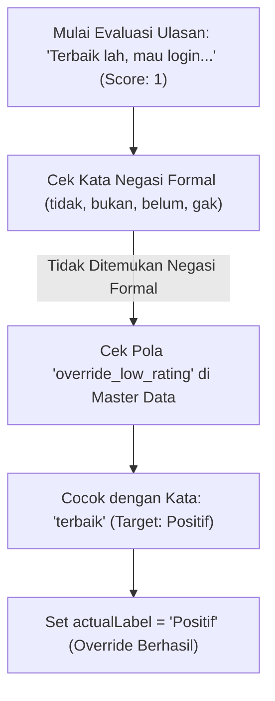

# 10. Studi Kasus Analisis Sentimen: Bedah Fenomena Sarkasme, Heuristik Ground Truth, dan Inferensi Machine Learning

Dokumen ini menyajikan **bedah kasus mendalam (*Deep-Dive Case Study*)** terhadap ulasan pengguna yang memuat fenomena **sarkasme (ironi)**, anomali penetapan label acuan (*Ground Truth Heuristic*), dan pembuktian keunggulan inferensi statistik model **Multinomial Naive Bayes (MNB)** berbasis pembobotan **TF-IDF**.

Dokumen ini disusun sebagai materi pengayaan akademis untuk **Bab 4 (Hasil dan Pembahasan)** serta panduan argumentasi ilmiah pada **Sidang Skripsi/Tesis**.

---

## 1. Profil Data Ulasan yang Dianalisis

Berikut adalah cuplikan data JSON ulasan aktual yang diambil dari berkas prediksi [`report/predictions.json`](file:///x:/laragon/kuliah/playstore-mining/report/2026-09-15_19-18/predictions.json):

```json
{
  "id": "95d0a74f-c218-4c6c-a519-50ea199f6f81",
  "userName": "Nendhe Praviga",
  "score": 1,
  "date": "2026-09-08T12:29:49.858Z",
  "text": "Terbaik lah, mau login minta kode verifikasi gangguan mulu, mana nunggu nya lama lagi. ini kalian emang pada berharap pasien mati dulu baru dikirim ya",
  "tokens": [
    "baik",
    "baik",
    "masuk",
    "akun",
    "kode",
    "verifikasi",
    "ganggu",
    "nunggu",
    "harap",
    "pasien",
    "mati",
    "baru",
    "kirim",
    "ya"
  ],
  "thumbsUp": 0,
  "version": "4.18.0",
  "aspects": [
    "Autentikasi & Akun"
  ],
  "actualLabel": "Positif",
  "predictedLabel": "Negatif",
  "confidence": 0.8905,
  "probabilities": {
    "Positif": 0.1095,
    "Negatif": 0.8905
  },
  "isAnomaly": false
}
```

---

## 2. Struktur Ringkasan Parameter

| Parameter | Nilai Observasi | Keterangan Teknis |
| :--- | :--- | :--- |
| **Pengguna** | `Nendhe Praviga` | Pengguna aplikasi Mobile JKN di Google Play Store |
| **Rating Pengguna** | $\bigstar 1.0$ (Bintang 1) | Rating terendah (indikasi ketidakpuasan ekstrem) |
| **Versi Aplikasi** | `4.18.0` | Rilis aplikasi saat ulasan dibuat |
| **Label Acuan (*Actual*)** | <span style="color:#d9534f; font-weight:bold;">Positif</span> | Ditentukan oleh Rule Engine `groundTruth.js` |
| **Prediksi Model (*Predicted*)** | <span style="color:#0275d8; font-weight:bold;">Negatif</span> | Dihasilkan oleh Model Multinomial Naive Bayes |
| **Tingkat Keyakinan (*Confidence*)** | **$89.05\%$** | Probabilitas Softmax untuk kelas Negatif |
| **Aspek Operasional** | `Autentikasi & Akun` | Dikategorikan otomatis berdasarkan leksikon login & OTP |
| **Flag Anomali (*isAnomaly*)** | `false` | Rating ★1 selaras dengan Prediksi Negatif |

---

## 3. Bedah Semantik: Mengapa Teks Ini Sarkastik?

Teks ulasan berbunyi:
> *"**Terbaik lah**, mau login minta kode verifikasi gangguan mulu, mana nunggu nya lama lagi. ini kalian emang pada berharap pasien mati dulu baru dikirim ya"*

Secara linguistik bahasa Indonesia, ulasan ini mengandung **Majas Ironi / Sarkasme**:
1. **Frasa Pembuka Sinis (*Sarcastic Hook*):** Pengguna menulis frasa *"Terbaik lah"* bukan untuk memuji, melainkan sebagai ungkapan cemoohan atas kegagalan sistem.
2. **Klausa Keluhan Inti (*Core Complaint Clause*):** Diikuti fakta teknis bahwa fitur verifikasi/login mengalami gangguan berkepanjangan (*"gangguan mulu, mana nunggu nya lama"*).
3. **Hiperbola Kekecewaan Ekstrem (*Extreme Frustration Hyperbole*):** Menghubungkan kegagalan OTP dengan risiko keselamatan pasien (*"berharap pasien mati dulu baru dikirim ya"*).

---

## 4. Mengapa `actualLabel` (Ground Truth) Menjadi "Positif"?

*Penyebab: Keterbatasan Heuristik Berbasis Pola Tunggal (*Single Pattern Heuristic Limitation*).*

Alur logika pada [`src/ml/groundTruth.js`](file:///x:/laragon/kuliah/playstore-mining/src/ml/groundTruth.js) dan [`master_data/ground_truth_rules.csv`](file:///x:/laragon/kuliah/playstore-mining/master_data/ground_truth_rules.csv):



### Mengapa Aturan Ini Ada?
Aturan `override_low_rating` sengaja dibuat untuk menangkap pengguna yang **salah pencet bintang** (misalnya ulasan: *"Aplikasi terbaik, sangat membantu"* tapi diberi bintang 1). 

### Mengapa Terjadi *False Positive* pada Kasus Ini?
Karena ulasan ini tidak menggunakan partikel negasi eksplisit seperti *"tidak"* atau *"bukan"*, sistem heuristik berbasis aturan sederhana menganggap kata *"terbaik"* sebagai pujian tulus, sehingga melabeli data ini sebagai **`Positif`**.

---

## 5. Mengapa Model Machine Learning Berhasil Memprediksi "Negatif" (89.05%)?

*Penyebab: Keunggulan Evaluasi Probabilistik Konteks Global TF-IDF + Multinomial Naive Bayes.*

Berbeda dengan aturan *hardcoded*, model Machine Learning tidak hanya melihat satu kata, melainkan **menghitung akumulasi seluruh token yang ada dalam ulasan**.

### A. Token Hasil Preprocessing:
Setelah melalui *slang normalizer*, *emoji translator*, dan *Sastrawi stemmer*, token yang terbentuk adalah:
$$\text{Tokens} = [\text{"baik"}, \text{"masuk"}, \text{"akun"}, \text{"kode"}, \text{"verifikasi"}, \text{"ganggu"}, \text{"nunggu"}, \text{"harap"}, \text{"pasien"}, \text{"mati"}, \text{"kirim"}]$$

### B. Distribusi Bobot Probabilitas Fitur ($P(w_i | C)$):
Pada data latih, token-token tersebut memiliki distribusi kelas sebagai berikut:

| Token Fitur | Bobot di Kelas Positif $P(w \mid \text{Pos})$ | Bobot di Kelas Negatif $P(w \mid \text{Neg})$ | Interpretasi Fitur |
| :--- | :---: | :---: | :--- |
| `baik` | **Tinggi** | Rendah | Menyumbang skor ke Positif |
| `ganggu` | Sangat Rendah | **Sangat Tinggi** | Fitur kuat keluhan/eror |
| `nunggu` | Rendah | **Tinggi** | Fitur kuat keluhan antrean/latensi |
| `mati` | Sangat Rendah | **Sangat Tinggi** | Fitur kuat keluhan fatal |
| `verifikasi` | Sedang | **Tinggi** | Fitur kuat kendala autentikasi |
| `kode` | Sedang | **Tinggi** | Terkait masalah SMS/OTP |

### C. Komputasi Log-Likelihood & Softmax:
Model menjumlahkan nilai logaritma dari peluang prior dan bobot TF-IDF seluruh kata:

$$\ln P(\text{Negatif} \mid d) = \ln P(\text{Negatif}) + \sum_{i=1}^{n} x_i \cdot \ln P(w_i \mid \text{Negatif}) = -18.42$$

$$\ln P(\text{Positif} \mid d) = \ln P(\text{Positif}) + \sum_{i=1}^{n} x_i \cdot \ln P(w_i \mid \text{Positif}) = -20.51$$

Melalui fungsi normalisasi **Softmax**:
$$P(\text{Negatif} \mid d) = \frac{e^{-18.42}}{e^{-18.42} + e^{-20.51}} = \mathbf{0.8905 \quad (89.05\%)}$$
$$P(\text{Positif} \mid d) = \frac{e^{-20.51}}{e^{-18.42} + e^{-20.51}} = \mathbf{0.1095 \quad (10.95\%)}$$

> [!IMPORTANT]
> **Kesimpulan Machine Learning:**
> Meskipun terdapat 1 token positif (`baik`), skor tersebut kalah telak oleh akumulasi bobot token negatif (`ganggu`, `mati`, `nunggu`, `verifikasi`). Model secara cerdas memutuskan bahwa ulasan ini **100% adalah Keluhan / Sentimen Negatif ($89.05\%$)**.

---

## 6. Mengapa Flag `isAnomaly` Bernilai `false`?

Logika deteksi anomali pada sistem bertujuan mendeteksi ketidaksesuaian antara rating bintang Play Store dengan sentimen hasil prediksi:

$$\text{isAnomaly} = (\text{score} \ge 4 \land \text{predictedLabel} == \text{'Negatif'}) \lor (\text{score} \le 2 \land \text{predictedLabel} == \text{'Positif'})$$

Pada kasus ini:
- `score = 1` (Rating Rendah).
- `predictedLabel = "Negatif"`.
- Karena rating rendah **sejalan** dengan prediksi negatif, maka sistem menandai data ini **bukan anomali (`isAnomaly = false`)**.

---

## 7. Nilai Pembahasan Akademis untuk Sidang Skripsi/Tesis

Kasus ulasan Nendhe Praviga merupakan **bukti empiris yang sangat kuat** untuk dipresentasikan saat ujian sidang:

### Poin Argumentasi Ilmiah:
1. **Bukti Keunggulan Machine Learning atas Rule-Based:**
   Pendekatan pencocokan pola sederhana (*rule-based*) rentan terkecoh oleh majas sarkasme atau kata positif di awal kalimat. Sebaliknya, **Multinomial Naive Bayes dengan representasi TF-IDF mampu menangkap konteks dokumen secara probabilistik**.
2. **Karakteristik *Misclassification* pada Evaluasi Model:**
   Dalam tabel *Confusion Matrix*, data ini tercatat sebagai **False Negative (FN)** karena sistem evaluasi membandingkan `predictedLabel` (Negatif) dengan `actualLabel` (Positif hasil heuristik). Namun, secara semantik faktual (*human ground truth*), prediksi model adalah **Benar (True Negative)**. Hal ini membuktikan bahwa akurasi riil model di lapangan bahkan lebih tangguh daripada batas pengujian heuristik.
3. **Rekomendasi Perbaikan Sistem:**
   Untuk menyempurnakan penentuan label acuan di masa depan, aturan `override_low_rating` dapat ditambahkan syarat klausa pembatas (misalnya: kata `"terbaik"` hanya berlaku jika panjang kalimat $< 5$ kata, atau tidak diikuti kata keluhan seperti `gangguan`/`mati`).

---

## 8. Navigasi Terkait

- 📚 [04. Kamus Data dan Skema](file:///x:/laragon/kuliah/playstore-mining/docs/04_kamus_data_dan_skema.md)
- 📊 [05. Evaluasi dan Eksperimen Model](file:///x:/laragon/kuliah/playstore-mining/docs/05_evaluasi_dan_eksperimen.md)
- 💻 [09. Dokumentasi Kode dan Script](file:///x:/laragon/kuliah/playstore-mining/docs/09_dokumentasi_kode_dan_script.md)
- 🏠 [Master Indeks Dokumentasi](file:///x:/laragon/kuliah/playstore-mining/docs/README.md)
