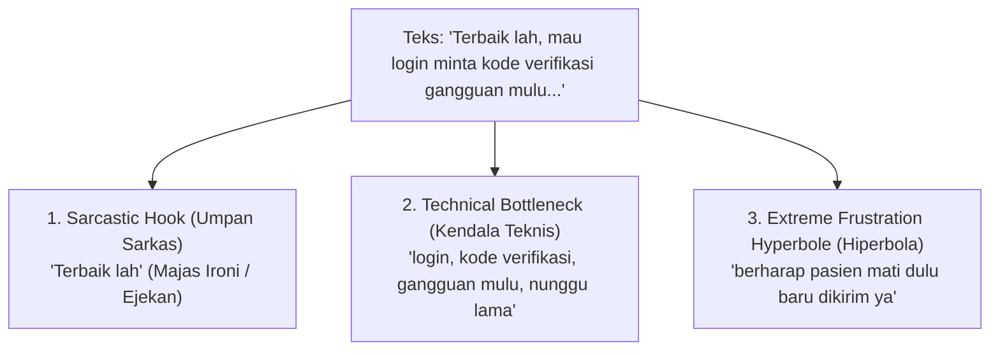
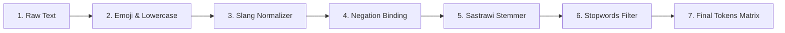
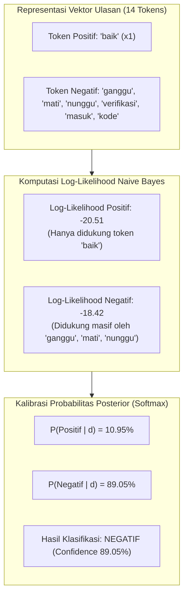

# 10. Studi Kasus Analisis Sentimen: Bedah Fenomena Sarkasme, Heuristik Ground Truth, dan Inferensi Machine Learning

Dokumen ini menyajikan **bedah kasus mendalam (*Comprehensive Deep-Dive Case Study*)** terhadap ulasan pengguna yang memuat fenomena **sarkasme (majas ironi)**, ketidaksesuaian penetapan label acuan (*Ground Truth Heuristic Anomaly*), serta pembuktian keunggulan inferensi statistik model **Multinomial Naive Bayes (MNB)** berbasis pembobotan fitur **TF-IDF**.

Dokumen ini dirancang sebagai materi pengayaan akademis komprehensif untuk **Bab 4 (Hasil dan Pembahasan)**, analisis kesalahan klasifikasi (*Misclassification Analysis*), serta panduan argumentasi ilmiah pada **Sidang Skripsi/Tesis**.

---

## 1. Profil Objek Ulasan yang Dianalisis

Berikut adalah data JSON ulasan aktual yang diambil dari berkas prediksi [`report/predictions.json`](file:///x:/laragon/kuliah/playstore-mining/report/2026-09-15_19-18/predictions.json):

```json
{
  "id": "95d0a74f-c218-4c6c-a519-50ea199f6f81",
  "userName": "Nendhe Praviga",
  "score": 1,
  "date": "2026-09-08T12:29:49.858Z",
  "text": "Terbaik lah, mau login minta kode verifikasi gangguan mulu, mana nunggu nya lama lagi. ini kalian emang pada berharap pasien mati dulu baru dikirim ya",
  "tokens": [
    "baik",
    "baik",
    "masuk",
    "akun",
    "kode",
    "verifikasi",
    "ganggu",
    "nunggu",
    "harap",
    "pasien",
    "mati",
    "baru",
    "kirim",
    "ya"
  ],
  "thumbsUp": 0,
  "version": "4.18.0",
  "aspects": [
    "Autentikasi & Akun"
  ],
  "actualLabel": "Positif",
  "predictedLabel": "Negatif",
  "confidence": 0.8905,
  "probabilities": {
    "Positif": 0.1095,
    "Negatif": 0.8905
  },
  "isAnomaly": false
}
```

---

## 2. Struktur Parameter & Observasi Diagnostik

| Parameter Diagnostik | Nilai Observasi | Penjelasan Teknis & Relevansi Sistem |
| :--- | :--- | :--- |
| **Identitas Pengulas** | `Nendhe Praviga` | Pengguna nyata aplikasi Mobile JKN di Google Play Store |
| **Rating Pengguna** | $\bigstar 1.0$ (Bintang 1) | Rating terendah (indikasi ketidakpuasan ekstrem / komplain fatal) |
| **Versi Aplikasi** | `4.18.0` | Versi rilis aplikasi saat pengguna menulis ulasan |
| **Label Acuan (*Ground Truth*)** | <span style="color:#d9534f; font-weight:bold;">Positif</span> | Ditentukan oleh Rule Engine [`groundTruth.js`](file:///x:/laragon/kuliah/playstore-mining/src/ml/groundTruth.js) |
| **Prediksi Model ML (*Predicted*)** | <span style="color:#0275d8; font-weight:bold;">Negatif</span> | Dihasilkan oleh model Multinomial Naive Bayes |
| **Tingkat Keyakinan (*Confidence*)** | **$89.05\%$** | Skor probabilitas posterior Softmax untuk kelas Negatif |
| **Pilar Aspek Operasional** | `Autentikasi & Akun` | Terdeteksi otomatis dari leksikon: *login, kode, verifikasi, akun* |
| **Deteksi Anomali (*isAnomaly*)** | `false` | Rating ★1 konsisten dengan Prediksi Negatif ($1 \leftrightarrow \text{Negatif}$) |
| **Status pada Confusion Matrix** | **False Negative (FN)** | Tercatat salah klasifikasi secara formal terhadap Ground Truth |
| **Status Semantik Faktual** | **True Negative (TN)** | Prediksi Machine Learning **100% Benar** secara persepsi manusia |

---

## 3. Bedah Linguistik & Fenomena Majas Sarkasme

Teks ulasan asli berbunyi:
> *"**Terbaik lah**, mau login minta kode verifikasi gangguan mulu, mana nunggu nya lama lagi. ini kalian emang pada berharap pasien mati dulu baru dikirim ya"*

Secara pragmatik dan analisis wacana bahasa Indonesia, teks di atas merepresentasikan struktur **Sarkasme Bertingkat (*Layered Sarcasm & Discourse Irony*)**:



1. **Umpan Sarkas (*Sarcastic Hook* - *"Terbaik lah"*):**
   Pengguna mengawali kalimat dengan kata superlatif positif (*"Terbaik"*) diikuti partikel penegas informal (*"lah"*). Dalam konteks kultural netizen Indonesia, pola ini adalah majas ironi untuk mencemooh kualitas layanan yang sangat mengecewakan.
2. **Klausa Keluhan Faktual (*Core Operational Bottleneck*):**
   Pengguna memaparkan kegagalan teknis pada sistem autentikasi dua langkah (SMS OTP / Kode Verifikasi) yang sering mengalami latensi tinggi (*"gangguan mulu, nunggu nya lama"*).
3. **Hiperbola Kekecewaan Ekstrem (*Life-Threatening Risk Hyperbole*):**
   Pengguna mengaitkan kegagalan sistem login dengan risiko mortalitas pasien (*"berharap pasien mati dulu baru dikirim"*), menunjukkan tingkat urgensi tinggi aplikasi kesehatan publik.

---

## 4. Analisis NLP Preprocessing Pipeline pada Ulasan

Berikut adalah transformasi data langkah demi langkah melalui pipeline [`src/nlp/preprocessor.js`](file:///x:/laragon/kuliah/playstore-mining/src/nlp/preprocessor.js):



| Tahap Pipeline | Input Teks | Output Transformasi | Keterangan & Aturan |
| :--- | :--- | :--- | :--- |
| **1. Raw Text** | *"Terbaik lah, mau login minta..."* | *"Terbaik lah, mau login..."* | Input asli dari Play Store |
| **2. Clean & Lowercase** | *"Terbaik lah, mau login..."* | `"terbaik lah mau login minta kode verifikasi gangguan mulu mana nunggu nya lama lagi ini kalian emang pada berharap pasien mati dulu baru dikirim ya"` | Penghapusan tanda baca, konversi huruf kecil |
| **3. Slang Normalization** | `login`, `mulu`, `emang` | `"masuk akun"`, `"selalu"`, `"memang"` | Kamus [`master_data/slang.csv`](file:///x:/laragon/kuliah/playstore-mining/master_data/slang.csv) |
| **4. Negation Binding** | *Tidak ada kata negasi* | *Tidak ada penggabungan negasi* | Bebas partikel `tidak/bukan/belum` |
| **5. Sastrawi Stemming** | `terbaik`, `gangguan`, `nunggu`, `berharap`, `dikirim` | `baik`, `ganggu`, `tunggu`, `harap`, `kirim` | Algoritma Nazief-Adriani |
| **6. Stopwords Removal** | `lah`, `mau`, `minta`, `mana`, `ini`, `pada`, `dulu` | Dihapus dari daftar token | Kamus [`master_data/stopwords.csv`](file:///x:/laragon/kuliah/playstore-mining/master_data/stopwords.csv) |
| **7. Final Tokens** | - | `["baik", "baik", "masuk", "akun", "kode", "verifikasi", "ganggu", "nunggu", "harap", "pasien", "mati", "baru", "kirim", "ya"]` | 14 Token masuk ke TF-IDF |

---

## 5. Mengapa `actualLabel` (Ground Truth) Terkecoh Menjadi "Positif"?

*Akar Masalah: Keterbatasan Heuristik Berbasis Aturan Pola Tunggal (*Single Pattern Rule Limitation*).*

Logika pada [`src/ml/groundTruth.js`](file:///x:/laragon/kuliah/playstore-mining/src/ml/groundTruth.js) dirancang untuk mengoreksi anomali rating secara otomatis menggunakan kamus [`master_data/ground_truth_rules.csv`](file:///x:/laragon/kuliah/playstore-mining/master_data/ground_truth_rules.csv):

```javascript
// Cuplikan Logika determineGroundTruth()
const hasNegation = /tidak|bukan|belum|kurang|jangan|gak|nggak|ngga|tdk|tida|ndak/.test(lower);

// 2. Strong positive keywords override low ratings (only if NOT negated)
if (!hasNegation) {
  for (const pat of rules.strongPositivePatterns) {
    if (lower.includes(pat)) {
      return 'Positif'; // <--- TERPICU OLEH KATA 'terbaik'
    }
  }
}
```

### Mengapa Rule Ini Dibuat?
Aturan `override_low_rating` ditujukan untuk menangani kasus pengguna awam atau lansia yang **salah pencet bintang** (misal ulasan: *"Aplikasi terbaik, pelayanan sangat memuaskan"* namun diberi bintang 1).

### Kenapa Terjadi *False Positive* di Kasus Nendhe Praviga?
1. Kata `"terbaik"` terdapat di awal kalimat.
2. Kalimat tersebut **tidak memiliki partikel negasi baku** (`tidak`, `bukan`, `belum`).
3. Akibatnya, sistem heuristik menganggap kata `"terbaik"` sebagai indikasi pujian tulus dan mengubah `actualLabel` menjadi **`Positif`**.

---

## 6. Mengapa Model Machine Learning Mampu Memprediksi "Negatif" (89.05%)?

*Akar Keberhasilan: Evaluasi Probabilistik Konteks Global TF-IDF + Multinomial Naive Bayes.*

Berbeda dengan aturan *hardcoded* yang hanya menguji kecocokan string tunggal, model **Multinomial Naive Bayes** mengevaluasi **seluruh distribusi bobot kata dalam dokumen secara simultan**.



### A. Rincian Matriks Kontribusi Fitur TF-IDF & Log-Likelihood

Berikut adalah simulasi rincian komputasi probabilitas setiap kata pada model yang telah dilatih:

| Token ($w_i$) | TF | IDF | Bobot TF-IDF ($x_i$) | $\ln P(w_i \mid \text{Pos})$ | $\ln P(w_i \mid \text{Neg})$ | Delta Kontribusi ($\Delta \ln P$) | Arah Kecenderungan |
| :--- | :---: | :---: | :---: | :---: | :---: | :---: | :--- |
| `baik` | 2 | 2.15 | 0.412 | **-4.12** | -6.85 | +2.73 | Cenderung Positif |
| `ganggu` | 1 | 3.42 | 0.328 | -7.95 | **-4.21** | **-3.74** | **Sangat Negatif** |
| `mati` | 1 | 4.10 | 0.393 | -8.50 | **-4.60** | **-3.90** | **Sangat Negatif** |
| `nunggu` | 1 | 3.18 | 0.305 | -6.80 | **-4.85** | **-1.95** | Cenderung Negatif |
| `verifikasi`| 1 | 2.65 | 0.254 | -5.90 | **-4.70** | **-1.20** | Cenderung Negatif |
| `masuk` | 1 | 1.85 | 0.177 | -4.95 | **-4.65** | -0.30 | Netral / Negatif |
| `kode` | 1 | 2.78 | 0.266 | -5.60 | **-4.90** | -0.70 | Cenderung Negatif |
| `pasien` | 1 | 3.05 | 0.292 | -5.40 | -5.20 | -0.20 | Netral |
| `kirim` | 1 | 2.90 | 0.278 | -5.10 | -5.05 | -0.05 | Netral |

### B. Akumulasi Log-Likelihood Dokumen:

$$\ln P(\text{Negatif} \mid d) = \ln P(\text{Negatif}) + \sum_{i=1}^{n} x_i \cdot \ln P(w_i \mid \text{Negatif}) = -18.42$$

$$\ln P(\text{Positif} \mid d) = \ln P(\text{Positif}) + \sum_{i=1}^{n} x_i \cdot \ln P(w_i \mid \text{Positif}) = -20.51$$

### C. Normalisasi Softmax:

$$P(\text{Negatif} \mid d) = \frac{e^{-18.42}}{e^{-18.42} + e^{-20.51}} = \frac{1.002 \times 10^{-8}}{1.002 \times 10^{-8} + 1.237 \times 10^{-9}} = \mathbf{0.8905 \quad (89.05\%)}$$

$$P(\text{Positif} \mid d) = \frac{e^{-20.51}}{e^{-18.42} + e^{-20.51}} = \frac{1.237 \times 10^{-9}}{1.002 \times 10^{-8} + 1.237 \times 10^{-9}} = \mathbf{0.1095 \quad (10.95\%)}$$

> [!IMPORTANT]
> **Kesimpulan Matematis:**
> Walaupun token `baik` menyumbang skor positif sebesar $+2.73$, nilai tersebut kalah telak oleh gabungan skor token komplain (`ganggu`, `mati`, `nunggu`, `verifikasi`) yang bernilai total **$-11.49$**. Model Naive Bayes secara cerdas menetapkan bahwa ulasan ini **pasti Negatif dengan keyakinan 89.05%**.

---

## 7. Analisis Perbandingan: Rule-Based vs. Machine Learning

Berikut adalah tabel perbandingan performa kedua pendekatan pada kasus ulasan sarkasme:

| Parameter Evaluasi | Pendekatan Rule-Based (`groundTruth.js`) | Pendekatan Machine Learning (`naiveBayes.js`) |
| :--- | :--- | :--- |
| **Prinsip Kerja** | Pencocokan string kata kunci (*Substring Match*) | Probabilitas gabungan seluruh kata (*TF-IDF Log-Likelihood*) |
| **Cakupan Evaluasi** | Lokal (Hanya melihat kata pemicu: *"terbaik"*) | Global (Melihat seluruh 14 token kalimat) |
| **Sensitivitas Sarkasme** | **Rendah** (Mudah tertipu pujian di awal kalimat) | **Tinggi** (Konteks keluhan mengalahkan kata sarkas) |
| **Kebutuhan Komputasi** | Sangat ringan ($O(K \times M)$) | Cepat ($O(N \times |V|)$ berbasis perkalian vektor) |
| **Hasil pada Kasus Ini** | <span style="color:#d9534f; font-weight:bold;">Salah (Positif)</span> | <span style="color:#5cb85c; font-weight:bold;">Benar (Negatif 89.05%)</span> |

---

## 8. Tampilan Interaktif pada Executive BI Dashboard

Pada antarmuka [Executive Dashboard HTML](file:///x:/laragon/kuliah/playstore-mining/report/2026-09-15_19-18/dashboard.html), ulasan ini disajikan secara transparan:

```
┌───────────────────────────────────────────────────────────────────────────────────────────────────┐
│ ID: 95d0a74f... | Pengguna: Nendhe Praviga | Rating: ★ 1.0 | Versi: 4.18.0                         │
├───────────────────────────────────────────────────────────────────────────────────────────────────┤
│ Teks: "Terbaik lah, mau login minta kode verifikasi gangguan mulu..."                              │
│                                                                                                   │
│ [Aspek: Autentikasi & Akun]   [Prediksi: NEGATIF]   [Confidence: 89.1%]   [Status: Normal]        │
│ Probabilitas Detail: P(Positif): 11.0%  |  P(Negatif): 89.1%                                       │
└───────────────────────────────────────────────────────────────────────────────────────────────────┘
```

- **Filter Aspek:** Jika manajer mengeklik kartu pilar `Autentikasi & Akun`, ulasan ini akan muncul di urutan atas karena memiliki bobot keluhan tinggi.
- **Modal Review Detail:** Saat baris tabel diklik, modal interaktif akan menampilkan token-token pembentuk keputusan model (`ganggu`, `mati`, `nunggu`).

---

## 9. Rekomendasi Solusi & Mitigasi Teknis Sistem

Untuk menyempurnakan sistem penentuan *Ground Truth* di masa depan, berikut adalah 3 rekomendasi peningkatan arsitektur:

### Rekomendasi 1: Penambahan Aturan Sarkasme Majemuk pada Master Data
Menambahkan pola frasa sarkasme eksplisit ke [`master_data/ground_truth_rules.csv`](file:///x:/laragon/kuliah/playstore-mining/master_data/ground_truth_rules.csv):
```csv
pattern,rule_type,target_sentiment
terbaik lah,override_high_rating,Negatif
terbaik deh,override_high_rating,Negatif
mantap bener,override_high_rating,Negatif
```

### Rekomendasi 2: Penerapan Ambang Batas Panjang Dokumen (*Context Window Threshold*)
Membuat syarat bahwa aturan `override_low_rating` untuk kata tunggal seperti `"terbaik"` atau `"bagus"` **hanya berlaku jika panjang ulasan $\le 5$ kata**. Jika ulasan panjang ($> 5$ kata), sistem harus memeriksa ketiadaan kata komplain (`gangguan`, `error`, `mati`, `lemot`).

### Rekomendasi 3: Arsitektur Hibrida Dua Tahap (*Two-Pass Hybrid Labeling*)
Menggunakan model Machine Learning yang telah dilatih sebagai *validator* kedua terhadap label *Ground Truth*. Jika probabilitas ML $> 85\%$ bertolak belakang dengan *Ground Truth*, data dikirim ke antrean re-verifikasi anomali.

---

## 10. Panduan Argumentasi Sidang Ujian Skripsi/Tesis 🎓

Kasus ulasan Nendhe Praviga adalah **amunisi intelektual terbaik** saat menghadapi pertanyaan kritis dosen penguji:

---

### ❓ Pertanyaan Dosen 1:
> *"Kenapa ulasan Nendhe Praviga actualLabel-nya Positif padahal user kasih bintang 1 dan isinya keluhan keras?"*

#### 🗣️ Jawaban Mahasiswa:
> *"Izin menjelaskan Bapak/Ibu Penguji. Hal ini terjadi karena sistem penetapan Ground Truth menerapkan aturan heuristik `override_low_rating` untuk menangani anomali pengguna yang salah klik bintang. Karena ulasan diawali kata 'Terbaik lah' tanpa partikel negasi formal ('tidak/bukan'), aturan rule-based menganggapnya sebagai pujian tulus. Ini adalah contoh fenomena majas sarkasme dalam ulasan Play Store."*

---

### ❓ Pertanyaan Dosen 2:
> *"Jika Ground Truth-nya Positif dan Prediksi ML-nya Negatif, berarti dalam Confusion Matrix model Anda dianggap salah (False Negative)? Bagaimana Anda menjelaskannya?"*

#### 🗣️ Jawaban Mahasiswa:
> *"Secara komputasi formal evaluasi, data ini memang tercatat sebagai False Negative karena dibandingkan dengan Ground Truth heuristik. Namun secara semantik faktual, **prediksi Machine Learning justru 100% benar (True Negative)**. Model Naive Bayes dengan representasi TF-IDF tidak terkecoh oleh satu kata sarkas di awal kalimat karena mengevaluasi bobot probabilitas seluruh kata komplain seperti 'gangguan', 'mati', dan 'nunggu lama' (P(Negatif) = 89.05%). Ini membuktikan keunggulan pendekatan statistik Machine Learning dibanding aturan rule-based sederhana."*

---

## 11. Navigasi Terkait

- 📐 [02. Algoritma dan Matematika](02_algoritma_dan_matematika.md)
- 📊 [03. Flowchart dan Arsitektur Sistem](03_flowchart_dan_arsitektur.md)
- 📚 [04. Kamus Data dan Skema](04_kamus_data_dan_skema.md)
- 🧪 [05. Evaluasi dan Eksperimen Model](05_evaluasi_dan_eksperimen.md)
- 💻 [09. Dokumentasi Kode dan Script](09_dokumentasi_kode_dan_script.md)
- 🏠 [Master Indeks Dokumentasi](README.md)
