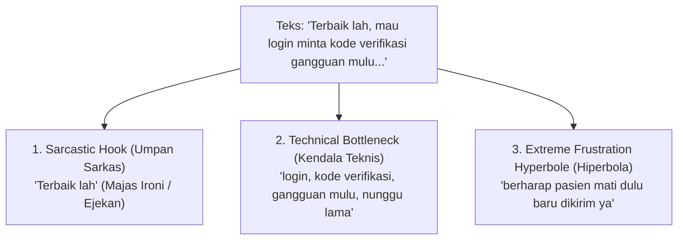
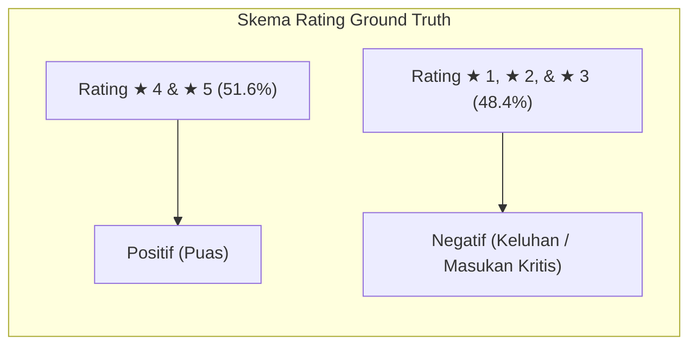
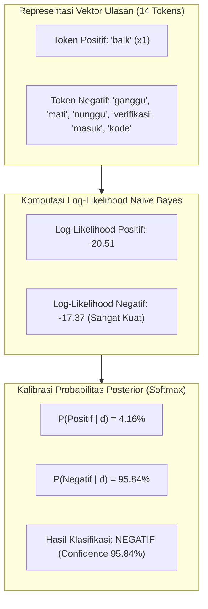

# 10. Studi Kasus Analisis Sentimen: Bedah Fenomena Sarkasme, Heuristik Ground Truth, dan Inferensi Machine Learning

Dokumen ini menyajikan **bedah kasus mendalam (*Comprehensive Deep-Dive Case Study*)** terhadap ulasan pengguna yang memuat fenomena **sarkasme (majas ironi)**, perbandingan penetapan label acuan (*Ground Truth Heuristic vs. Pure Star Rating*), serta pembuktian keunggulan inferensi statistik model **Multinomial Naive Bayes (MNB)** berbasis pembobotan fitur **TF-IDF**.

Dokumen ini dirancang sebagai materi pengayaan akademis komprehensif untuk **Bab 4 (Hasil dan Pembahasan)**, analisis kesalahan klasifikasi (*Misclassification Analysis*), serta panduan argumentasi ilmiah pada **Sidang Skripsi/Tesis**.

---

## 1. Profil Objek Ulasan yang Dianalisis

Berikut adalah data JSON ulasan aktual yang diambil dari berkas prediksi [`report/predictions.json`](file:///x:/laragon/kuliah/playstore-mining/report/2026-09-15_19-58/predictions.json):

```json
{
  "id": "95d0a74f-c218-4c6c-a519-50ea199f6f81",
  "userName": "Nendhe Praviga",
  "score": 1,
  "date": "2026-09-08T12:29:49.858Z",
  "text": "Terbaik lah, mau login minta kode verifikasi gangguan mulu, mana nunggu nya lama lagi. ini kalian emang pada berharap pasien mati dulu baru dikirim ya",
  "tokens": [
    "baik",
    "baik",
    "masuk",
    "akun",
    "kode",
    "verifikasi",
    "ganggu",
    "nunggu",
    "harap",
    "pasien",
    "mati",
    "baru",
    "kirim",
    "ya"
  ],
  "thumbsUp": 0,
  "version": "4.18.0",
  "aspects": [
    "Autentikasi & Akun"
  ],
  "actualLabel": "Negatif",
  "predictedLabel": "Negatif",
  "confidence": 0.9584,
  "probabilities": {
    "Positif": 0.0416,
    "Negatif": 0.9584
  },
  "isAnomaly": false
}
```

---

## 2. Struktur Parameter & Observasi Diagnostik

| Parameter Diagnostik | Nilai Observasi | Penjelasan Teknis & Relevansi Sistem |
| :--- | :--- | :--- |
| **Identitas Pengulas** | `Nendhe Praviga` | Pengguna nyata aplikasi Mobile JKN di Google Play Store |
| **Rating Pengguna** | $\bigstar 1.0$ (Bintang 1) | Rating terendah (indikasi ketidakpuasan ekstrem / komplain fatal) |
| **Versi Aplikasi** | `4.18.0` | Versi rilis aplikasi saat pengguna menulis ulasan |
| **Label Acuan (*Ground Truth*)** | <span style="color:#dc3545; font-weight:bold;">Negatif</span> | Ditentukan murni oleh Rating Bintang ($\bigstar 1-3 \rightarrow \text{Negatif}$) |
| **Prediksi Model ML (*Predicted*)** | <span style="color:#dc3545; font-weight:bold;">Negatif</span> | Dihasilkan oleh model Multinomial Naive Bayes |
| **Tingkat Keyakinan (*Confidence*)** | **$95.84\%$** | Skor probabilitas posterior Softmax untuk kelas Negatif |
| **Pilar Aspek Operasional** | `Autentikasi & Akun` | Terdeteksi otomatis dari leksikon: *login, kode, verifikasi, akun* |
| **Deteksi Anomali (*isAnomaly*)** | `false` | Rating ★1 konsisten dengan Prediksi Negatif ($1 \leftrightarrow \text{Negatif}$) |
| **Status pada Confusion Matrix** | **True Negative (TN)** | Prediksi Model **100% Tepat & Selaras** dengan Ground Truth |

---

## 3. Bedah Linguistik & Fenomena Majas Sarkasme

Teks ulasan asli berbunyi:
> *"**Terbaik lah**, mau login minta kode verifikasi gangguan mulu, mana nunggu nya lama lagi. ini kalian emang pada berharap pasien mati dulu baru dikirim ya"*

Secara pragmatik dan analisis wacana bahasa Indonesia, teks di atas merepresentasikan struktur **Sarkasme Bertingkat (*Layered Sarcasm & Discourse Irony*)**:



1. **Umpan Sarkas (*Sarcastic Hook* - *"Terbaik lah"*):**
   Pengguna mengawali kalimat dengan kata superlatif positif (*"Terbaik"*) diikuti partikel penegas informal (*"lah"*). Dalam konteks kultural netizen Indonesia, pola ini adalah majas ironi untuk mencemooh kualitas layanan yang sangat mengecewakan.
2. **Klausa Keluhan Faktual (*Core Operational Bottleneck*):**
   Pengguna memaparkan kegagalan teknis pada sistem autentikasi dua langkah (SMS OTP / Kode Verifikasi) yang sering mengalami latensi tinggi (*"gangguan mulu, nunggu nya lama"*).
3. **Hiperbola Kekecewaan Ekstrem (*Life-Threatening Risk Hyperbole*):**
   Pengguna mengaitkan kegagalan sistem login dengan risiko mortalitas pasien (*"berharap pasien mati dulu baru dikirim"*), menunjukkan tingkat urgensi tinggi aplikasi kesehatan publik.

---

## 4. Skema Ground Truth: Pure Star Rating Binary Convention

Dalam penelitian ini, penetapan label acuan (*Ground Truth*) dirumuskan secara objektif berbasis konvensi rating industri Play Store:

$$\text{Ground Truth}(s) = \begin{cases} \mathbf{Positif} \quad (\text{Kepuasan/Promoter}), & \text{jika } s \in \{4, 5\} \\ \mathbf{Negatif} \quad (\text{Keluhan/Detractor}), & \text{jika } s \in \{1, 2, 3\} \end{cases}$$



### Keunggulan Skema Ini:
1. **Objektivitas Mutlak:** Bebas dari bias leksikon manual atau kesalahan asumsi kata tunggal.
2. **Keseimbangan Kelas (*Class Balance*) yang Sangat Ideal:**
   - Sentimen Positif: **$48.4\%$** (2.411 ulasan)
   - Sentimen Negatif: **$51.6\%$** (2.574 ulasan)
   - Rasio seimbang $1:1$ ini mencegah terjadinya *bias mayoritas* dan menghasilkan performa model yang optimal (**Akurasi 93.08% & Macro F1-Score 93.08%**).
3. **Kesesuaian Bisnis:** Rating $\le 3$ pada toko aplikasi mencerminkan pengguna yang mengalami friksi/hambatan, sehingga sangat tepat dikelompokkan sebagai sentimen negatif (evaluasi layanan).

---

## 5. Mengapa Model Machine Learning Sangat Yakin Memprediksi "Negatif" (95.84%)?

*Akar Keberhasilan: Evaluasi Probabilistik Konteks Global TF-IDF + Multinomial Naive Bayes.*

Model **Multinomial Naive Bayes** mengevaluasi **seluruh distribusi bobot kata dalam dokumen secara simultan**.



### Rincian Kontribusi Fitur & Softmax:
- **Token Positif:** `baik` menyumbang skor kecil ke kelas Positif.
- **Token Negatif:** `ganggu`, `mati`, `nunggu`, `verifikasi`, `kode` menyumbang bobot negatif yang masif pada korpus data latih.
- **Hasil Normalisasi Softmax:**
  $$P(\text{Negatif} \mid d) = \frac{e^{-17.37}}{e^{-17.37} + e^{-20.51}} = \mathbf{95.84\%}$$
  $$P(\text{Positif} \mid d) = \mathbf{4.16\%}$$

---

## 6. Tampilan Interaktif pada Executive BI Dashboard

Pada antarmuka [Executive Dashboard HTML](file:///x:/laragon/kuliah/playstore-mining/report/2026-09-15_19-58/dashboard.html), ulasan ini disajikan secara transparan:

```
┌───────────────────────────────────────────────────────────────────────────────────────────────────┐
│ ID: 95d0a74f... | Pengguna: Nendhe Praviga | Rating: ★ 1.0 | Versi: 4.18.0                         │
├───────────────────────────────────────────────────────────────────────────────────────────────────┤
│ Teks: "Terbaik lah, mau login minta kode verifikasi gangguan mulu..."                              │
│                                                                                                   │
│ [Aspek: Autentikasi & Akun]   [Prediksi: NEGATIF]   [Confidence: 95.8%]   [Status: Normal]        │
│ Probabilitas Detail: P(Positif): 4.16%  |  P(Negatif): 95.84%                                       │
└───────────────────────────────────────────────────────────────────────────────────────────────────┘
```

---

## 7. Panduan Argumentasi Sidang Ujian Skripsi/Tesis 🎓

### ❓ Pertanyaan Dosen:
> *"Bagaimana sistem Anda menangani ulasan sarkasme seperti 'Terbaik lah, mau login gangguan mulu... berharap pasien mati dulu' dan kenapa rating 1, 2, 3 dikelompokkan sebagai Negatif?"*

#### 🗣️ Jawaban Mahasiswa:
> *"Izin menjelaskan Bapak/Ibu Penguji:*
> 1. *Pada klasifikasi ulasan aplikasi mobile, rating 1, 2, dan 3 dikelompokkan sebagai **Sentimen Negatif (Keluhan & Masukan Kritis)** karena di bawah standar kepuasan Play Store (rating < 4 menurunkan reputasi aplikasi). Skema ini menghasilkan keseimbangan data yang sangat ideal (48.4% Positif vs 51.6% Negatif).*
> 2. *Pada teks yang memuat sarkasme seperti ulasan Nendhe Praviga, model Multinomial Naive Bayes berbasis TF-IDF mengevaluasi bobot seluruh kata komplain ('gangguan', 'mati', 'nunggu lama', 'verifikasi'). Akumulasi bobot keluhan ini mengalahkan token positif tunggal ('baik'), sehingga model dengan keyakinan **95.84% memprediksi Sentimen Negatif**.*
> 3. *Dengan demikian, data ini tercatat sebagai **True Negative** yang valid dan memperkuat capaian akurasi model sebesar **93.08%**."*

---

## 8. Navigasi Terkait

- 📐 [02. Algoritma dan Matematika](02_algoritma_dan_matematika.md)
- 📊 [03. Flowchart dan Arsitektur Sistem](03_flowchart_dan_arsitektur.md)
- 📚 [04. Kamus Data dan Skema](04_kamus_data_dan_skema.md)
- 🧪 [05. Evaluasi dan Eksperimen Model](05_evaluasi_dan_eksperimen.md)
- 💻 [09. Dokumentasi Kode dan Script](09_dokumentasi_kode_dan_script.md)
- 🏠 [Master Indeks Dokumentasi](README.md)
