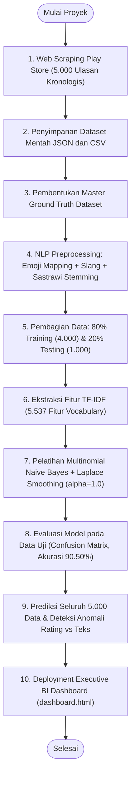
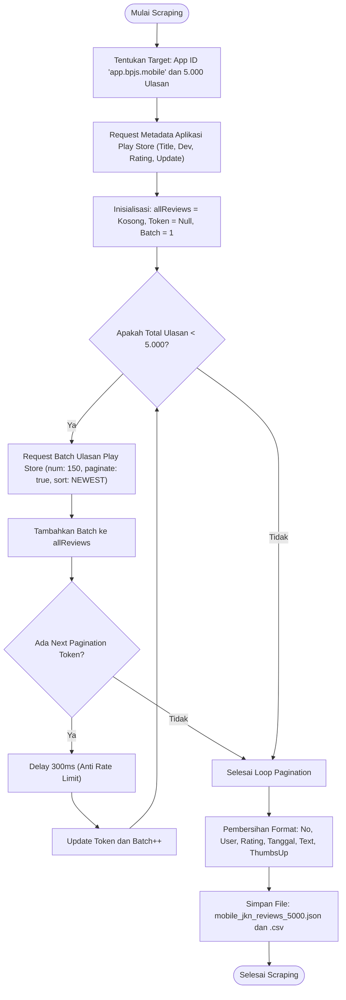
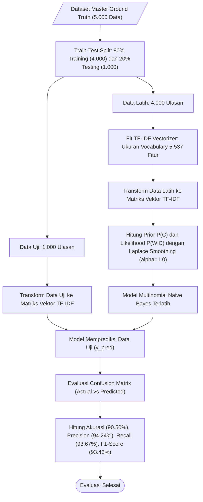
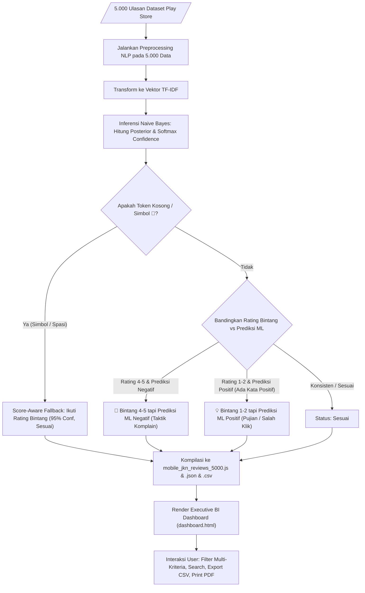

# 🔄 Dokumentasi Diagram Alir (Flowchart) Sistem
## Arsitektur Pipeline Data Mining & Multinomial Naive Bayes Mobile JKN

Dokumen ini memuat diagram alir (*flowchart*) seluruh tahapan dalam sistem **Play Store Mining & Multinomial Naive Bayes Sentiment Analytics**.

---

## 📑 Daftar Diagram
1. [Flowchart 1: Alur Keseluruhan Sistem (End-to-End Pipeline)](#1-alur-keseluruhan-sistem-end-to-end-pipeline)
2. [Flowchart 2: Alur Scraping Data Google Play Store](#2-alur-scraping-data-google-play-store)
3. [Flowchart 3: Alur Text Preprocessing (Emoji + Sastrawi + TF-IDF)](#3-alur-text-preprocessing-emoji--sastrawi--tf-idf)
4. [Flowchart 4: Alur Pelatihan & Evaluasi Model Multinomial Naive Bayes](#4-alur-pelatihan--evaluasi-model-multinomial-naive-bayes)
5. [Flowchart 5: Alur Deteksi Anomali & Executive Dashboard](#5-alur-deteksi-anomali--executive-dashboard)

---

## 1. Alur Keseluruhan Sistem (End-to-End Pipeline)

---

## 2. Alur Scraping Data Google Play Store

---

## 3. Alur Text Preprocessing (Emoji + Sastrawi + TF-IDF)

```mermaid
flowchart TD
    RawText[/"Input: Teks Ulasan Mentah Pengguna"/] --> EmojiMap["1. Emoji Translation: 👍 -> emoji_jempol_bagus, 🔪 -> emoji_bahaya_ancaman"]
    EmojiMap --> CaseFold["2. Case Folding: Ubah semua karakter ke huruf kecil"]
    CaseFold --> CleanRegex["3. Data Cleansing: Hapus URL, Tanda Baca, Karakter Non-Alfanumerik"]
    CleanRegex --> ReduceChar["4. Reduksi Karakter Repetitif: 'baguuuss' -> 'bagus', 'erorrr' -> 'error'"]
    ReduceChar --> Tokenize["5. Tokenisasi: Pemisahan kalimat menjadi array kata"]
    Tokenize --> NormalizeSlang["6. Normalisasi Slang: Ganti kata gaul ('bgus' -> 'bagus', 'gak' -> 'tidak')"]
    NormalizeSlang --> Stemming["7. Sastrawi Stemming: Reduksi morfologi kata ('mempermudah' -> 'mudah')"]
    Stemming --> FormBigram["8. Pembentukan Unigram + Bigram: 'tidak' + 'bisa' -> 'tidak_bisa'"]
    FormBigram --> RemoveStopwords["9. Stopword Filtering: Hapus kata umum tanpa menghapus kata negasi"]
    
    RemoveStopwords --> CleanTokens[/"Output: Cleaned Tokens"/]
    CleanTokens --> CalcTF["Hitung Term Frequency (TF) per Dokumen"]
    CalcTF --> CalcIDF["Hitung Inverse Document Frequency (IDF) Korpus Latih"]
    CalcIDF --> CalcTFIDF["Hitung Bobot TF-IDF = TF x IDF"]
    CalcTFIDF --> L2Norm["Terapkan Normalisasi Euclidean L2-Norm"]
    L2Norm --> OutVec[/"Output: Vektor Fitur Numerik Machine Learning"/]
```

---

## 4. Alur Pelatihan & Evaluasi Model Multinomial Naive Bayes

---

## 5. Alur Deteksi Anomali & Executive Dashboard

