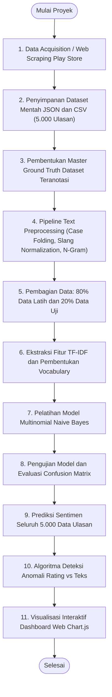
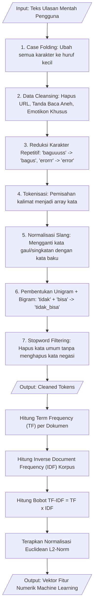
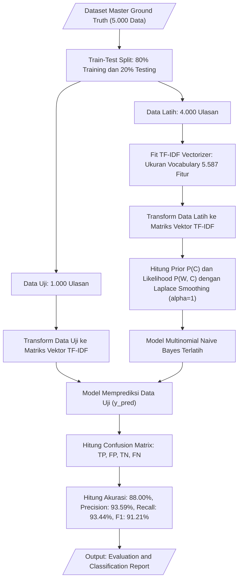
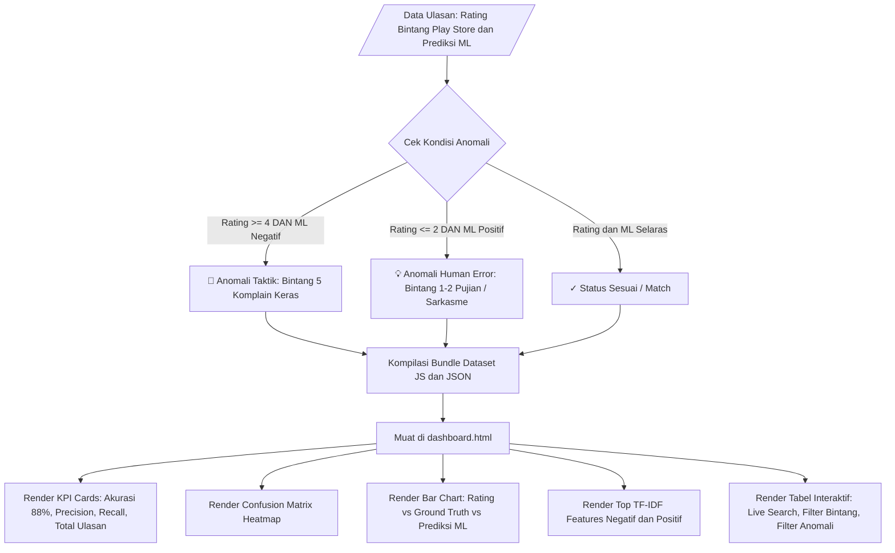
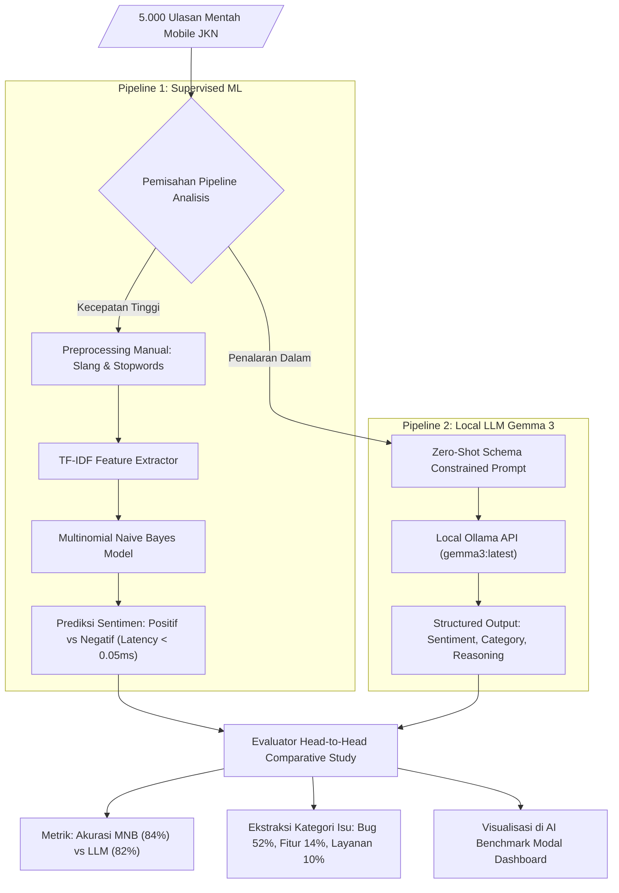

# 🔄 Dokumentasi Diagram Alir (Flowchart) Sistem

Dokumen ini memuat diagram alir (*flowchart*) seluruh tahapan dalam sistem **Play Store Mining & Supervised Machine Learning Sentiment Analysis Mobile JKN**.

---

## 📑 Daftar Diagram
1. [Flowchart 1: Alur Keseluruhan Sistem (End-to-End Pipeline)](#1-alur-keseluruhan-sistem-end-to-end-pipeline)
2. [Flowchart 2: Alur Scraping Data Google Play Store](#2-alur-scraping-data-google-play-store)
3. [Flowchart 3: Alur Text Preprocessing & Ekstraksi Fitur TF-IDF](#3-alur-text-preprocessing--ekstraksi-fitur-tf-idf)
4. [Flowchart 4: Alur Pelatihan & Evaluasi Model Machine Learning](#4-alur-pelatihan--evaluasi-model-machine-learning)
5. [Flowchart 5: Alur Deteksi Anomali & Visualisasi Dashboard](#5-alur-deteksi-anomali--visualisasi-dashboard)

---

## 1. Alur Keseluruhan Sistem (End-to-End Pipeline)

---

## 2. Alur Scraping Data Google Play Store

---

## 3. Alur Text Preprocessing & Ekstraksi Fitur TF-IDF

---

## 4. Alur Pelatihan & Evaluasi Model Machine Learning

---

## 5. Alur Deteksi Anomali & Visualisasi Dashboard

---

## 6. Alur Hybrid AI & Studi Komparatif LLM Gemma 3 vs Naive Bayes

