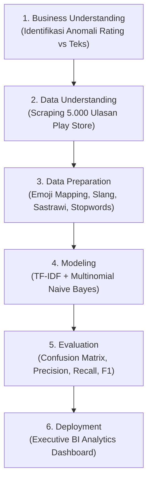

# 🔬 Metodologi Penelitian Data Mining & Machine Learning
## Klasifikasi Sentimen & Deteksi Anomali Ulasan Mobile JKN Menggunakan Multinomial Naive Bayes

Dokumen ini menyajikan kerangka kerja metodologi ilmiah standar (*CRISP-DM / KDD Framework*) yang dapat langsung diadopsi ke dalam penyusunan **Bab 3 (Metodologi Penelitian) Skripsi / Tugas Akhir / Tesis S2**.

---

## 📑 Daftar Isi
1. [Kerangka Kerja Penelitian (CRISP-DM)](#1-kerangka-kerja-penelitian-crisp-dm)
2. [Objek & Sumber Data Penelitian](#2-objek--sumber-data-penelitian)
3. [Teknik Pengumpulan Data (Scraping)](#3-teknik-pengumpulan-data-scraping)
4. [Teknik Anotasi & Pembuatan Ground Truth](#4-teknik-anotasi--pembuatan-ground-truth)
5. [Tahapan Preprocessing & Pemodelan Machine Learning](#5-tahapan-preprocessing--pemodelan-machine-learning)
6. [Instrumen & Lingkungan Pengembangan](#6-instrumen--lingkungan-pengembangan)

---

## 1. Kerangka Kerja Penelitian (CRISP-DM)

Penelitian ini mengadopsi metodologi **CRISP-DM (*Cross-Industry Standard Process for Data Mining*)**:

1. **Business Understanding**:
   - Menganalisis ketidaksesuaian (*inconsistency*) antara rating bintang Play Store dan teks ulasan sebenarnya.
   - Merancang model klasifikasi sentimen otomatis yang andal dan cepat untuk membantu pengambil keputusan BPJS Kesehatan.
2. **Data Understanding**:
   - Pengumpulan dataset ulasan aktual dari Google Play Store sebanyak 5.000 ulasan.
3. **Data Preparation**:
   - Pemetaan emoji semantik, pembersihan teks, normalisasi kata slang gaul, stemming morfologi bahasa Indonesia Sastrawi, dan penghapusan stopword selektif.
4. **Modeling**:
   - Pembagian data 80:20 (*Train-Test Split*), pembobotan kata dengan TF-IDF Vectorizer (5.537 vocabulary unik), dan pelatihan Multinomial Naive Bayes dengan Laplace Smoothing ($\alpha=1.0$).
5. **Evaluation**:
   - Pengujian Confusion Matrix pada data uji 1.000 ulasan (Akurasi 90.50% | F1-Score 61.11%).
6. **Deployment**:
   - Implementasi Executive BI Analytics Dashboard (`dashboard.html`) berbasis web dengan fitur interaktif filter, pencarian, dan export.

---

## 2. Objek & Sumber Data Penelitian

- **Nama Aplikasi**: Mobile JKN
- **Developer**: BPJS Kesehatan
- **Package ID**: `app.bpjs.mobile`
- **Sumber Data**: Google Play Store Indonesia (`lang: 'id', country: 'id'`)
- **Total Populasi Sampel**: 5.000 Ulasan Pengguna
- **Rentang Periode Ulasan**: 05 Agustus 2026 s/d 11 September 2026

---

## 3. Teknik Pengumpulan Data (Scraping)

Pengambilan data dilakukan menggunakan automated API scraper berbasis Node.js (`google-play-scraper`) dengan spesifikasi:
- **Metode Sortir**: `gplay.sort.NEWEST` (Ulasan terbaru secara kronologis).
- **Pagination Control**: Menggunakan token rekursif (*nextPaginationToken*) dengan batch 150 ulasan per request hingga mencapai kuota 5.000 ulasan.
- **Rate-Limiting Protection**: Jeda interval 300 ms per request untuk menjaga stabilitas koneksi.

---

## 4. Teknik Anotasi & Pembuatan Ground Truth

Untuk menghindari bias rating bintang (seperti taktik *"Bintang 5 biar dibaca"* atau salah klik), dibangun **Master Ground Truth Dataset**:
1. **Kelas Sentimen**:
   - `Positif`: Ulasan berisi apresiasi, kepuasan, kemudahan antrean faskes, atau emoji pujian (`👍`, `🙏`, `❤️`).
   - `Negatif`: Ulasan berisi keluhan pendaftaran, kegagalan OTP, antrean penuh, bug server, atau emoji kekecewaan (`👎`, `😡`, `🔪`).
   - `Netral`: Ulasan tanpa muatan emosional khusus atau pernyataan umum singkat.
2. **Kaidah Khusus Anotasi**:
   - Frasa taktik (*"bintang 5 biar dibaca"*) wajib dianotasi sebagai `Negatif`.
   - Frasa sarkasme (*"terima kasih mengajarkan kesabaran"*) wajib dianotasi sebagai `Negatif`.
   - Keluhan layanan tersirat (*"jadwal dokter spesialis penuh berhari-hari"*) wajib dianotasi sebagai `Negatif`.

---

## 5. Tahapan Preprocessing & Pemodelan Machine Learning

### A. Pembagian Data (Train-Test Split)
Dataset 5.000 ulasan dibagi dengan rasio:
- **Data Latih (Training Set)**: 80% (4.000 ulasan) untuk membangun vocabulary TF-IDF dan menghitung probabilitas prior/likelihood Naive Bayes.
- **Data Uji (Testing Set)**: 20% (1.000 ulasan) untuk menguji akurasi model pada data yang belum pernah dilihat (*unseen data*).

### B. Pipeline Preprocessing
1. **Emoji Translation**: Menerjemahkan icon emoji ke token sentimen (`👍` $\rightarrow$ `emoji_jempol_bagus`).
2. **Case Folding & Cleaning**: Mengubah ke huruf kecil dan menghapus karakter non-alfanumerik.
3. **Slang Normalization**: Mengubah kata tidak baku menjadi baku (*"bgus"* $\rightarrow$ *"bagus"*, *"gak"* $\rightarrow$ *"tidak"*).
4. **Sastrawi Morphological Stemming**: Reduksi kata berimbuhan ke kata dasar (*"mempermudah"* $\rightarrow$ *"mudah"*).
5. **Stopwords Removal**: Menghapus kata umum non-sentimen (*"nya"*, *"banget"*, *"aplikasi"*).
6. **N-Gram Feature Extraction**: Ekstraksi Unigram dan Bigram (*"tidak_bisa"*, *"sangat_mudah"*).

### C. Pemodelan Multinomial Naive Bayes
- Pembobotan fitur teks dengan **TF-IDF + Normalisasi L2**.
- Penerapan **Laplace Add-One Smoothing ($\alpha = 1.0$)** untuk mencegah *Zero Probability Trap*.
- Penggunaan **Log-Likelihood** untuk mencegah *Floating-Point Arithmetic Underflow*.
- Kalibrasi skor posterior dengan fungsi **Softmax** untuk menghasilkan *Confidence Score* 0–100%.

---

## 6. Instrumen & Lingkungan Pengembangan

| Perangkat / Modul | Spesifikasi | Fungsi |
| :--- | :--- | :--- |
| **Runtime Environment** | Node.js v18+ | Eksekusi pipeline data mining & backend server |
| **NLP Engine** | Sastrawi Stemmer (`ts-sastrawi`) | Reduksi morfologi kata dasar bahasa Indonesia |
| **Data Scraping** | `google-play-scraper` | Ekstraksi 5.000 ulasan dari Google Play Store |
| **Format Dataset** | JSON & CSV (`csv-writer`) | Penyimpanan data latih, uji, dan master ground truth |
| **Frontend Framework** | HTML5, Bootstrap 5, jQuery | Pembangunan Executive BI Dashboard |
| **Data Visualization** | Chart.js & DataTables | Visualisasi grafik komparasi & tabel interaktif 5.000 data |
