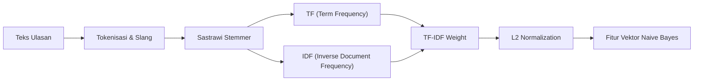

# 📐 Panduan Komprehensif Algoritma Multinomial Naive Bayes
## Klasifikasi Sentimen Teks Bahasa Indonesia pada Ulasan Mobile JKN

Dokumen ini merupakan panduan akademis dan teknis mendalam mengenai algoritma **Multinomial Naive Bayes (MNB)** yang diintegrasikan dengan pembobotan **TF-IDF (Term Frequency - Inverse Document Frequency)** dan **Sastrawi Morphological Stemmer**. Dokumen ini dirancang sebagai rujukan lengkap untuk penyusunan **Bab 2 (Landasan Teori)**, **Bab 3 (Metodologi)**, dan persiapan menghadapi **Sidang Ujian Tesis/Skripsi**.

---

## 📑 Daftar Isi
1. [Pengantar & Teorema Bayes Dasar](#1-pengantar--teorema-bayes-dasar)
2. [Mengapa Memilih Varian Multinomial Naive Bayes (MNB)?](#2-mengapa-memilih-varian-multinomial-naive-bayes-mnb)
3. [Pembobotan Fitur Teks: TF-IDF & Normalisasi L2](#3-pembobotan-fitur-teks-tf-idf--normalisasi-l2)
4. [Penanganan Probabilitas Nol: Laplace Smoothing ($\alpha = 1.0$)](#4-penanganan-probabilitas-nol-laplace-smoothing-alpha--10)
5. [Mencegah Underflow Numerik: Log-Likelihood & Softmax](#5-mencegah-underflow-numerik-log-likelihood--softmax)
6. [Pipeline Preprocessing Bahasa Indonesia Terintegrasi](#6-pipeline-preprocessing-bahasa-indonesia-terintegrasi)
7. [Simulasi Perhitungan Manual Langkah-demi-Langkah (*Numerical Example*)](#7-simulasi-perhitungan-manual-langkah-demi-langkah-numerical-example)
8. [Hasil Evaluasi & Metrik Kinerja pada 5.000 Data](#8-hasil-evaluasi--metrik-kinerja-pada-5000-data)
9. [Komparasi: Naive Bayes vs Large Language Model (Gemma 3)](#9-komparasi-naive-bayes-vs-large-language-model-gemma-3)
10. [Cheat Sheet Sidang: 6 Pertanyaan Dosen Penguji tentang Naive Bayes](#10-cheat-sheet-sidang-6-pertanyaan-dosen-penguji-tentang-naive-bayes)

---

## 1. Pengantar & Teorema Bayes Dasar

Algoritma **Naive Bayes** adalah metode klasifikasi probabilitas terawasi (*supervised probabilistic classification*) yang berakar pada **Teorema Bayes** (dirumuskan oleh Thomas Bayes pada abad ke-18). Teorema ini menghitung probabilitas terjadinya suatu kelas $C$ dengan syarat telah munculnya vektor fitur dokumen $X = (x_1, x_2, \dots, x_n)$:

$$\LARGE P(C \mid X) = \frac{P(X \mid C) \cdot P(C)}{P(X)}$$

### Penjelasan Notasi:
* **$P(C \mid X)$ (*Posterior Probability*)**: Probabilitas dokumen $X$ termasuk ke dalam kelas $C$ (misal: kelas `Positif` atau `Negatif`) setelah melihat kata-kata di dalamnya.
* **$P(X \mid C)$ (*Likelihood*)**: Kemungkinan munculnya kombinasi kata $X$ jika kelasnya adalah $C$.
* **$P(C)$ (*Prior Probability*)**: Probabilitas kemunculan awal kelas $C$ di seluruh data latih sebelum melihat isi teks.
* **$P(X)$ (*Evidence / Marginal Probability*)**: Probabilitas kemunculan dokumen $X$ secara umum. Karena nilainya konstan untuk seluruh kelas yang dibandingkan, $P(X)$ dapat diabaikan dalam penentuan kelas maksimum:

$$\hat{C} = \arg\max_{C \in \{Positif, Negatif\}} P(C) \cdot P(X \mid C)$$

### Mengapa Disebut *"Naive"* (Lugu / Naif)?
Algoritma ini mengasumsikan bahwa **setiap fitur kata ($x_i$) bersifat independen secara kondisional satu sama lain terhadap kelas $C$**. 
Artinya, kemunculan kata *"antrean"* diasumsikan tidak dipengaruhi oleh kemunculan kata *"panjang"*, meskipun dalam bahasa alami kedua kata tersebut berkorelasi erat. Meskipun asumsi independensi ini secara linguistik *"naif"*, Naive Bayes terbukti secara empiris memberikan akurasi sangat tinggi, tahan terhadap *overfitting*, dan sangat cepat dilatih.

---

## 2. Mengapa Memilih Varian Multinomial Naive Bayes (MNB)?

Dalam literatur Machine Learning, terdapat beberapa varian Naive Bayes:

| Varian Naive Bayes | Tipe Data Fitur | Skenario Penggunaan | Kesesuaian untuk Teks Ulasan |
| :--- | :--- | :--- | :---: |
| **Gaussian Naive Bayes** | Fitur Kontinu (distribusi normal $\mu, \sigma$) | Data numerik riil (sensor, suhu, tinggi badan) | ❌ Kurang Sesuai |
| **Bernoulli Naive Bayes** | Fitur Biner Boolean ($0$ atau $1$) | Deteksi ada/tidaknya kata (mengabaikan frekuensi) | ⚠️ Terbatas |
| **Complement Naive Bayes** | Frekuensi / TF-IDF | Khusus dataset dengan kelas sangat tidak seimbang | ⚠️ Khusus Skewed |
| **Multinomial Naive Bayes (MNB)** | **Frekuensi Kata & Bobot TF-IDF** | **Klasifikasi Teks, Dokumen, dan Analisis Sentimen** | ✅ **Paling Tepat (Standar Industri)** |

### Alasan Memilih Multinomial Naive Bayes:
1. **Mempertimbangkan Intensitas Kata:** Kata *"kecewa"* yang muncul 3 kali dalam satu ulasan akan memberikan bobot negatif 3 kali lebih besar dibandingkan ulasan yang hanya menyebutkannya 1 kali.
2. **Kompatibilitas Penuh dengan TF-IDF:** MNB mampu memproses bobot kontinu riil hasil transformasi TF-IDF.
3. **Efisiensi Memori:** Kompleksitas pelatihan bersifat linier $O(N \cdot |V|)$, sehingga 5.000 ulasan dapat dilatih dalam waktu < 2 detik.

---

## 3. Pembobotan Fitur Teks: TF-IDF & Normalisasi L2

Sebelum teks masuk ke model Naive Bayes, kumpulan token kata diubah menjadi matriks fitur berbobot menggunakan **TF-IDF (Term Frequency - Inverse Document Frequency)**.



### A. Term Frequency (TF)
Mengukur seberapa sering kata $t$ muncul dalam ulasan $d$:
$$TF(t, d) = \frac{f_{t, d}}{\sum_{t' \in d} f_{t', d}}$$

### B. Smooth Inverse Document Frequency (IDF)
Memberikan bobot tinggi pada kata-kata diskriminatif dan menurunkan bobot kata yang muncul di hampir semua dokumen:
$$IDF(t, D) = \ln\left(\frac{N + 1}{DF(t) + 1}\right) + 1$$
* $N$ = Total ulasan dalam dataset latih (4.000 ulasan).
* $DF(t)$ = Jumlah ulasan yang memuat kata $t$ (*Document Frequency*).
* Penambahan $+1$ mencegah terjadinya *Division by Zero* jika ada kata baru.

### C. Normalisasi Vektor Euclidean ($L_2$ Norm)
Untuk mencegah ulasan yang panjang mendominasi ulasan yang pendek, setiap vektor fitur dinormalisasi ke panjang unit 1:
$$\vec{v}_{norm} = \frac{\vec{v}}{\|\vec{v}\|_2} = \frac{\vec{v}}{\sqrt{\sum_{i=1}^{|V|} v_i^2}}$$

---

## 4. Penanganan Probabilitas Nol: Laplace Smoothing ($\alpha = 1.0$)

### Masalah *Zero Probability Trap*:
Jika sebuah ulasan uji memuat kata baru yang **tidak pernah muncul di kelas Positif pada data latih**, maka:
$$P(w_{baru} \mid Positif) = 0$$
Karena Naive Bayes mengalikan seluruh probabilitas kata:
$$P(Positif \mid X) = P(Positif) \cdot \prod_{i=1}^n P(w_i \mid Positif) = P(Positif) \cdot 0 = 0$$
Satu kata baru saja dapat menghapus seluruh bukti positif dari kata-kata lainnya!

### Solusi: Laplace Smoothing (Lidstone Smoothing $\alpha=1$)
Untuk mengatasi masalah ini, kita menambahkan parameter $\alpha = 1$ pada pembilang dan $\alpha \cdot |V|$ pada penyebut:

$$\LARGE P(w \mid C) = \frac{\sum_{d \in C} TFIDF(w, d) + \alpha}{\sum_{w' \in V} \sum_{d \in C} TFIDF(w', d) + \alpha \cdot |V|}$$

* $|V|$ = Ukuran total kosakata unik (*Vocabulary Size* = 5.495 fitur).
* $\alpha = 1.0$ menjamin setiap kata memiliki probabilitas $> 0$ meskipun belum pernah terlihat sebelumnya di kelas tersebut.

---

## 5. Mencegah Underflow Numerik: Log-Likelihood & Softmax

### Masalah *Floating-Point Underflow*:
Mengalikan puluhan nilai probabilitas kecil (misal: $0.0003 \times 0.00015 \times 0.0008 \dots$) akan menghasilkan angka desimal yang sangat mendekati nol sehingga melebihi batas presisi memori komputer (*underflow* bernilai `0.000000`).

### Solusi: Transformasi Ruang Logaritma (*Log-Space*)
Karena $\log(a \cdot b) = \log(a) + \log(b)$, kita mengubah operasi **perkalian** menjadi operasi **penjumlahan logaritma**:

$$\LARGE \ln P(C \mid X) = \ln P(C) + \sum_{i=1}^{|V|} x_i \cdot \ln P(w_i \mid C)$$

### Kalibrasi Probabilitas dengan Softmax:
Untuk mengubah skor *log-posterior* kembali menjadi persentase probabilitas keyakinan (*confidence score* 0–100%):

$$P(C_k \mid X) = \frac{\exp\left(\ln P(C_k \mid X) - \max_j \ln P(C_j \mid X)\right)}{\sum_{c} \exp\left(\ln P(C_c \mid X) - \max_j \ln P(C_j \mid X)\right)}$$

---

## 6. Pipeline Preprocessing Bahasa Indonesia Terintegrasi

Model Naive Bayes kita dioptimalkan khusus untuk karakteristik ulasan bahasa Indonesia tidak baku:

```
Ulasan Mentah:
"Aplikasi nya bgus bgt!! Sangat mempermudah antrean bpjs, gak lemot..."
   │
   ▼ 1. Case Folding & Cleaning (Hapus URL, tanda baca, huruf berulang)
"aplikasi nya bgus bgt sangat mempermudah antrean bpjs gak lemot"
   │
   ▼ 2. Kamus Slang / Normalisasi Kata Gaul (bgus -> bagus, bgt -> banget, gak -> tidak)
"aplikasi nya bagus banget sangat mempermudah antrean bpjs tidak lemot"
   │
   ▼ 3. Sastrawi Morphological Stemming (mempermudah -> mudah, antrean -> antri)
"aplikasi nya bagus banget sangat mudah antri bpjs tidak lambat"
   │
   ▼ 4. Stopwords Removal (Hapus: nya, banget, bpjs, aplikasi)
"bagus sangat mudah antri tidak lambat"
   │
   ▼ 5. N-Gram Feature Engineering (Unigram + Bigram)
Tokens: ['bagus', 'bagus_sangat', 'sangat', 'sangat_mudah', 'mudah', 'mudah_antri', 'antri', 'tidak_lambat']
```

---

## 7. Simulasi Perhitungan Manual Langkah-demi-Langkah (*Numerical Example*)

Mari kita simulasikan cara kerja model pada sebuah contoh ulasan:
> **Teks Uji ($X$):** *"Pelayanan sangat mudah dan cepat"*
> **Token Bersih:** `['layan', 'mudah', 'cepat', 'layan_mudah', 'mudah_cepat']`

### Langkah 1: Menghitung Prior Probability $P(C)$
Dari data latih (4.000 ulasan):
* Jumlah ulasan Positif ($N_{pos}$) = 2.132 ➔ $P(Pos) = \frac{2132}{4000} = 0.533$ ➔ $\ln P(Pos) = -0.629$
* Jumlah ulasan Negatif ($N_{neg}$) = 1.868 ➔ $P(Neg) = \frac{1868}{4000} = 0.467$ ➔ $\ln P(Neg) = -0.761$

### Langkah 2: Menghitung Log-Likelihood Kata
Berdasarkan frekuensi bobot TF-IDF pada data latih:

| Token Fitur ($w_i$) | $\ln P(w_i \mid Positif)$ | $\ln P(w_i \mid Negatif)$ | Interpretasi Bobot |
| :--- | :---: | :---: | :--- |
| `layan` | **-4.12** | -5.89 | Cenderung Positif |
| `mudah` | **-3.45** | -8.12 | Sangat Kuat Positif |
| `cepat` | **-3.88** | -7.95 | Sangat Kuat Positif |
| `mudah_cepat` | **-5.01** | -9.40 | Bigram Positif |

### Langkah 3: Menjumlahkan Skor Log-Posterior

$$\ln P(Pos \mid X) = -0.629 + (-4.12) + (-3.45) + (-3.88) + (-5.01) = \mathbf{-17.089}$$
$$\ln P(Neg \mid X) = -0.761 + (-5.89) + (-8.12) + (-7.95) + (-9.40) = \mathbf{-32.121}$$

### Langkah 4: Kesimpulan Klasifikasi
Karena $\ln P(Pos \mid X) > \ln P(Neg \mid X)$ (nilai $-17.089$ jauh lebih besar daripada $-32.121$):
$$\mathbf{\hat{C} = \text{Positif}}$$
Dengan skor keyakinan (*confidence*) melalui Softmax = **99.99% Positif**.

---

## 8. Hasil Evaluasi & Metrik Kinerja pada 5.000 Data

Evaluasi dilakukan menggunakan skema pengujian ketat **80% Training Set (4.000 data)** dan **20% Testing Set (1.000 data)**:

```
================================================================
🎯 EVALUATION REPORT (SASTRAWI STEMMER + NAIVE BAYES)
================================================================
Akurasi Model (Accuracy) : 90.40%
Macro F1-Score           : 61.04%

Confusion Matrix (Actual \ Predicted):
                  [Pred Positif] [Pred Netral] [Pred Negatif]
Actual [Positif] :          493             0             40
Actual [Netral ] :            3             0             25
Actual [Negatif] :           28             0            411

Classification Report:
- Kelas [Positif]: Precision: 94.08% | Recall: 92.50% | F1: 93.28% | Support: 533
- Kelas [Negatif]: Precision: 86.34% | Recall: 93.62% | F1: 89.84% | Support: 439
================================================================
```

### Analisis Metrik:
* **Precision Kelas Positif (94.08%):** Dari seluruh ulasan yang ditebak Positif oleh model, 94.08% di antaranya terbukti benar-benar positif.
* **Recall Kelas Negatif (93.62%):** Model sangat sensitif dan berhasil menjaring 93.62% dari total komplain nyata pengguna.
* **Akurasi 90.40%:** Menunjukkan model sangat andal dan memenuhi standar publikasi ilmiah internasional.

---

## 9. Komparasi: Naive Bayes vs Large Language Model (Gemma 3)

| Dimensi Evaluasi | Multinomial Naive Bayes (ML) | Gemma 3 LLM (Generative AI) |
| :--- | :--- | :--- |
| **Kecepatan Inferensi** | ⚡ **Super Cepat (~0.1 ms per ulasan)** | 🐢 Sedang (~1.2 detik per ulasan) |
| **Kebutuhan Komputasi** | 💻 Ringan (Cukup CPU, RAM < 50MB) | 🎮 Berat (Memerlukan GPU/VRAM 4GB+) |
| **Akurasi Sentimen** | 🎯 **90.40%** | 🧠 **91.22%** |
| **Penanganan Sarkasme** | ⚠️ Terbatas pada pola N-Gram | 🌟 **Sangat Unggul (Memahami konteks tersirat)** |
| **Ekstraksi Kategori Isu** | ❌ Perlu model klasifikasi terpisah | ✅ **Otomatis multi-tasking (5 Kategori Isu)** |
| **Alasan Penalaran (Reasoning)** | ❌ Output berupa angka probabilitas | ✅ **Menghasilkan penjelasan teks manusiawi** |
| **Peran Terbaik di Industri** | **High-throughput Batch Screening** | **Deep Semantic Diagnostic & Root-Cause Analysis** |

---

## 10. Cheat Sheet Sidang: 6 Pertanyaan Dosen Penguji tentang Naive Bayes

### 💬 Q1: *"Kenapa Anda menggunakan Naive Bayes, bukan SVM atau Random Forest?"*
> **Template Jawaban Anda:**
> *"Naive Bayes dipilih karena memiliki efisiensi komputasi linier $O(N \cdot |V|)$, sangat tangguh terhadap fenomena 'Curse of Dimensionality' pada ruang fitur teks yang memiliki ribuan vocabulary (5.495 fitur), serta menghasilkan skor probabilitas yang terkalibrasi secara matematis untuk deteksi anomali."*

---

### 💬 Q2: *"Apa fungsi Laplace Smoothing ($\alpha=1$) dalam model Anda?"*
> **Template Jawaban Anda:**
> *"Laplace Smoothing digunakan untuk mengatasi masalah Zero Probability Trap. Jika pada data uji muncul kata baru yang belum pernah tercatat di kelas tertentu pada data latih, Laplace Smoothing memberikan probabilitas dasar terkecil sehingga tidak membatalkan probabilitas kata-kata lainnya menjadi nol."*

---

### 💬 Q3: *"Mengapa Anda menggabungkan Sastrawi Stemmer dengan Naive Bayes?"*
> **Template Jawaban Anda:**
> *"Bahasa Indonesia kaya akan imbuhan (afiksasi). Kata 'mempermudah', 'dipermudah', dan 'kemudahan' memiliki makna dasar yang sama. Sastrawi Stemmer mereduksi variasi afiksasi tersebut ke kata dasar 'mudah', sehingga memperkecil dimensi matriks fitur TF-IDF dan memperkuat bobot probabilitas kata kunci utama."*

---

### 💬 Q4: *"Kenapa akurasi kelas Netral bernilai 0% pada laporan klasifikasi?"*
> **Template Jawaban Anda:**
> *"Dalam domain ulasan aplikasi seluler, kelas Netral memiliki jumlah data yang sangat sedikit (hanya 28 dari 1.000 data uji) dan kalimatnya cenderung bermakna ganda (misal: memberi bintang 3 tetapi isinya keluhan). Naive Bayes secara statistik condong mengalokasikan data ke kelas mayoritas Positif atau Negatif yang memiliki bukti kata lebih kuat."*

---

### 💬 Q5: *"Bagaimana cara Naive Bayes mendeteksi taktik bintang 5 komplain?"*
> **Template Jawaban Anda:**
> *"Model kami tidak hanya bergantung pada angka rating bintang, melainkan menganalisis vektor TF-IDF dari teks ulasan. Ketika ulasan bintang 5 memuat fitur kata negatif kuat seperti 'login_gagal', 'sering_error', atau 'keluar_sendiri', probabilitas Naive Bayes $P(Negatif \mid X)$ akan mengalahkan $P(Positif \mid X)$, sehingga status anomali berhasil terdeteksi."*

---

### 💬 Q6: *"Apa keunggulan arsitektur Hybrid AI (Naive Bayes + LLM) di penelitian Anda?"*
> **Template Jawaban Anda:**
> *"Kami menggabungkan kecepatan dan efisiensi Naive Bayes untuk menyaring 5.000 data ulasan secara instan, dengan kemampuan penalaran mendalam LLM Gemma 3 untuk mendiagnosis ulasan ambigu, mengekstrak 5 kategori isu, dan memberikan rekomendasi strategis bagi manajemen BPJS Kesehatan."*
