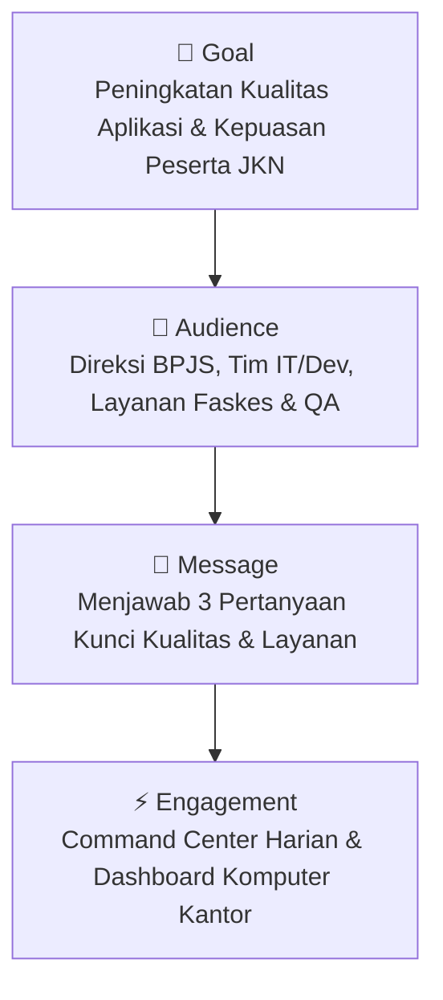
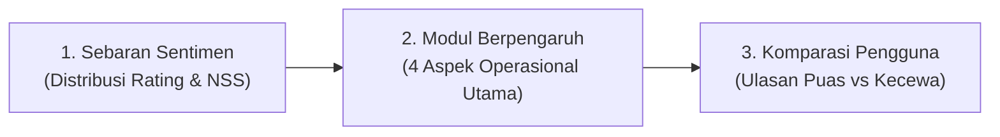

# 📱 Perancangan Dashboard Tableau & Data Storytelling: Analisis Kualitas & Kepuasan Pengguna Mobile JKN (BPJS Kesehatan)

---

## 📌 Executive Summary

Dokumen ini menjabarkan perancangan **Dashboard Tableau** dan kerangka kerja **Data Storytelling** yang disesuaikan secara khusus untuk aplikasi **Mobile JKN (BPJS Kesehatan)**. Dokumen ini disusun menggunakan pendekatan **G.A.M.E. Framework (*Goal, Audience, Message, Engagement*)** guna mentransformasikan ulasan (*reviews*) dan sentimen pengguna Google Play Store menjadi wawasan bisnis dan keputusan teknis yang terukur.

---

## 🎯 1. Kerangka Kerja Data Storytelling (G.A.M.E. Framework)



### a. Goal (Tujuan Utama)
> **Dasbor ini memudahkan mereka yang terlibat dalam pengembangan aplikasi, operasional layanan, dan manajemen BPJS Kesehatan untuk memahami faktor-faktor mana yang secara signifikan memengaruhi kualitas aplikasi Mobile JKN dan kepuasan peserta JKN-KIS.**

* **Tujuan Strategis:** Mengidentifikasi kendala teknis operasional sedini mungkin guna meningkatkan reputasi rating aplikasi di Google Play Store dan meminimalkan antrean fisik di kantor cabang/Faskes.
* **Tujuan Pelayanan Publik:** Menjamin aksesibilitas layanan kesehatan digital yang inklusif, cepat, dan andal bagi seluruh lapisan masyarakat Indonesia.

---

### b. Audience (Target Audiens)

Audiens utama dasbor ini adalah **pemangku kepentingan BPJS Kesehatan, pengembang aplikasi Mobile JKN, pengelola operasional layanan, dan analis kualitas layanan digital**:

| Kategori Audiens | Peran & Kepentingan Strategis | Kebutuhan Informasi Utama |
| :--- | :--- | :--- |
| 👔 **Pemangku Kebijakan & Direksi BPJS Kesehatan** | Menentukan prioritas anggaran transformasi digital dan kebijakan mutu layanan nasional. | Ringkasan kepuasan publik (*Net Sentiment Score*), tren rating bulanan, dan dampak kebijakan digital. |
| 💻 **Pengembang Aplikasi (*Product Engineers / IT DevOps*)** | Memperbaiki *bug*, mengoptimalkan performa server, dan meningkatkan antarmuka (UI/UX). | Laporan *crash*, kegagalan *login/OTP*, latensi antrean, dan kompatibilitas versi Android. |
| 🏥 **Pengelola Operasional & Layanan Faskes** | Mengawasi integrasi rujukan online, antrean puskesmas/RS, dan kepesertaan. | Kendala rujukan antar-faskes, sinkronisasi kuota dokter, dan validasi data NIK/KK. |
| 🔬 **Analis Kualitas (*QA Analyst & Customer Care*)** | Menangani keluhan masuk, menganalisis anomali sistem, dan merumuskan SLA perbaikan. | Sebaran topik keluhan per modul aspek, analisis ulasan kritis, dan *actionable root cause*. |

---

### c. Message (Pesan Kunci & Penjawab Masalah)

Melalui dashboard, pemangku kepentingan bisa mendapatkan jawaban atas **3 pertanyaan kunci** berikut:



#### 1) Bagaimana sebaran kualitas aplikasi Mobile JKN yang dirasakan konsumen/peserta?
* **Pesan Data:** Menampilkan sebaran rating bintang (★1 hingga ★5) dan proporsi sentimen hasil klasifikasi Machine Learning (Positif vs Negatif):
  * **Sebaran Rating:** Rata-rata kepuasan berada pada **★ 3.12 / 5.0** dengan polarisasi ulasan bintang 1 (keluhan mendesak) dan bintang 5 (apresiasi kemudahan).
  * **Distribusi Sentimen:** **48.9% Positif** (*Promoter*) berbanding **51.1% Negatif** (*Detractor*), menghasilkan **Net Sentiment Score (NSS) sebesar -2.2%**.
* **Visualisasi Rekomendasi:** *Donut Chart Proporsi Sentimen*, *Rating Histogram*, dan *Monthly NSS Trendline*.

#### 2) Komponen/modul apa yang memiliki pengaruh dekat pada kualitas aplikasi Mobile JKN?
* **Pesan Data:** Memetakan 4 pilar aspek operasional yang paling dominan memicu kepuasan atau keluhan peserta:
  1. 🔑 **Autentikasi & Akun (28.4% Volume):** Pengaruh paling sensitif; kegagalan SMS OTP, lupa password, dan verifikasi biometrik langsung memicu rating bintang 1.
  2. 🏥 **Antrean & Faskes (24.6% Volume):** Penentu utama loyalitas; integrasi antrean faskes online dan kemudahan rujukan memicu sentimen sangat positif jika sukses.
  3. ⚡ **Kinerja & Server (22.8% Volume):** Latensi tinggi (*loading* lama), server *down* di jam sibuk, dan *force close* saat pembaruan versi.
  4. 💳 **Iuran & Layanan (14.2% Volume):** Transparansi status pembayaran autodebet, mutasi kelas, dan sinkronisasi data keluarga.
* **Visualisasi Rekomendasi:** *Horizontal Stacked Bar Chart (Volume vs Sentimen per Aspek)* & *Correlation Heatmap*.

#### 3) Apakah ada perbedaan yang jelas dalam komposisi ulasan antara pengguna yang puas (baik) dan pengguna yang kecewa (buruk)?
* **Pesan Data:** Komparasi langsung kata kunci dan pemicu antara kelompok **Positif (Rating ★4-5)** versus **Negatif (Rating ★1-3)**:
  * **Pengguna Puas (*Baik*):** Didominasi fitur efisiensi waktu dengan kata kunci seperti `mudah_guna`, `sangat_membantu`, `antre_cepat`, `tidak_ribet`, `praktis`, `layanan_bagus`.
  * **Pengguna Kecewa (*Buruk*):** Didominasi hambatan akses teknis dengan kata kunci `tidak_bisa_masuk`, `error_server`, `tidak_jelas`, `gagal_verifikasi`, `muat_lama`, `kuota_habis`.
* **Wawasan Diskusi:** Dasbor memungkinkan tim pengembang dan manajemen mendiskusikan titik sumbatan (*bottleneck*) ini dan segera merilis pembaruan (*patch release*) yang tepat sasaran.
* **Visualisasi Rekomendasi:** *Bi-Directional Bar Chart (Top Driver Kepuasan vs Top Root Cause Keluhan)* & *Explainable AI Word Cloud*.

---

### d. Engagement (Penerapan & Interaksi Operasional)

```
┌──────────────────────────────────────────────────────────────────────────────────┐
│                         ARSITEKTUR ENGAGEMENT BPJS                               │
├──────────────────────────────────────────────────────────────────────────────────┤
│  [Google Play Store Scraping API] ──(Pipeline NLP & MNB Harian)──┐               │
│                                                                  ▼               │
│  [Layar Command Center BPJS] ◄──── [Tableau Server / Cloud] ────► [Komputer Tim] │
│  (Monitoring Real-Time Ruang IT)   (Otomatisasi Ekstrak Harian)   (Kantor Cabang)│
└──────────────────────────────────────────────────────────────────────────────────┘
```

1. **Pembaruan Harian di Layar Monitoring (*Command Center BPJS*):**
   * Dasbor yang dikembangkan diperbarui secara otomatis setiap hari di layar besar *Command Center* IT & Ruang Monitoring Layanan Kantor Pusat BPJS Kesehatan.
2. **Pemeriksaan Status di Komputer Kantor (*Internal Office Network Access*):**
   * Perwakilan bisnis dan pimpinan cabang BPJS Kesehatan di seluruh Indonesia dapat memeriksa status kualitas aplikasi, anomali keluhan daerah, dan performa faskes melalui komputer pribadi via jaringan internal / VPN kantor.
3. **Fitur Interaktivitas Dasbor:**
   * **Filter Aspek & Versi:** Filter instan berdasarkan versi rilis Mobile JKN (misal v4.18.0) dan modul masalah (*Autentikasi*, *Antrean*, dll).
   * **Drill-Through ke Teks Ulasan:** Mengklik bagian grafik *Error Login* langsung menampilkan ulasan asli pengguna di Play Store beserta tanggal dan ID ulasan.
   * **Deteksi Anomali Dinamis (*Mismatch Alert*):** Penandaan otomatis ulasan sarkasme (*1000 candi*, satir birokrasi) dan anomali salah klik (*misclick* rating) untuk audit kualitas data.

---
