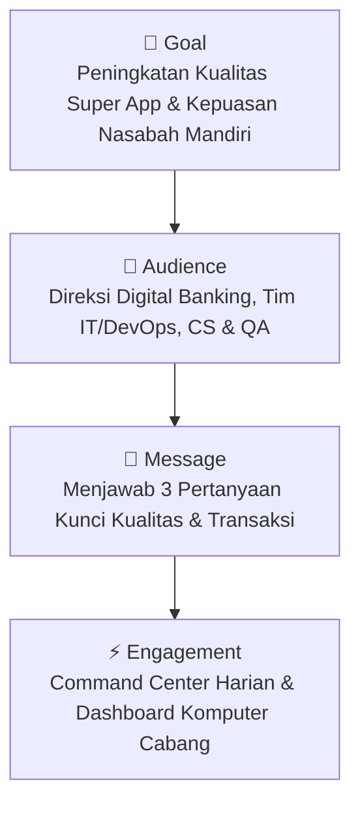
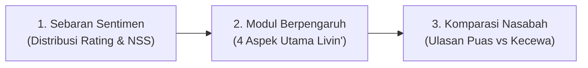

# 📱 Perancangan Dashboard Tableau & Data Storytelling: Analisis Kualitas & Kepuasan Pengguna Livin' by Mandiri

---

## 📌 Executive Summary

Dokumen ini menjabarkan perancangan **Dashboard Tableau** dan kerangka kerja **Data Storytelling** yang disesuaikan secara khusus untuk aplikasi *super app* perbankan digital **Livin' by Mandiri (`id.bmri.livin`)** milik PT Bank Mandiri (Persero) Tbk. Dokumen ini disusun menggunakan pendekatan **G.A.M.E. Framework (*Goal, Audience, Message, Engagement*)** guna mentransformasikan ulasan (*reviews*) dan kepuasan nasabah di Google Play Store menjadi wawasan bisnis dan keputusan teknologi perbankan yang terukur.

---

## 🎯 1. Kerangka Kerja Data Storytelling (G.A.M.E. Framework)



### a. Goal (Tujuan Utama)
> **Dasbor ini memudahkan mereka yang terlibat dalam pengembangan aplikasi perbankan digital, operasional layanan transaksi, dan manajemen Bank Mandiri untuk memahami faktor mana yang secara signifikan memengaruhi kualitas aplikasi Livin' by Mandiri dan kepuasan nasabah.**

* **Tujuan Strategis:** Mengidentifikasi kendala transaksi digital (*payment & transfer bottleneck*) sedini mungkin guna mempertahankan reputasi perbankan digital nomor satu dan meminimalkan antrean di kantor cabang.
* **Tujuan Finansial:** Memaksimalkan volume transaksi digital (*fee-based income*), adopsi fitur investasi/Sukha, dan retensi nasabah aktif harian (*Daily Active Users / DAU*).

---

### b. Audience (Target Audiens)

Audiens utama dasbor ini adalah **pemangku kepentingan bisnis Bank Mandiri, pengembang aplikasi Livin', pengelola operasional perbankan, dan analis kualitas layanan digital**:

| Kategori Audiens | Peran & Kepentingan Strategis | Kebutuhan Informasi Utama |
| :--- | :--- | :--- |
| 👔 **Pemangku Kebijakan & Direksi Digital Banking** | Menentukan prioritas anggaran fitur digital, strategi adopsi produk, dan kepuasan nasabah nasional. | Ringkasan kepuasan publik (*Net Sentiment Score*), tren rating bulanan, dan perbandingan performa fitur perbankan. |
| 💻 **Pengembang Aplikasi (*Mobile Engineers / DevOps*)** | Memperbaiki *bug*, menjaga stabilitas server transaksi, dan mengoptimalkan kecepatan respons aplikasi. | Log *crash*, kegagalan *Face ID/Fingerprint*, latensi BI-Fast/QRIS, dan kendala rilis versi baru. |
| 🏦 **Operasional Layanan & Tim Cabang** | Mengawasi kelancaran transaksi harian, edukasi nasabah, dan mitigasi keluhan akun terblokir. | Titik rawan gagal aktivasi rekening online, pergantian nomor HP, dan blokir kartu debit/kredit. |
| 🔬 **Analis Kualitas (*QA Analyst & Mandiri Care 14000*)** | Menganalisis keluhan masuk, mengukur SLA penanganan isu transaksi, dan menemukan *root cause*. | Sebaran sentimen per modul perbankan, analisis anomali ulasan, dan metrik akurasi deteksi masalah. |

---

### c. Message (Pesan Kunci & Penjawab Masalah)

Melalui dashboard, pemangku kepentingan bisa mendapatkan jawaban atas **3 pertanyaan kunci** berikut:



#### 1) Bagaimana sebaran kualitas aplikasi Livin' by Mandiri yang dirasakan konsumen/nasabah?
* **Pesan Data:** Menampilkan sebaran rating bintang (★1 hingga ★5) dan proporsi sentimen hasil klasifikasi Machine Learning (Positif vs Negatif):
  * **Sebaran Rating:** Skor rating publik saat ini berada pada **★ 2.80 / 5.0** (dari total 330.000+ ulasan), menunjukkan polarisasi yang kuat antara nasabah yang sangat terbantu (*power users*) dan nasabah yang mengalami hambatan akses (*frustrated users*).
  * **Distribusi Sentimen:** Menggambarkan rasio kepuasan (*Promoters*) vs keluhan kritis (*Detractors*) serta indikator **Net Sentiment Score (NSS)** secara berkala.
* **Visualisasi Rekomendasi:** *Donut Chart Proporsi Sentimen*, *Histogram Sebaran Bintang (1–5)*, dan *Line Chart Tren Sentimen Bulanan*.

#### 2) Komponen/fitur apa yang memiliki pengaruh paling dekat pada kualitas aplikasi Livin' by Mandiri?
* **Pesan Data:** Memetakan 4 pilar fitur utama Livin' by Mandiri yang paling dominan memicu kepuasan atau keluhan:
  1. 🔑 **Autentikasi & Akun:** Pemicu keluhan nomor satu jika terjadi kendala (kegagalan verifikasi *Face ID/Biometric*, akun terblokir mendadak, kesulitan *login* ulang pasca-ganti perangkat, dan SMS OTP).
  2. 💸 **Transaksi & Pembayaran:** Penentu loyalitas utama; kecepatan transfer BI-Fast (Rp2.500), kemudahan scan QRIS, *top-up e-wallet* (GoPay, OVO, Dana), dan pembayaran tagihan.
  3. ⚡ **Kinerja & Keandalan Server:** Keluhan saat jam sibuk/tanggal gajian (*payday*) seperti *loading screen* berputar lama, *blank screen*, server *maintenance*, atau *force close*.
  4. 🛍️ **Layanan Finansial & Fitur Sukha:** Kepuasan atas fitur inovatif seperti pembukaan deposito, kartu kredit digital, investasi reksa dana, pembelian valas, dan tiket *Sukha*.
* **Visualisasi Rekomendasi:** *Horizontal Stacked Bar Chart (Volume vs Rasio Sentimen per Aspek)* & *Correlation Matrix*.

#### 3) Apakah ada perbedaan yang jelas dalam komposisi ulasan antara nasabah yang puas (baik) dan nasabah yang kecewa (buruk)?
* **Pesan Data:** Komparasi langsung komposisi kata kunci dan pemicu antara kelompok **Ulasan Baik (Rating ★4-5)** versus **Ulasan Buruk (Rating ★1-3)**:
  * **Nasabah Puas (*Baik*):** Mengapresiasi kenyamanan antarmuka dan kecepatan transaksi dengan kata kunci: `sangat_membantu`, `mudah_guna`, `fitur_lengkap`, `transfer_cepat`, `praktis`, `terbaik`.
  * **Nasabah Kecewa (*Buruk*):** Menyoroti hambatan teknis yang mengunci uang/transaksi mereka dengan kata kunci: `tidak_bisa_login`, `gagal_verifikasi`, `server_gangguan`, `uang_terpotong`, `rekening_blokir`, `loading_terus`.
* **Wawasan Diskusi:** Dasbor memungkinkan pemangku kepentingan untuk mendiskusikan pertanyaan-pertanyaan ini dan mengambil tindakan taktis (seperti perbaikan *gateway OTP*, optimalisasi *server scaling* saat *payday*, dan penyederhanaan alur pemulihan akun).
* **Visualisasi Rekomendasi:** *Bi-Directional Bar Chart (Top Driver Kepuasan vs Top Root Cause Keluhan)* & *Keyword Importance Table*.

---

### d. Engagement (Penerapan & Interaksi Operasional)

```
┌──────────────────────────────────────────────────────────────────────────────────┐
│                     ARSITEKTUR ENGAGEMENT BANK MANDIRI                           │
├──────────────────────────────────────────────────────────────────────────────────┤
│  [Google Play Store Scraping API] ──(Pipeline NLP & MNB Harian)──┐               │
│                                                                  ▼               │
│  [Layar Digital Command Center] ◄──── [Tableau Server / Cloud] ──► [Komputer Tim]│
│  (Plaza Mandiri - Monitoring 24/7)   (Auto Refresh Setiap Pagi)   (Kantor Cabang)│
└──────────────────────────────────────────────────────────────────────────────────┘
```

1. **Pembaruan Harian di Layar Digital Command Center (*Daily On-Site Refresh*):**
   * Dasbor yang dikembangkan dapat diperbarui setiap hari di layar besar *Digital Command Center* Plaza Mandiri (Kantor Pusat Bank Mandiri) untuk memantau kesehatan sistem dan sentimen nasabah secara *real-time*.
2. **Pemeriksaan Status di Komputer Kantor Cabang (*Internal Network Access*):**
   * Perwakilan bisnis dan kepala cabang Bank Mandiri di seluruh Indonesia dapat memeriksa status kualitas aplikasi, anomali keluhan regional, dan kepuasan nasabah melalui komputer pribadi via jaringan internal / VPN Bank Mandiri.
3. **Fitur Interaktivitas Dasbor:**
   * **Filter Aspek & Versi Aplikasi:** Pengecekan performa spesifik versi terbaru (misal: rilis v2.x / v3.x) terhadap versi sebelumnya.
   * **Drill-Through ke Detail Ulasan:** Mengklik bagian grafik *Error Verifikasi Wajah* langsung menampilkan teks ulasan asli nasabah dan nomor versinya.
   * **Threshold Alert System:** Indikator visual berwarna merah otomatis menyala jika sentimen negatif pada modul *Transaksi* atau *Login* melampaui ambang batas toleransi (>35%).

---

## 📊 2. Blueprint Tata Letak Dashboard Tableau (Wireframe)

```
┌───────────────────────────────────────────────────────────────────────────────────────────────────┐
│ 🟡 LIVIN' BY MANDIRI - DIGITAL BANKING SENTIMENT DASHBOARD                     [Filter: Versi App]│
├──────────────────────────┬──────────────────────────┬──────────────────────────┬──────────────────┤
│ TOTAL ULASAN ANALISIS    │ RATA-RATA RATING         │ NET SENTIMENT SCORE      │ MODEL ACCURACY   │
│       5,000 Ulasan       │        ★ 2.80 / 5.0      │        -14.2% (Perhatian)│   93.8% (5-Fold) │
├──────────────────────────┴──────────────────────────┴──────────────────────────┴──────────────────┤
│ [SEBARAN SENTIMEN & RATING NASABAH]                 │ [DISTRIBUSI KELUHAN PER MODUL PERBANKAN]    │
│  • Donut: % Positif vs % Negatif                    │  1. Autentikasi & Akun [████████ Negatif]   │
│  • Bar: Sebaran Rating Bintang (★1 - ★5)            │  2. Transaksi & QRIS   [██████ Positif]     │
│  • Tren Sentimen & Volume Bulanan                   │  3. Kinerja & Server   [████████ Negatif]   │
├─────────────────────────────────────────────────────┼─────────────────────────────────────────────┤
│ [KOMPARASI KATA KUNCI: PUAS VS KECEWA]              │ [PANDUAN AKSI IT & MANAJEMEN MANDIRI]       │
│  Top Drivers Kepuasan (Positif):                    │  Rekomendasi Tindakan Cepat Minggu Ini:     │
│  • sangat_membantu (+5.2)   • mudah_guna (+4.8)     │  1. Optimasi Algoritma Face Recognition Bio │
│  Top Root Cause Keluhan (Negatif):                  │  2. Auto-scaling Server di Tanggal Gajian   │
│  • gagal_verifikasi (-4.9)  • server_gangguan (-4.6)│  3. Sederhanakan Alur Buka Blokir Akun App  │
└─────────────────────────────────────────────────────┴─────────────────────────────────────────────┘
```

---

## 🚀 3. Rencana Aksi Bisnis Berbasis Data (*Data-Driven Actions*)

| Temuan Analisis Dasbor | Tindakan Operasional Tim IT / DevOps | Tindakan Strategis Bisnis & Layanan Cabang |
| :--- | :--- | :--- |
| **Tingginya Keluhan Gagal Verifikasi Biometrik / Face ID** | Kalibrasi toleransi pencahayaan pada modul *Liveness Detection* SDK dan sediakan opsi verifikasi alternatif (PIN + SMS OTP/Email). | Sediakan *Fast-Track Service* di *Customer Service* cabang bagi nasabah yang mengalami kendala aktivasi biometrik. |
| **Lonjakan Sentimen Negatif di Tanggal Gajian (25–30)** | Terapkan *auto-scaling compute resources* dan *queue management* pada mikroservis transaksi perbankan. | Buat pengumuman berkala dan panduan bertransaksi alternatif melalui Mandiri ATM / SMS Banking jika terjadi lonjakan trafik. |
| **Apresiasi Tinggi pada Fitur QRIS & BI-Fast** | Perluas *partnership merchant* dan pertahankan latensi transaksi di bawah 2 detik. | Buat kampanye *reward / cashback* poin Livin' untuk meningkatkan volume transaksi *cashless*. |
