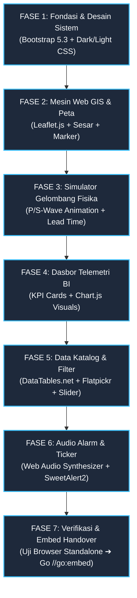

# 🚀 Tahapan Pengembangan Web Template GIS (Development Phases)

> **Dokumen Panduan Eksekusi Bertahap Pembuatan Template Frontend Web GIS & Spatial Business Intelligence**  
> *Panduan sistematis 7 fase pengembangan antarmuka mandiri di `template-gis/` sebelum di-embed ke dalam biner Golang.*

---

## 📋 Ikhtisar Tahapan (Phasing Roadmap Overview)

```
┌─────────────────────────────────────────────────────────────────────────────────────────────┐
│                          7 FASE PENGEMBANGAN WEB TEMPLATE GIS                               │
├─────────┬──────────────────────────────────┬────────────────────────────────────────────────┤
│ Fase    │ Nama Fase                        │ Sasaran Utama & Deliverables                   │
├─────────┼──────────────────────────────────┼────────────────────────────────────────────────┤
│ **1**   │ **Fondasi & Desain Glassmorphism**│ Setup HTML5, Bootstrap 5.3, Dark/Light Tokens. │
├─────────┼──────────────────────────────────┼────────────────────────────────────────────────┤
│ **2**   │ **Mesin Web GIS & Layer Peta**   │ Leaflet.js, CartoDB Tiles, Layer Sesar Aktif.  │
├─────────┼──────────────────────────────────┼────────────────────────────────────────────────┤
│ **3**   │ **Fisika Gelombang & Simulator** │ Animasi Gelombang P/S & Hitung Mundur Lead Time│
├─────────┼──────────────────────────────────┼────────────────────────────────────────────────┤
│ **4**   │ **Dasbor Telemetri & Chart.js**  │ 4 Kartu KPI, Grafik Tren, Histogram Kedalaman. │
├─────────┼──────────────────────────────────┼────────────────────────────────────────────────┤
│ **5**   │ **Tabel Interaktif & Filter**    │ DataTables.net, Flatpickr Date, noUiSlider Mag.│
├─────────┼──────────────────────────────────┼────────────────────────────────────────────────┤
│ **6**   │ **Audio Alarm & Notifikasi UI**  │ Web Audio API Beep, SweetAlert2, Seismic Ticker│
├─────────┼──────────────────────────────────┼────────────────────────────────────────────────┤
│ **7**   │ **Verifikasi & Integrasi Go**    │ Uji Responsif, Standalone Demo, Handover Embed.│
└─────────┴──────────────────────────────────┴────────────────────────────────────────────────┘
```

---

## 🏗️ Rincian 7 Fase Pengembangan



---

### 🎨 FASE 1: Fondasi Grid & Sistem Desain Glassmorphism
- **Tujuan**: Menyiapkan kerangka dasar HTML5 semantik, tata letak grid responsif 12-kolom Bootstrap 5, serta variabel warna tema ganda (*Dark Mode* & *Light Mode*).
- **Deliverables**:
  - `template-gis/index.html` (Struktur dasar Navbar, Sidebar Filter, Container Peta, Panel Dasbor, Container Tabel, dan Ticker).
  - `template-gis/css/style.css` (Variabel CSS `--bg-dark`, `--card-bg`, efek `backdrop-filter: blur(12px)`, neon glowing pulse).
  - `template-gis/js/theme.js` (Logika peralihan instan tema `data-bs-theme="dark"` $\longleftrightarrow$ `light` dengan persistensi `localStorage`).

---

### 🗺️ FASE 2: Mesin Web GIS & Lapisan Kartografi Spasial
- **Tujuan**: Mengintegrasikan engine peta Leaflet.js dengan basemap kontras tinggi, layer marker gempa berbobot magnitudo, dan jalur sesar aktif tektonik.
- **Deliverables**:
  - `template-gis/js/map.js` (Inisialisasi Leaflet koordinat fokus Indonesia `[-2.5, 118.0]`, zoom 5).
  - Integrasi ubin peta dinamis: **CartoDB Dark Matter** (Dark) dan **CartoDB Positron** (Light).
  - Rendering marker *circle* dengan radius proporsional magnitudo ($r = \text{mag}^{1.8}$) dan warna berdasarkan klaster risiko (🔴 Merah, 🟡 Kuning, 🟢 Hijau).
  - Efek animasi CSS *Pulsing Halo* pada kejadian gempa paling mutakhir.
  - Layer GeoJSON patahan sesar aktif darat (*Semangko, Palu-Koro, Cimandiri*) dan palung *Megathrust* (`template-gis/assets/faults.geojson`).

---

### 🌊 FASE 3: Simulator Fisika Gelombang Seismik & HUD Lead Time
- **Tujuan**: Membangun simulator interaktif di mana pengguna dapat mengklik titik manapun di peta untuk menghitung waktu tiba gelombang dan intensitas guncangan.
- **Deliverables**:
  - `template-gis/js/simulator.js` (Kalkulasi jarak Haversine & Hiposentral 3D $D_{\text{hipo}} = \sqrt{D_{\text{epi}}^2 + H^2}$).
  - Animasi dua lingkaran gelombang merambat membesar:
    - 🔵 **Gelombang Primer ($P$-Wave)**: Kecepatan $6.0\text{ km/s}$ (Cyan).
    - 🔴 **Gelombang Sekunder ($S$-Wave)**: Kecepatan $3.5\text{ km/s}$ (Merah Destruktif).
  - *Floating HUD Glass Overlay*: Hitung mundur detik (*Lead Time Countdown*) hingga gelombang $S$ menyentuh lokasi pengguna.
  - Badge estimasi guncangan skala **MMI (I - XII)** beserta rekomendasi evakuasi mandiri.

---

### 📊 FASE 4: Dasbor Spatial Business Intelligence & Telemetri
- **Tujuan**: Menyediakan visualisasi analitik agregat yang informatif bagi pengambil keputusan.
- **Deliverables**:
  - `template-gis/js/charts.js` (Konfigurasi Chart.js v4.4 responsif dengan tema adaptif).
  - **4 Kartu KPI Eksekutif**: Total Gempa Terdata, Kejadian 24 Jam Terakhir, Rekor Magnitudo Maksimum, dan Status Peringatan Tsunami.
  - **Grafik Tren Deret Waktu (Line Chart)**: Fluktuasi frekuensi gempa harian.
  - **Grafik Donat Proporsi Klaster (Doughnut Chart)**: Persentase Zona Merah (38%), Zona Kuning (48%), dan Zona Hijau (14%).
  - **Histogram Sebaran Kedalaman (Bar Chart)**: Komparasi gempa dangkal ($<60\text{ km}$), menengah ($60-300\text{ km}$), dan dalam ($>300\text{ km}$).

---

### 📑 FASE 5: Katalog Data Interaktif & Kontrol Multi-Filter
- **Tujuan**: Menghubungkan tabel data gempa dengan kontrol filter multi-parameter yang sinkron secara real-time (*two-way binding*).
- **Deliverables**:
  - Integrasi **DataTables.net (Bootstrap 5 Dark/Light Styling)** dengan fitur pengurutan, pencarian cepat, dan paginasi.
  - Integrasi **Flatpickr Calendar**: Pemilihan rentang tanggal kejadian gempa (*Date Range*).
  - Integrasi **noUiSlider**: Slider rentang magnitudo ganda ($M 3.0 - 9.0$).
  - Filter tombol radio sumber data (**BMKG Live**, **USGS 10-Tahun**, **Semua**).
  - Tombol aksi **Ekspor CSV** dan **Ekspor GeoJSON** instan.

---

### 🔔 FASE 6: Sistem Notifikasi Visual, Audio Synthesizer, & Live Ticker
- **Tujuan**: Memberikan peringatan dini otomatis dan pengalaman pengguna yang hidup.
- **Deliverables**:
  - **Web Audio API Frequency Synthesizer**: Membunyikan nada peringatan (*harmonic beep 880 Hz*) secara otomatis saat gempa signifikan ($M \ge 5.0$) terdeteksi.
  - **SweetAlert2 Modal**: Dialog pop-up detail gempa signifikan dengan opsi langsung memusatkan peta ke episentrum.
  - **Real-Time Ticker Bar**: Pita informasi berjalan (*marquee ticker*) di bagian bawah layar yang menampilkan berita gempa terkini.

---

### 🚀 FASE 7: Verifikasi Responsivitas, Standalone Testing, & Handover
- **Tujuan**: Menguji template secara mandiri menggunakan mock data (`mock_data.json`) dan menyiapkan integrasi ke biner Go.
- **Deliverables**:
  - `template-gis/mock_data.json` (Dataset tiruan 50+ gempa bumi Indonesia untuk pengujian offline tanpa backend).
  - Pengujian responsivitas pada layar Desktop ($\ge 1200\text{px}$), Tablet ($768-1199\text{px}$), dan Smartphone ($<768\text{px}$).
  - Standarisasi path aset relatif untuk kemudahan penyalinan (*copy-paste*) ke folder `ina-seismobi/web/` (`//go:embed`).

---
*Dokumen ini merupakan panduan resmi tahapan pembuatan template Web GIS INA-SEISMOBI.*
